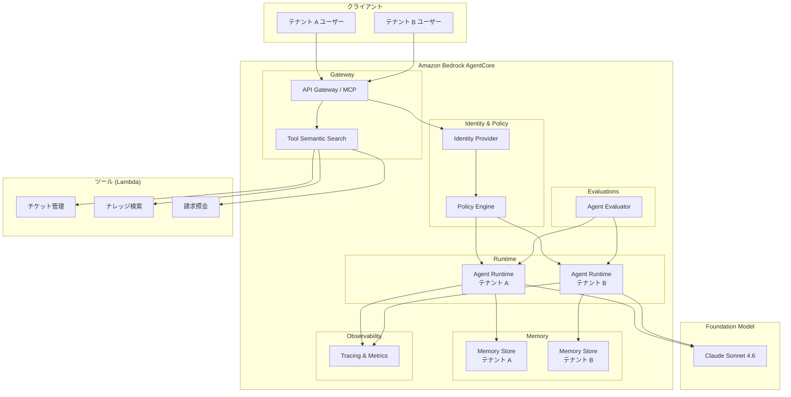

# Amazon Bedrock AgentCore マルチテナント ハンズオン

マルチテナント SaaS カスタマーサポートエージェントプラットフォームを Amazon Bedrock AgentCore で構築するハンズオンチュートリアルです。

## 概要

本ハンズオンでは、複数のテナント（企業）がそれぞれ独立したカスタマーサポート AI エージェントを利用できる SaaS プラットフォームを構築します。Amazon Bedrock AgentCore の各コンポーネントを段階的に学びながら、本番レベルのマルチテナントアーキテクチャを実装します。

### 学習できること

- AgentCore Runtime によるエージェントのデプロイと実行
- Gateway を活用したツール管理と MCP プロトコル統合
- Memory によるテナント別の会話履歴・知識管理
- Identity / Policy によるテナント分離とアクセス制御
- Observability によるモニタリングと運用
- Evaluations によるエージェント品質の評価

## シナリオ

マルチテナント型カスタマーサポートプラットフォーム「SupportHub」を構築します。

- **テナント A（EC サイト運営会社）**: 注文状況確認、返品対応、FAQ 検索
- **テナント B（SaaS 企業）**: 技術サポート、請求照会、ナレッジベース検索
- 各テナントのデータは完全に分離され、他テナントからアクセスできません

## アーキテクチャ



## チャプター構成

| チャプター | タイトル | 内容 |
|-----------|---------|------|
| [00](docs/00-prerequisites.md) | 前提条件・環境構築 | IAM 設定、CLI ツール、モデルアクセス |
| [01](docs/01-architecture-overview.md) | アーキテクチャ概要 | AgentCore 9 コンポーネント、マルチテナント戦略 |
| [02](docs/02-runtime-basics.md) | Runtime 基礎 | エージェント作成、ローカル実行、デプロイ |
| [03](docs/03-gateway-tools.md) | Gateway & ツール | MCP、Lambda ツール、セマンティック検索 |

## クイックスタート

### 1. リポジトリのクローン

```bash
git clone https://github.com/your-org/agentcore-multi-tenant-handson.git
cd agentcore-multi-tenant-handson
```

### 2. 前提条件の確認

[前提条件・環境構築](docs/00-prerequisites.md) を参照し、必要なツールとアクセス権限を設定してください。

### 3. Python 環境のセットアップ

```bash
python -m venv .venv
source .venv/bin/activate
pip install -r requirements.txt
```

### 4. チュートリアルの開始

[チャプター 00](docs/00-prerequisites.md) から順に進めてください。

## クリーンアップ

ハンズオン完了後、不要なリソースを削除してコストを抑えてください。

### 1. AgentCore リソースの削除

```bash
# デプロイしたエージェントの削除
agentcore delete --agent-name support-agent-tenant-a
agentcore delete --agent-name support-agent-tenant-b

# Memory Store の削除
aws bedrock-agent-core delete-memory-store --memory-store-id <MEMORY_STORE_ID>
```

### 2. CDK スタックの削除

```bash
cd cdk
cdk destroy --all --force
```

### 3. Lambda 関数の削除

```bash
aws lambda delete-function --function-name ticket-management
aws lambda delete-function --function-name knowledge-search
aws lambda delete-function --function-name billing-inquiry
```

### 4. 確認

```bash
# 残存リソースの確認
aws bedrock-agent-core list-agent-runtimes
aws cloudformation list-stacks --stack-status-filter CREATE_COMPLETE UPDATE_COMPLETE
```

全てのリソースが削除されていることを確認してください。

## ディレクトリ構成

```
agentcore-multi-tenant-handson/
├── README.md                  # 本ファイル
├── docs/                      # チュートリアルドキュメント
│   ├── 00-prerequisites.md
│   ├── 01-architecture-overview.md
│   ├── 02-runtime-basics.md
│   └── 03-gateway-tools.md
├── agents/                    # エージェントコード
├── cdk/                       # CDK インフラコード
├── lambda/                    # Lambda 関数
├── policies/                  # IAM / AgentCore ポリシー
├── scripts/                   # ユーティリティスクリプト
├── tests/                     # テストコード
├── database/                  # DB スキーマ・マイグレーション
└── diagrams/                  # 設計図
```

## 前提知識

- AWS の基本的な操作（マネジメントコンソール、CLI）
- Python の基礎知識
- REST API の基本概念
- 生成 AI / LLM の基礎知識（推奨）

## ライセンス

MIT License
