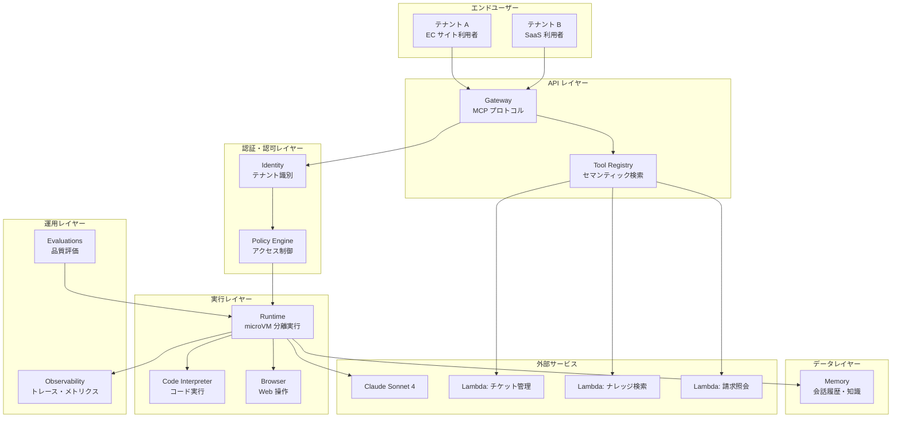
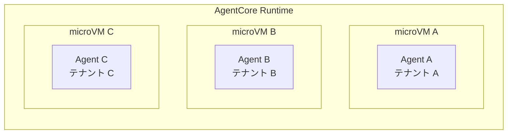
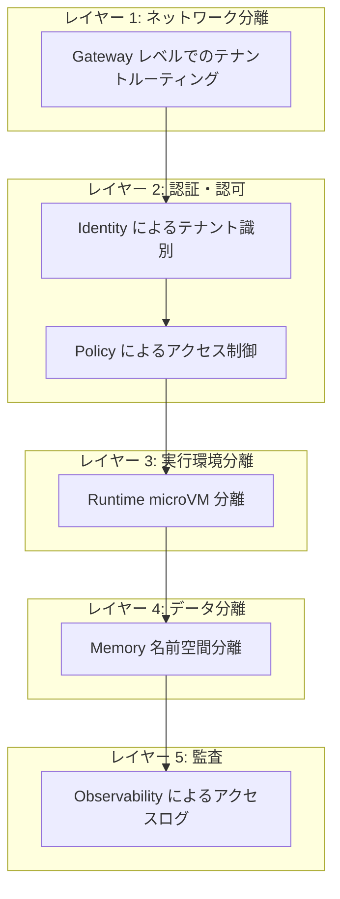
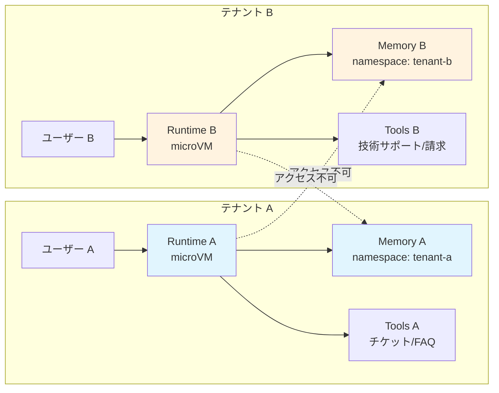
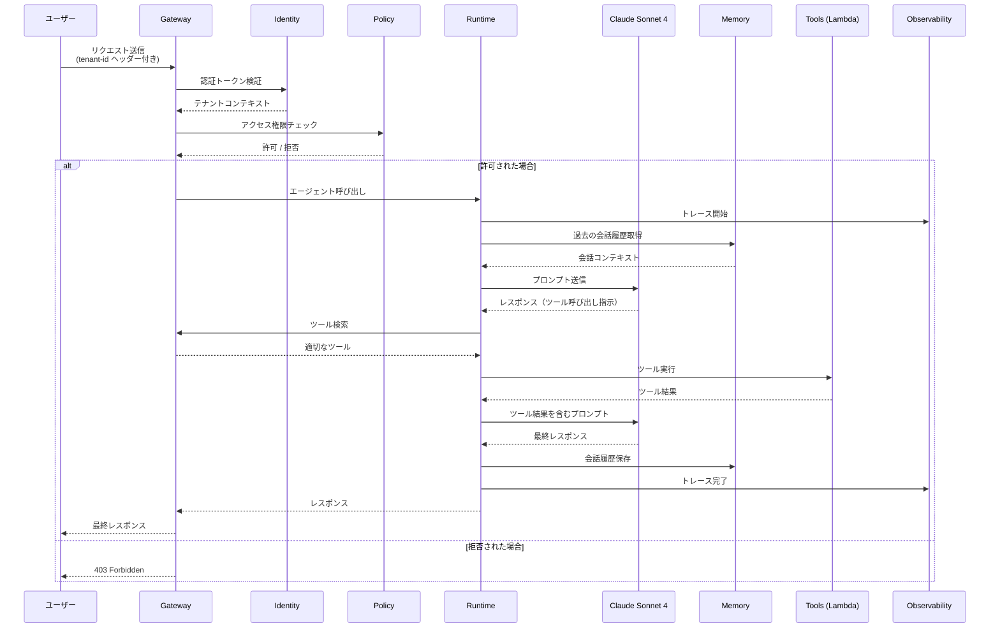
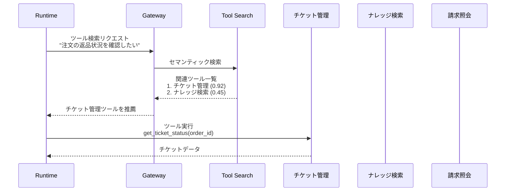
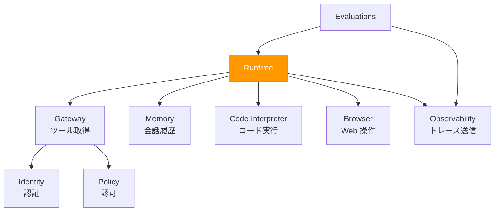
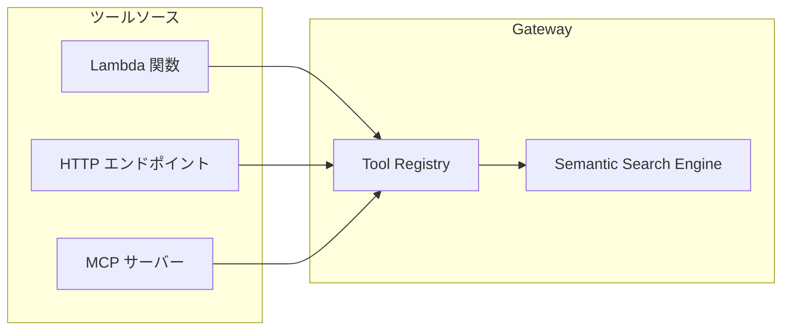

# チャプター 01: アーキテクチャ概要

本チャプターでは、Amazon Bedrock AgentCore の全体アーキテクチャと 9 つのコンポーネント、およびマルチテナント分離戦略について解説します。

## 目次

- [システム全体アーキテクチャ](#システム全体アーキテクチャ)
- [AgentCore 9 コンポーネント](#agentcore-9-コンポーネント)
- [マルチテナント分離戦略](#マルチテナント分離戦略)
- [データフロー](#データフロー)
- [コンポーネント間の連携](#コンポーネント間の連携)
- [確認手順](#確認手順)

---

## システム全体アーキテクチャ

本ハンズオンで構築する「SupportHub」のアーキテクチャ全体像です。



---

## AgentCore 9 コンポーネント

Amazon Bedrock AgentCore は、AI エージェントの構築・デプロイ・運用に必要な 9 つのマネージドコンポーネントを提供します。

### 1. Runtime（ランタイム）

エージェントの実行環境です。各エージェントは **microVM** 上で隔離実行され、セキュリティとパフォーマンスが保証されます。



**主な特徴:**
- Firecracker ベースの microVM による完全隔離
- オートスケーリング
- セッション管理（ステートフル / ステートレス）
- WebSocket によるストリーミングレスポンス
- `agentcore` CLI によるローカル開発・デプロイ

### 2. Gateway（ゲートウェイ）

エージェントがアクセスするツール群を管理するコンポーネントです。MCP（Model Context Protocol）に準拠しています。

**主な特徴:**
- MCP サーバーとしてのツール公開
- セマンティック検索によるツール自動選択
- Lambda / HTTP エンドポイントとの統合
- ツールのバージョン管理

### 3. Memory（メモリ）

エージェントの会話履歴やナレッジを保持するコンポーネントです。

**主な特徴:**
- 会話履歴の永続化（Session Memory）
- ナレッジの蓄積と検索（Semantic Memory）
- テナントごとの名前空間分離
- 自動要約・圧縮

### 4. Identity（アイデンティティ）

ユーザーとテナントの認証を管理するコンポーネントです。

**主な特徴:**
- OAuth 2.0 / OIDC 連携
- テナント識別
- トークンベースの認証
- 外部 IdP との統合

### 5. Policy（ポリシー）

エージェントのアクセス制御と権限管理を行うコンポーネントです。

**主な特徴:**
- テナントベースのアクセス制御
- ツールへのアクセス権限管理
- モデル利用の制限
- Cedar ポリシー言語によるきめ細かな制御

### 6. Code Interpreter（コードインタプリタ）

エージェントが動的にコードを生成・実行できる環境です。

**主な特徴:**
- サンドボックス環境でのコード実行
- Python / JavaScript 対応
- ファイルの読み書き
- データ分析・可視化

### 7. Browser（ブラウザ）

エージェントが Web ページを操作できるコンポーネントです。

**主な特徴:**
- ヘッドレスブラウザによる Web 操作
- スクリーンショット取得
- フォーム入力・ボタンクリック
- Web スクレイピング

### 8. Observability（オブザーバビリティ）

エージェントの実行状況を監視・トレースするコンポーネントです。

**主な特徴:**
- 分散トレーシング（OpenTelemetry 互換）
- メトリクス収集
- ログ集約
- CloudWatch 統合

### 9. Evaluations（評価）

エージェントの応答品質を評価するコンポーネントです。

**主な特徴:**
- 自動品質評価
- 正確性・関連性・安全性のスコアリング
- A/B テスト
- リグレッションテスト

---

## コンポーネント一覧表

| コンポーネント | 役割 | 本ハンズオンでの利用 |
|--------------|------|-------------------|
| Runtime | エージェント実行環境 | チャプター 02 |
| Gateway | ツール管理・MCP | チャプター 03 |
| Memory | 会話履歴・知識管理 | 以降のチャプター |
| Identity | 認証 | 以降のチャプター |
| Policy | 認可・アクセス制御 | 以降のチャプター |
| Code Interpreter | コード実行 | 以降のチャプター |
| Browser | Web 操作 | 以降のチャプター |
| Observability | 監視・トレース | 以降のチャプター |
| Evaluations | 品質評価 | 以降のチャプター |

---

## マルチテナント分離戦略

本ハンズオンでは **多層防御（Defense-in-Depth）** アプローチを採用し、複数のレイヤーでテナント分離を実現します。

### 分離レイヤー



### 各レイヤーの詳細

#### レイヤー 1: ネットワーク分離

- Gateway がリクエストヘッダーからテナント ID を識別
- テナントごとに異なるエンドポイントまたはパスプレフィックスを使用
- 不正なテナント ID は Gateway レベルで拒否

#### レイヤー 2: 認証・認可

- Identity がトークンを検証し、テナントコンテキストを設定
- Policy Engine が Cedar ポリシーに基づきアクセス可否を判定
- テナント A のユーザーはテナント B のリソースにアクセスできない

```
// Cedar ポリシーの例
permit(
  principal in TenantGroup::"tenant-a",
  action in [Action::"InvokeAgent", Action::"ReadMemory"],
  resource in Namespace::"tenant-a"
);
```

#### レイヤー 3: 実行環境分離

- 各テナントのエージェントは個別の microVM で実行
- microVM 間のネットワーク・ファイルシステムは完全分離
- リソース制限（CPU、メモリ）もテナント単位で設定可能

#### レイヤー 4: データ分離

- Memory はテナント ID をパーティションキーとして使用
- 会話履歴・ナレッジは名前空間で論理分離
- クロステナントのデータ参照は API レベルで防止

#### レイヤー 5: 監査

- 全てのアクセスは Observability で記録
- テナント ID 付きのトレースデータ
- 異常アクセスの検知とアラート

### テナント分離の全体像



---

## データフロー

### リクエスト処理フロー

ユーザーのリクエストが処理される全体フローです。



### ツール選択フロー

Gateway のセマンティック検索によるツール選択の詳細フローです。



---

## コンポーネント間の連携

### Runtime と他コンポーネントの関係

Runtime は AgentCore のコアコンポーネントであり、他の全てのコンポーネントと連携します。



### Gateway のツール管理

Gateway は複数のツールソースを統合し、エージェントに統一的なインタフェースを提供します。



---

## 確認手順

本チャプターの内容を理解できたか確認します。

### 理解度チェック

以下の質問に答えられるか確認してください。

1. **AgentCore の 9 つのコンポーネントを全て挙げられますか？**
   - Runtime、Gateway、Memory、Identity、Policy、Code Interpreter、Browser、Observability、Evaluations

2. **Runtime の microVM 分離はなぜ重要ですか？**
   - テナント間の実行環境を物理的に隔離し、セキュリティとパフォーマンスを保証するため

3. **多層防御（Defense-in-Depth）の 5 つのレイヤーは何ですか？**
   - ネットワーク分離、認証・認可、実行環境分離、データ分離、監査

4. **Gateway のセマンティック検索はどのような場面で役立ちますか？**
   - ユーザーの自然言語リクエストから最適なツールを自動選択する場面

### 次のチャプター

アーキテクチャの全体像を理解できたら、[チャプター 02: Runtime 基礎](02-runtime-basics.md) に進み、実際にエージェントを構築・デプロイしましょう。
