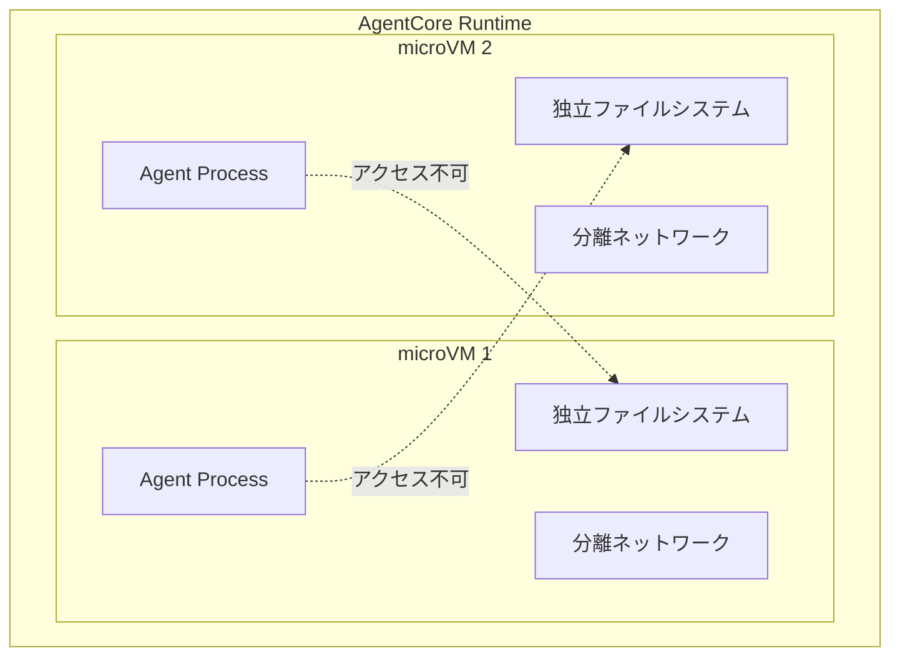
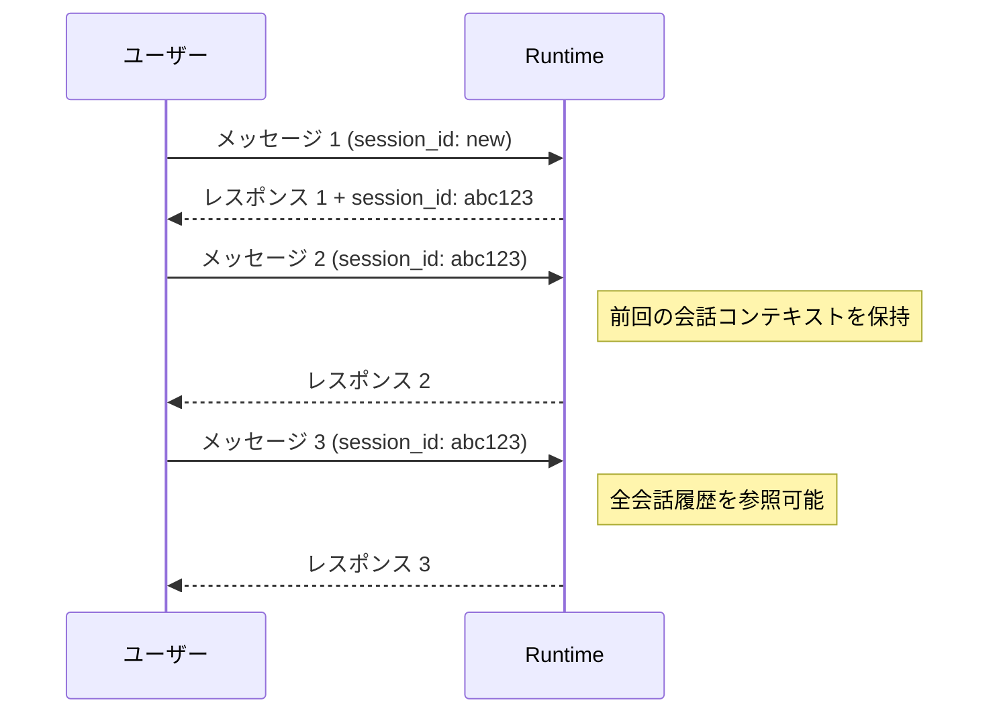

# チャプター 02: AgentCore Runtime 基礎

本チャプターでは、AgentCore Runtime の基本概念を理解し、Strands Agents フレームワークでエージェントを作成、ローカルテスト、Runtime へのデプロイ、プログラムからの呼び出しまでを行います。

## 目次

- [Runtime の基本概念](#runtime-の基本概念)
- [ステップ 1: Strands Agent の作成](#ステップ-1-strands-agent-の作成)
- [ステップ 2: ローカルテスト](#ステップ-2-ローカルテスト)
- [ステップ 3: Runtime へのデプロイ](#ステップ-3-runtime-へのデプロイ)
- [ステップ 4: プログラムからの呼び出し](#ステップ-4-プログラムからの呼び出し)
- [ステップ 5: WebSocket ストリーミング](#ステップ-5-websocket-ストリーミング)
- [確認手順](#確認手順)

---

## Runtime の基本概念

### microVM 分離

AgentCore Runtime は、各エージェント呼び出しを **Firecracker microVM** 上で実行します。これにより以下が保証されます。



- **セキュリティ**: 他のエージェント（テナント）のデータ・プロセスにアクセスできない
- **安定性**: 1 つのエージェントの障害が他に影響しない
- **リソース制御**: CPU・メモリをエージェントごとに制限可能

### セッション管理

Runtime はセッションベースのステートフルな会話をサポートします。



### Runtime のライフサイクル

```
ローカル開発 → ローカルテスト → デプロイ → 呼び出し → モニタリング
  (コード作成)   (agentcore run)  (agentcore deploy)  (boto3/WebSocket)  (Observability)
```

---

## ステップ 1: Strands Agent の作成

カスタマーサポートエージェントを Strands Agents フレームワークで作成します。

### 1.1 ディレクトリ構成の確認

```bash
cd agentcore-multi-tenant-handson
ls agents/
```

### 1.2 エージェントコードの作成

`agents/support_agent.py` を作成します。

```python
"""
SupportHub カスタマーサポートエージェント
マルチテナント SaaS 向けの基本エージェント実装
"""

from strands import Agent, tool
from strands.models.bedrock import BedrockModel


# シンプルなツール定義（後のチャプターで Gateway 経由に置き換えます）
@tool
def get_greeting(customer_name: str) -> str:
    """顧客に挨拶を返すツール。顧客名を受け取り、適切な挨拶メッセージを生成します。"""
    return f"こんにちは、{customer_name} 様。本日はどのようなご用件でしょうか？"


@tool
def get_faq(question: str) -> str:
    """よくある質問に回答するツール。質問内容から適切な FAQ エントリを検索します。"""
    # 簡易的な FAQ データ（後のチャプターで実際のナレッジベースに置き換えます）
    faq_data = {
        "返品": "商品到着後 30 日以内であれば返品可能です。マイページの「注文履歴」から返品申請を行ってください。",
        "配送": "通常配送は 3-5 営業日、お急ぎ便は翌日到着です。配送状況は注文確認メールのトラッキング番号で確認できます。",
        "支払い": "クレジットカード、デビットカード、コンビニ払い、銀行振込に対応しています。",
    }
    for key, answer in faq_data.items():
        if key in question:
            return answer
    return "申し訳ございません。該当する FAQ が見つかりませんでした。オペレーターにおつなぎしましょうか？"


# エージェントの構成
SYSTEM_PROMPT = """あなたは SupportHub のカスタマーサポートエージェントです。
以下のルールに従って対応してください:

1. 常に丁寧な日本語で応答すること
2. 顧客の問い合わせ内容を正確に理解すること
3. 利用可能なツールを活用して適切な情報を提供すること
4. 解決できない場合は、人間のオペレーターへのエスカレーションを案内すること
5. 個人情報の取り扱いには十分注意すること
"""


def create_agent() -> Agent:
    """カスタマーサポートエージェントを作成して返す"""
    model = BedrockModel(
        model_id="anthropic.claude-sonnet-4-20250514",
        region_name="us-east-1",
    )

    agent = Agent(
        model=model,
        system_prompt=SYSTEM_PROMPT,
        tools=[get_greeting, get_faq],
    )

    return agent


# ローカル実行用のエントリポイント
if __name__ == "__main__":
    agent = create_agent()
    response = agent("返品について教えてください")
    print(response)
```

### 1.3 BedrockAgentCoreApp でラップ

`agents/app.py` を作成します。これは AgentCore Runtime にデプロイするためのエントリポイントです。

```python
"""
AgentCore Runtime 用のエントリポイント
BedrockAgentCoreApp でエージェントをラップし、Runtime で実行可能にする
"""

from bedrock_agentcore.runtime import BedrockAgentCoreApp
from support_agent import create_agent


# BedrockAgentCoreApp の初期化
app = BedrockAgentCoreApp()

# エージェントインスタンスを作成
agent = create_agent()


@app.handler
def handler(event: dict) -> dict:
    """
    Runtime からのリクエストを処理するハンドラー

    Args:
        event: Runtime から渡されるイベント
            - prompt: ユーザーのメッセージ
            - session_id: セッション ID（オプション）
            - tenant_id: テナント ID（オプション）

    Returns:
        dict: エージェントのレスポンス
    """
    prompt = event.get("prompt", "")
    session_id = event.get("session_id", None)
    tenant_id = event.get("tenant_id", None)

    # テナント ID のログ出力（Observability で追跡可能）
    if tenant_id:
        print(f"[INFO] Processing request for tenant: {tenant_id}")

    # エージェントの実行
    response = agent(prompt)

    return {
        "response": str(response),
        "session_id": session_id,
        "tenant_id": tenant_id,
    }


# アプリケーション起動
if __name__ == "__main__":
    app.run()
```

### 1.4 設定ファイルの作成

`agents/agentcore.yaml` を作成します。

```yaml
# AgentCore Runtime 設定ファイル
name: support-agent
description: "SupportHub カスタマーサポートエージェント"

# エントリポイント
entrypoint: app.py

# Python 依存関係
requirements:
  - strands-agents
  - bedrock-agentcore

# Runtime 設定
runtime:
  memory: 512  # MB
  timeout: 300  # 秒

# 環境変数
environment:
  AWS_DEFAULT_REGION: us-east-1
```

---

## ステップ 2: ローカルテスト

`agentcore run` コマンドでローカル環境でエージェントをテストします。

### 2.1 ローカル実行

```bash
cd agents
agentcore run
```

以下のような出力が表示されます。

```
🚀 Starting local AgentCore runtime...
📦 Loading agent from app.py...
✅ Agent 'support-agent' is running locally
🌐 Local endpoint: http://localhost:8080
```

### 2.2 別ターミナルからテスト

ローカルエンドポイントにリクエストを送信します。

```bash
curl -X POST http://localhost:8080/invoke \
  -H "Content-Type: application/json" \
  -d '{
    "prompt": "返品について教えてください",
    "tenant_id": "tenant-a"
  }'
```

### 2.3 期待されるレスポンス

```json
{
  "response": "返品についてご案内いたします。商品到着後 30 日以内であれば返品可能です。マイページの「注文履歴」から返品申請を行ってください。...",
  "session_id": null,
  "tenant_id": "tenant-a"
}
```

### 2.4 Python からのローカルテスト

`tests/test_local.py` を作成してテストすることもできます。

```python
"""ローカル環境でのエージェントテスト"""

import sys
sys.path.insert(0, "../agents")

from support_agent import create_agent


def test_greeting():
    """挨拶ツールのテスト"""
    agent = create_agent()
    response = agent("田中太郎さんに挨拶してください")
    assert "田中太郎" in str(response)
    print(f"✅ 挨拶テスト成功: {response}")


def test_faq():
    """FAQ ツールのテスト"""
    agent = create_agent()
    response = agent("返品のやり方を教えてください")
    assert "返品" in str(response)
    print(f"✅ FAQ テスト成功: {response}")


if __name__ == "__main__":
    test_greeting()
    test_faq()
    print("\n🎉 全テスト成功!")
```

```bash
cd tests
python test_local.py
```

---

## ステップ 3: Runtime へのデプロイ

ローカルテストが成功したら、AgentCore Runtime にデプロイします。

### 3.1 デプロイ

```bash
cd agents
agentcore deploy
```

デプロイが開始されると以下のような出力が表示されます。

```
📦 Packaging agent 'support-agent'...
🔨 Building container image...
📤 Pushing to AgentCore Runtime...
⏳ Deploying agent...
✅ Agent 'support-agent' deployed successfully!

Agent Details:
  Name:       support-agent
  Agent ID:   agt-xxxxxxxxxxxx
  Status:     ACTIVE
  Endpoint:   wss://runtime.agentcore.us-east-1.amazonaws.com/agents/agt-xxxxxxxxxxxx
```

### 3.2 デプロイ状態の確認

```bash
agentcore status --agent-name support-agent
```

```
Agent: support-agent
  ID:       agt-xxxxxxxxxxxx
  Status:   ACTIVE
  Version:  1
  Created:  2026-03-23T10:00:00Z
  Updated:  2026-03-23T10:00:00Z
```

### 3.3 デプロイ済みエージェント一覧

```bash
agentcore list
```

---

## ステップ 4: プログラムからの呼び出し

デプロイしたエージェントを boto3 で呼び出します。

### 4.1 基本的な呼び出し

`scripts/invoke_agent.py` を作成します。

```python
"""
デプロイ済みエージェントの呼び出しスクリプト
boto3 を使用して AgentCore Runtime のエージェントを実行する
"""

import json
import boto3


def invoke_agent(
    agent_id: str,
    prompt: str,
    session_id: str | None = None,
    tenant_id: str = "tenant-a",
) -> dict:
    """
    AgentCore Runtime 上のエージェントを呼び出す

    Args:
        agent_id: デプロイ済みエージェントの ID
        prompt: ユーザーのメッセージ
        session_id: セッション ID（継続会話の場合）
        tenant_id: テナント ID

    Returns:
        dict: エージェントのレスポンス
    """
    client = boto3.client(
        "bedrock-agent-core",
        region_name="us-east-1",
    )

    # リクエストペイロードの構築
    payload = {
        "prompt": prompt,
        "tenant_id": tenant_id,
    }
    if session_id:
        payload["session_id"] = session_id

    # エージェントの呼び出し
    response = client.invoke_agent_runtime(
        agentId=agent_id,
        payload=json.dumps(payload),
    )

    # レスポンスの解析
    result = json.loads(response["body"].read().decode("utf-8"))
    return result


def main():
    # デプロイ時に取得した Agent ID を設定
    AGENT_ID = "agt-xxxxxxxxxxxx"  # ← 自分の Agent ID に置き換えてください

    # 1. 新規会話の開始
    print("=== 新規会話 ===")
    result = invoke_agent(
        agent_id=AGENT_ID,
        prompt="こんにちは。返品について教えてください。",
        tenant_id="tenant-a",
    )
    print(f"レスポンス: {result['response']}")
    session_id = result.get("session_id")
    print(f"セッション ID: {session_id}")

    # 2. 会話の継続（セッション ID を使用）
    if session_id:
        print("\n=== 会話の継続 ===")
        result = invoke_agent(
            agent_id=AGENT_ID,
            prompt="送料はかかりますか？",
            session_id=session_id,
            tenant_id="tenant-a",
        )
        print(f"レスポンス: {result['response']}")

    # 3. 別テナントでの呼び出し
    print("\n=== テナント B での呼び出し ===")
    result = invoke_agent(
        agent_id=AGENT_ID,
        prompt="技術サポートに問い合わせたいのですが",
        tenant_id="tenant-b",
    )
    print(f"レスポンス: {result['response']}")


if __name__ == "__main__":
    main()
```

### 4.2 実行

```bash
python scripts/invoke_agent.py
```

### 4.3 期待される出力

```
=== 新規会話 ===
レスポンス: こんにちは！返品についてご案内いたします。商品到着後 30 日以内であれば返品可能です...
セッション ID: sess-xxxxxxxxxxxx

=== 会話の継続 ===
レスポンス: 返品の送料についてですが、不良品の場合は弊社が負担いたします...

=== テナント B での呼び出し ===
レスポンス: 技術サポートへのお問い合わせですね。どのような技術的な問題が発生していますか？...
```

---

## ステップ 5: WebSocket ストリーミング

WebSocket を使用してリアルタイムにレスポンスをストリーミング受信します。

### 5.1 WebSocket クライアント

`scripts/stream_agent.py` を作成します。

```python
"""
WebSocket ストリーミングによるエージェント呼び出し
リアルタイムにレスポンスを受信する
"""

import json
import boto3
import websocket


def get_signed_url(agent_id: str) -> str:
    """
    WebSocket 接続用の署名付き URL を取得する
    """
    client = boto3.client(
        "bedrock-agent-core",
        region_name="us-east-1",
    )

    response = client.get_agent_runtime_endpoint(
        agentId=agent_id,
        protocol="WSS",
    )

    return response["endpoint"]


def stream_agent(agent_id: str, prompt: str, tenant_id: str = "tenant-a"):
    """
    WebSocket でエージェントのレスポンスをストリーミング受信する

    Args:
        agent_id: デプロイ済みエージェントの ID
        prompt: ユーザーのメッセージ
        tenant_id: テナント ID
    """
    # 署名付き URL の取得
    ws_url = get_signed_url(agent_id)

    print(f"接続先: {ws_url}")
    print(f"プロンプト: {prompt}")
    print(f"テナント: {tenant_id}")
    print("-" * 50)

    # WebSocket 接続
    ws = websocket.create_connection(ws_url)

    try:
        # リクエスト送信
        request_payload = json.dumps({
            "action": "invoke",
            "payload": {
                "prompt": prompt,
                "tenant_id": tenant_id,
            },
        })
        ws.send(request_payload)

        # ストリーミングレスポンスの受信
        print("レスポンス: ", end="", flush=True)

        while True:
            message = ws.recv()
            data = json.loads(message)

            if data.get("type") == "chunk":
                # テキストチャンクを逐次表示
                print(data["content"], end="", flush=True)

            elif data.get("type") == "tool_use":
                # ツール使用の通知
                print(f"\n  [ツール使用: {data['tool_name']}]", flush=True)

            elif data.get("type") == "end":
                # ストリーミング完了
                print("\n")
                print(f"セッション ID: {data.get('session_id')}")
                break

            elif data.get("type") == "error":
                print(f"\nエラー: {data['message']}")
                break

    finally:
        ws.close()


def main():
    AGENT_ID = "agt-xxxxxxxxxxxx"  # ← 自分の Agent ID に置き換えてください

    stream_agent(
        agent_id=AGENT_ID,
        prompt="注文番号 ORD-12345 の返品手続きについて教えてください",
        tenant_id="tenant-a",
    )


if __name__ == "__main__":
    main()
```

### 5.2 websocket-client のインストール

```bash
pip install websocket-client
```

### 5.3 実行

```bash
python scripts/stream_agent.py
```

### 5.4 期待される出力

```
接続先: wss://runtime.agentcore.us-east-1.amazonaws.com/agents/agt-xxxxxxxxxxxx
プロンプト: 注文番号 ORD-12345 の返品手続きについて教えてください
テナント: tenant-a
--------------------------------------------------
レスポンス: 注文番号 ORD-12345 の返品手続きについてご案内いたします。
  [ツール使用: get_faq]
商品到着後 30 日以内であれば返品可能です。マイページの「注文履歴」から返品申請を行ってください。...

セッション ID: sess-xxxxxxxxxxxx
```

レスポンスがリアルタイムに表示されることを確認してください。

---

## 確認手順

本チャプターで実施した内容を振り返ります。

### チェックリスト

- [ ] `agents/support_agent.py` を作成し、Strands Agent でカスタマーサポートエージェントを定義した
- [ ] `agents/app.py` を作成し、BedrockAgentCoreApp でラップした
- [ ] `agents/agentcore.yaml` を作成し、Runtime の設定を定義した
- [ ] `agentcore run` でローカルテストを実行し、正常にレスポンスが返ることを確認した
- [ ] `agentcore deploy` で Runtime にデプロイした
- [ ] `agentcore status` でデプロイ状態が `ACTIVE` であることを確認した
- [ ] boto3 の `invoke_agent_runtime` でプログラムからエージェントを呼び出せた
- [ ] セッション ID を使用して会話の継続ができることを確認した
- [ ] WebSocket ストリーミングでリアルタイムにレスポンスを受信できた

### トラブルシューティング

| 問題 | 対処方法 |
|------|---------|
| `agentcore run` でエラーが出る | Docker が起動しているか確認。`docker info` でチェック |
| デプロイが失敗する | IAM 権限を確認。`BedrockAgentCoreFullAccess` がアタッチされているか |
| `invoke_agent_runtime` でタイムアウト | Runtime のステータスが `ACTIVE` か確認。デプロイ直後は数分かかる場合がある |
| WebSocket 接続が拒否される | エージェント ID が正しいか確認。リージョンが `us-east-1` か確認 |
| モデル呼び出しエラー | Bedrock の Claude Sonnet 4 モデルアクセスが有効か確認 |

### 次のチャプター

Runtime の基礎を習得しました。次は [チャプター 03: Gateway & ツール](03-gateway-tools.md) に進み、Lambda ツールの作成と Gateway を使ったツール管理を学びましょう。
