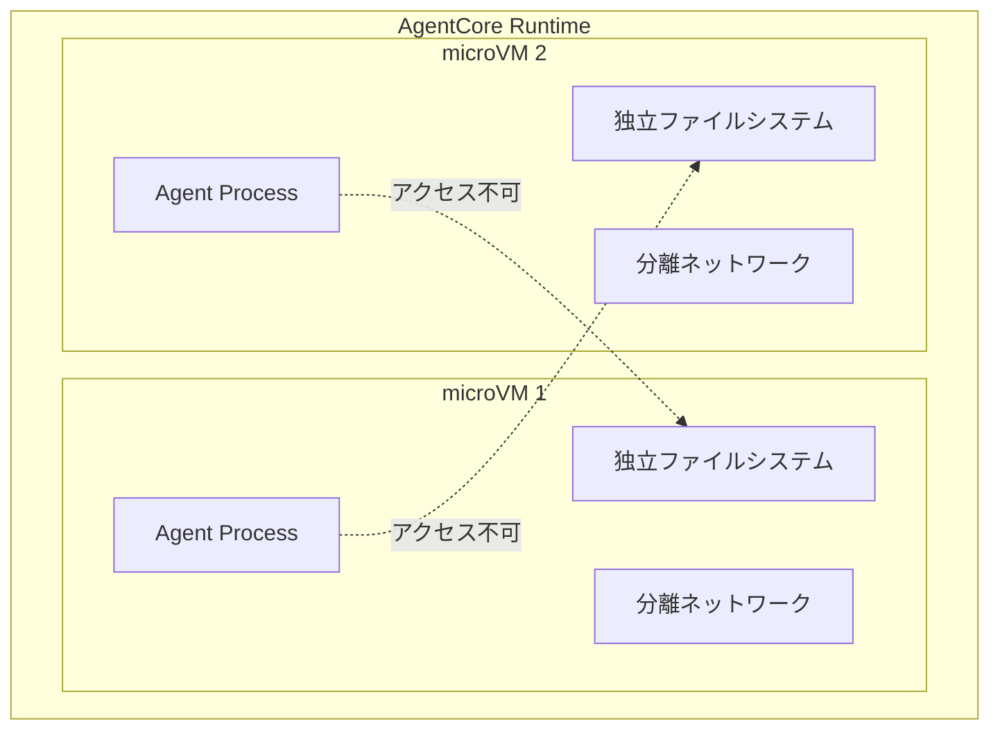
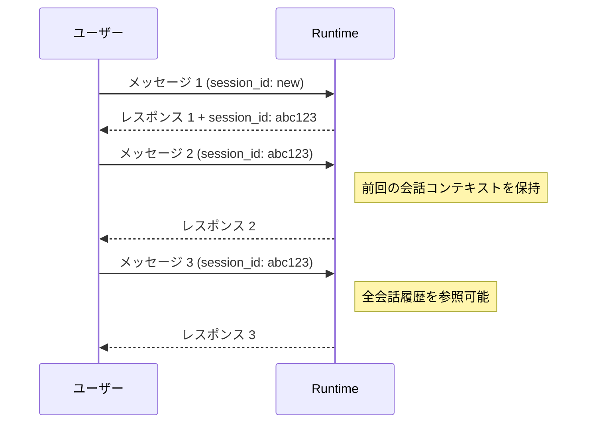

# チャプター 2: AgentCore Runtime 基礎

本チャプターでは、AgentCore Runtime の基本概念を理解し、Strands Agents フレームワークでエージェントを作成、ローカルテスト、Runtime へのデプロイ、CLI からの呼び出しまでを行います。

## 目次

- [Runtime の基本概念](#runtime-の基本概念)
- [ステップ 1: プロジェクト構造の確認](#ステップ-1-プロジェクト構造の確認)
- [ステップ 2: エージェントコードの理解](#ステップ-2-エージェントコードの理解)
- [ステップ 3: ローカルテスト](#ステップ-3-ローカルテスト)
- [ステップ 4: Runtime へのデプロイ](#ステップ-4-runtime-へのデプロイ)
- [ステップ 5: エージェントの呼び出し](#ステップ-5-エージェントの呼び出し)
- [確認手順](#確認手順)

---

## Runtime の基本概念

### microVM 分離

AgentCore Runtime は、各エージェント呼び出しを **Firecracker microVM** 上で実行します。これにより以下が保証されます。



- **セキュリティ**: 他のエージェント（テナント）のデータ・プロセスにアクセスできない
- **安定性**: 1 つのエージェントの障害が他に影響しない
- **リソース制御**: CPU・メモリをエージェントごとに制限可能

### セッション管理

Runtime はセッションベースのステートフルな会話をサポートします。



### Runtime のライフサイクル

```
ローカル開発 → ローカルテスト → デプロイ → 呼び出し → モニタリング
  (コード作成)   (agentcore dev)  (agentcore deploy)  (agentcore invoke)  (Observability)
```

---

## ステップ 1: プロジェクト構造の確認

本ハンズオンではカスタマーサポートエージェントのプロジェクトが `agents/customer_support/` に用意されています。まずはプロジェクト構造を確認します。

### 1.1 プロジェクトの生成（参考）

新規にプロジェクトを作成する場合は、以下のコマンドを使用します。

```bash
cd agents
agentcore create -p customer_support -t basic --agent-framework Strands --model-provider Bedrock --non-interactive --no-venv
```

本ハンズオンではあらかじめ作成済みのプロジェクトを使用するため、以下のディレクトリに移動します。

```bash
cd agents/customer_support
```

### 1.2 ディレクトリ構造

```
agents/customer_support/
├── .bedrock_agentcore.yaml   # AgentCore 設定ファイル
├── pyproject.toml             # Python 依存関係
├── Dockerfile                 # コンテナビルド用（オプション）
└── src/
    ├── main.py                # エントリポイント
    ├── tools.py               # カスタムツール定義
    └── model/
        ├── __init__.py
        └── load.py            # モデルローダー
```

> **重要**: `agentcore dev` や `agentcore deploy` は `.bedrock_agentcore.yaml` がある `agents/customer_support/` ディレクトリ内で実行する必要があります。

### 1.3 設定ファイルの確認

`.bedrock_agentcore.yaml` の主要な設定項目を確認します。

```yaml
default_agent: customersupport_Agent
agents:
  customersupport_Agent:
    name: customersupport_Agent
    language: python
    entrypoint: src/main.py
    deployment_type: direct_code_deploy
    runtime_type: PYTHON_3_10
    platform: linux/amd64
    source_path: src
    aws:
      execution_role_auto_create: true
      network_configuration:
        network_mode: PUBLIC
      protocol_configuration:
        server_protocol: HTTP
      observability:
        enabled: true
    memory:
      mode: NO_MEMORY
```

主なポイント:
- `entrypoint: src/main.py` -- Runtime が起動時に実行するファイル
- `deployment_type: direct_code_deploy` -- ソースコードを直接デプロイ
- `source_path: src` -- デプロイ対象のソースディレクトリ
- `observability.enabled: true` -- オブザーバビリティが有効

### 1.4 依存関係の確認

`pyproject.toml` で定義された主要な依存パッケージを確認します。

```toml
[project]
name = "customersupport"
version = "0.1.0"
requires-python = ">=3.10"

dependencies = [
    "bedrock-agentcore >= 1.0.3",
    "boto3 >= 1.38.0",
    "strands-agents >= 1.13.0",
    "strands-agents-tools >= 0.2.16",
    "mcp >= 1.19.0",
    "python-dotenv >= 1.2.1",
]
```

- `bedrock-agentcore` -- AgentCore Runtime SDK
- `strands-agents` -- Strands Agent フレームワーク
- `mcp` -- MCP（Model Context Protocol）クライアント

---

## ステップ 2: エージェントコードの理解

### 2.1 モデル設定 (`src/model/load.py`)

Claude Sonnet 4.6 のクロスリージョン推論プロファイルを使用しています。

```python
from strands.models import BedrockModel

# US クロスリージョン推論プロファイルで Claude Sonnet 4.6 を使用
MODEL_ID = "us.anthropic.claude-sonnet-4-6"


def load_model() -> BedrockModel:
    """
    Get Bedrock model client.
    Uses IAM authentication via the execution role.
    """
    return BedrockModel(model_id=MODEL_ID)
```

### 2.2 カスタムツール (`src/tools.py`)

エージェントが使用する 3 つのツールが定義されています。Strands の `@tool` デコレータで関数をツールとして宣言します。

```python
from strands import tool

@tool
def get_customer_info(tenant_id: str, customer_id: str = "", email: str = "") -> str:
    """Look up customer information by tenant. Provide either customer_id or email."""
    ...

@tool
def escalate_ticket(
    tenant_id: str, ticket_id: str, reason: str,
    priority: str = "high", assigned_team: str = "tier2-support",
) -> str:
    """Escalate a support ticket to a human agent or specialized team."""
    ...

@tool
def get_faq(tenant_id: str, category: str = "", query: str = "") -> str:
    """Retrieve FAQ answers for the tenant. Optionally filter by category or search query."""
    ...
```

各ツールは `tenant_id` を必須パラメータとして受け取り、テナント固有のデータのみを返します。これにより、マルチテナント環境でのデータ分離が実現されています。

### 2.3 エントリポイント (`src/main.py`)

Runtime からのリクエストを処理するメインコードです。

```python
from strands import Agent, tool
from bedrock_agentcore.runtime import BedrockAgentCoreApp
from model.load import load_model
from tools import get_customer_info, escalate_ticket, get_faq

app = BedrockAgentCoreApp()
log = app.logger

SYSTEM_PROMPT = """あなたはマルチテナントSaaSプラットフォームのカスタマーサポートエージェントです。
お客様からの問い合わせに対して、丁寧かつ正確にサポートを提供してください。
...
"""


def extract_tenant_context(payload: dict) -> dict:
    """Extract tenant context from the invocation payload (JWT claims)."""
    tenant_context = {}
    session_attrs = payload.get("sessionAttributes", {})
    if session_attrs:
        tenant_context["tenant_id"] = session_attrs.get("tenantId", "")
        tenant_context["tenant_name"] = session_attrs.get("tenantName", "")
        tenant_context["plan"] = session_attrs.get("tenantPlan", "")
    ...
    return tenant_context


@app.entrypoint
async def invoke(payload, context):
    session_id = getattr(context, 'session_id', 'default')
    user_id = payload.get("user_id") or 'default-user'

    # Extract tenant context
    tenant_context = extract_tenant_context(payload)
    tenant_id = tenant_context.get("tenant_id", "unknown")
    log.info(f"Processing request for tenant: {tenant_id}")

    # Build tenant-aware system prompt
    tenant_prompt = SYSTEM_PROMPT
    if tenant_context.get("tenant_id"):
        tenant_prompt += f"""
## 現在のテナント情報 / Current Tenant Context
- Tenant ID: {tenant_context.get('tenant_id', 'unknown')}
- Tenant Name: {tenant_context.get('tenant_name', 'unknown')}
- Plan: {tenant_context.get('plan', 'unknown')}
"""

    # Create agent with model and tools
    agent = Agent(
        model=load_model(),
        system_prompt=tenant_prompt,
        tools=[get_customer_info, escalate_ticket, get_faq],
    )

    # Execute and stream response
    stream = agent.stream_async(payload.get("prompt", "Hello!"))
    async for event in stream:
        if "data" in event and isinstance(event["data"], str):
            yield event["data"]


if __name__ == "__main__":
    app.run()
```

主要なポイント:

- `BedrockAgentCoreApp()` -- Runtime アプリケーションのインスタンスを作成
- `@app.entrypoint` -- Runtime がリクエストを受け取ったときに呼び出されるエントリポイントを定義
- `async def invoke(payload, context)` -- 非同期ジェネレータとして定義し、`yield` でストリーミングレスポンスを返す
- `extract_tenant_context()` -- JWT クレームやセッション属性からテナント情報を抽出
- `Agent(model=..., system_prompt=..., tools=[...])` -- Strands Agent を作成し、モデル・プロンプト・ツールを設定
- `agent.stream_async()` -- ストリーミングでエージェントを実行

---

## ステップ 3: ローカルテスト

`agentcore dev` コマンドでローカル環境でエージェントをテストします。

### 3.1 ローカル実行

```bash
cd agents/customer_support
agentcore dev
```

以下のような出力が表示されます。

```
🚀 Starting development server with hot reloading
Agent: customersupport_Agent
💡 Test your agent with: agentcore invoke --dev "Hello" in a new terminal window

Server will be available at:
  • Localhost: http://localhost:8080/invocations
```

> **注意**: 初回実行時は依存パッケージのインストールのため、起動に時間がかかります。

### 3.2 別ターミナルからテスト

推奨方法は `agentcore invoke --dev` コマンドです。

```bash
# 別のターミナルで実行
cd agents/customer_support
agentcore invoke --dev "パスワードをリセットする方法を教えてください"
```

curl で直接テストする場合は、エンドポイントは `/invocations` です。

```bash
curl -X POST http://localhost:8080/invocations \
  -H "Content-Type: application/json" \
  -d '{
    "prompt": "パスワードをリセットする方法を教えてください",
    "sessionAttributes": {
      "tenantId": "tenant-a",
      "tenantName": "Acme Corp",
      "tenantPlan": "enterprise"
    }
  }'
```

### 3.3 期待されるレスポンス

SSE（Server-Sent Events）ストリーミング形式でレスポンスが返されます。

```
data: "設定画面の"
data: "「セキュリティ」"
data: "タブから"
data: "「パスワードリセット」を"
data: "クリックしてください。"
...
```

---

## ステップ 4: Runtime へのデプロイ

ローカルテストが成功したら、AgentCore Runtime にデプロイします。

### 4.1 デプロイ

```bash
cd agents/customer_support
agentcore deploy
```

デプロイが開始されると、コードの S3 アップロードと Runtime の設定が自動で行われます。

```
✓ Agent 'customersupport_Agent' deployed successfully!

Agent Details:
  Agent ID:   agt-xxxxxxxxxxxx
  Status:     ACTIVE
```

### 4.2 デプロイ状態の確認

```bash
agentcore status
```

```
Agent: customersupport_Agent
  ID:       agt-xxxxxxxxxxxx
  Status:   ACTIVE
```

---

## ステップ 5: エージェントの呼び出し

デプロイしたエージェントを `agentcore invoke` CLI コマンドで呼び出します。

### 5.1 基本的な呼び出し

```bash
agentcore invoke --payload '{"prompt": "こんにちは。返品について教えてください。"}'
```

### 5.2 テナントコンテキスト付きの呼び出し

セッション属性にテナント情報を含めて呼び出します。

```bash
agentcore invoke --payload '{
  "prompt": "顧客 cust-001 の情報を教えてください",
  "sessionAttributes": {
    "tenantId": "tenant-a",
    "tenantName": "Acme Corp",
    "tenantPlan": "enterprise"
  }
}'
```

### 5.3 別テナントでの呼び出し

テナント B のコンテキストで呼び出すと、テナント B 固有のデータのみが返されます。

```bash
agentcore invoke --payload '{
  "prompt": "顧客 cust-101 の情報を教えてください",
  "sessionAttributes": {
    "tenantId": "tenant-b",
    "tenantName": "GlobalTech",
    "tenantPlan": "professional"
  }
}'
```

### 5.4 期待される出力

```
=== テナント A ===
顧客 cust-001 の情報です:
- 名前: 田中太郎
- メール: tanaka@acme-corp.example.com
- プラン: enterprise
- ステータス: active
- 会社: Acme Corp

=== テナント B ===
顧客 cust-101 の情報です:
- 名前: John Smith
- メール: john@globaltech.example.com
- プラン: professional
- ステータス: active
- 会社: GlobalTech
```

テナント A のコンテキストではテナント A の顧客データのみ、テナント B のコンテキストではテナント B の顧客データのみが返されることを確認してください。

### 5.5 セッションの停止

不要になったセッションを停止するには、以下のコマンドを使用します。

```bash
agentcore stop-session
```

---

## 確認手順

本チャプターで実施した内容を振り返ります。

### チェックリスト

- [ ] `agents/customer_support/` のプロジェクト構造を確認した
- [ ] `.bedrock_agentcore.yaml` の設定内容を理解した
- [ ] `src/model/load.py` で Claude Sonnet 4.6 (`us.anthropic.claude-sonnet-4-6`) が設定されていることを確認した
- [ ] `src/tools.py` のツール定義（`get_customer_info`, `escalate_ticket`, `get_faq`）を理解した
- [ ] `src/main.py` の `@app.entrypoint` と `async def invoke` の構造を理解した
- [ ] `agentcore dev` でローカルテストを実行し、正常にレスポンスが返ることを確認した
- [ ] `agentcore deploy` で Runtime にデプロイした
- [ ] `agentcore status` でデプロイ状態が `ACTIVE` であることを確認した
- [ ] `agentcore invoke` でエージェントを呼び出せた
- [ ] テナントコンテキストによるデータ分離が機能していることを確認した

### トラブルシューティング

| 問題 | 対処方法 |
|------|---------|
| `agentcore dev` でエラーが出る | `agents/customer_support/` ディレクトリ内で実行しているか確認。`.bedrock_agentcore.yaml` と `src/main.py` が存在するか確認 |
| デプロイが失敗する | IAM 権限を確認。`BedrockAgentCoreFullAccess` がアタッチされているか |
| `agentcore invoke` でタイムアウト | `agentcore status` で Runtime のステータスが `ACTIVE` か確認。デプロイ直後は数分かかる場合がある |
| モデル呼び出しエラー | Bedrock の Claude Sonnet 4.6 モデルアクセスが有効か確認（us リージョンのクロスリージョン推論プロファイル） |
| テナントデータが返されない | payload の `sessionAttributes` に `tenantId` が正しく含まれているか確認 |

### 次のチャプター

Runtime の基礎を習得しました。次は [チャプター 3: Gateway & ツール](03-gateway-tools.md) に進み、Lambda ツールの作成と Gateway を使ったツール管理を学びましょう。
