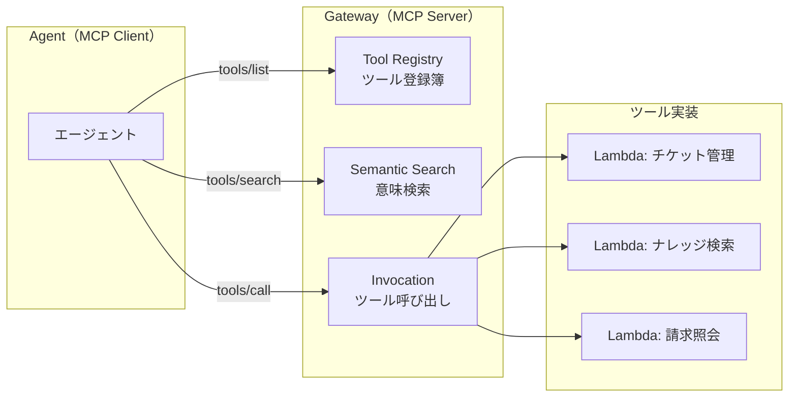
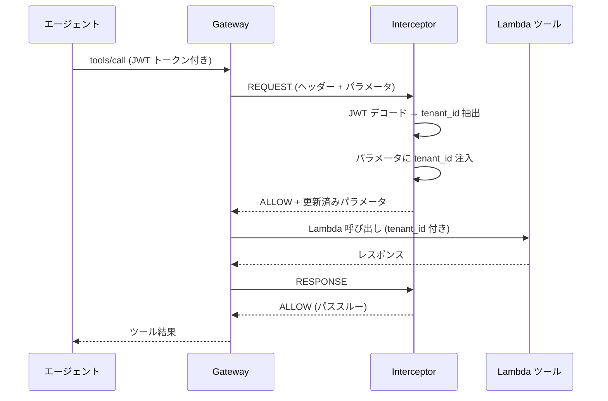
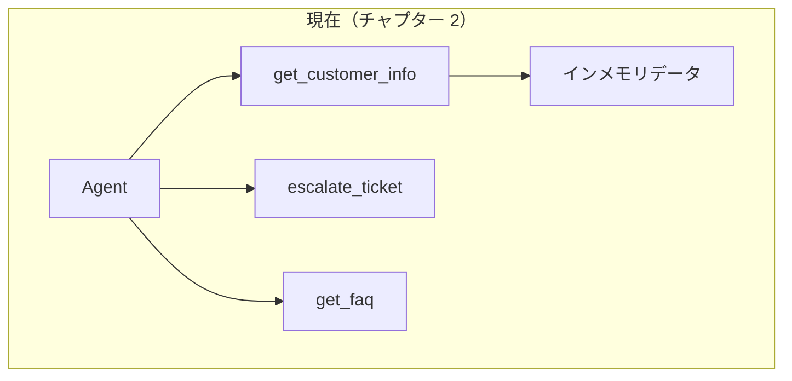
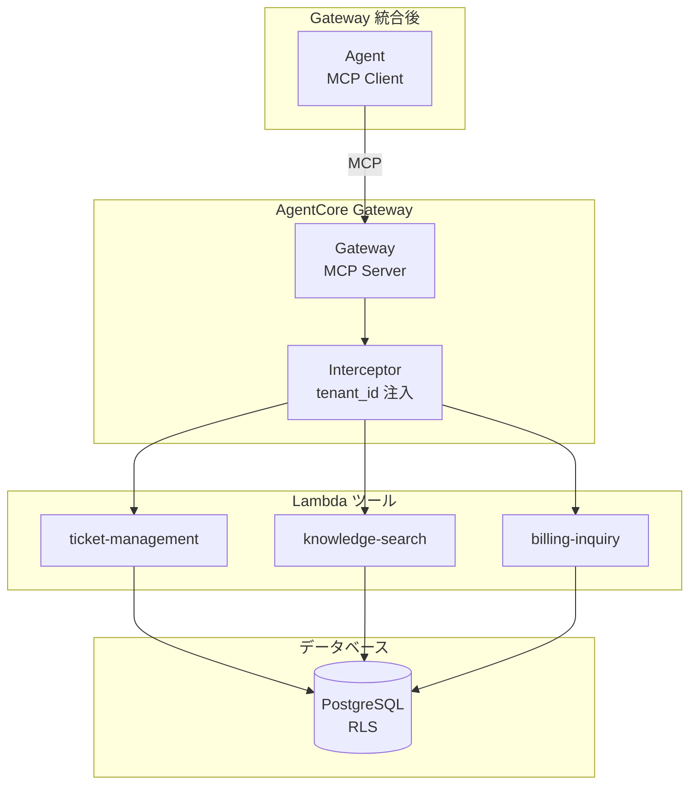
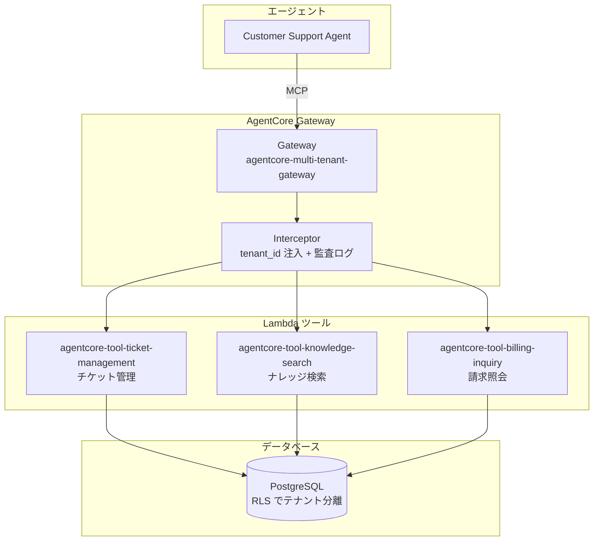

# チャプター 3: Gateway & ツール

本チャプターでは、AgentCore Gateway の概念を理解し、Lambda ツールの作成、Gateway への登録、エージェントとの統合までを行います。

## 目次

- [Gateway の基本概念](#gateway-の基本概念)
- [ステップ 1: Lambda ツールの確認](#ステップ-1-lambda-ツールの確認)
- [ステップ 2: Gateway の CDK デプロイ](#ステップ-2-gateway-の-cdk-デプロイ)
- [ステップ 3: Gateway とツールの CLI 登録](#ステップ-3-gateway-とツールの-cli-登録)
- [ステップ 4: テナントインターセプター](#ステップ-4-テナントインターセプター)
- [ステップ 5: エージェントとの統合](#ステップ-5-エージェントとの統合)
- [確認手順](#確認手順)

---

## Gateway の基本概念

### Gateway とは

AgentCore Gateway は、エージェントが利用するツール群を一元管理するコンポーネントです。**MCP（Model Context Protocol）** に準拠しており、ツールの登録・検索・呼び出しを統一的なインタフェースで行えます。

### MCP プロトコル

MCP は、LLM アプリケーションが外部ツールやデータソースに接続するための標準プロトコルです。



**MCP の主要操作:**

| 操作 | 説明 |
|------|------|
| `tools/list` | 登録済みツール一覧を取得 |
| `tools/search` | セマンティック検索でツールを検索 |
| `tools/call` | 指定したツールを実行 |

### Gateway のメリット

1. **ツールの一元管理**: 全ツールを Gateway で管理し、エージェントはツールの実装詳細を意識しない
2. **セマンティック検索**: 自然言語でツールを検索し、最適なツールを自動選択
3. **アクセス制御**: テナントごとにアクセス可能なツールを制限
4. **バージョン管理**: ツールの更新をエージェントに影響なく実施

---

## ステップ 1: Lambda ツールの確認

カスタマーサポートに必要な 3 つの Lambda ツールが `lambda/gateway_tools/` ディレクトリに用意されています。

```
lambda/gateway_tools/
├── ticket_management/
│   └── handler.py       # チケット管理ツール
├── knowledge_search/
│   └── handler.py       # ナレッジ検索ツール
└── billing_inquiry/
    └── handler.py       # 請求照会ツール
```

### 1.1 チケット管理ツール (`lambda/gateway_tools/ticket_management/handler.py`)

サポートチケットの CRUD 操作を提供します。PostgreSQL の RLS（Row Level Security）でテナント分離を実現しています。

```python
def lambda_handler(event, context):
    """AWS Lambda handler for ticket management gateway tool."""
    action = event.get("action", "")
    params = event.get("parameters", {})
    tenant_id = params.get("tenant_id", "")

    if not tenant_id:
        return {"statusCode": 400, "body": json.dumps({"error": "tenant_id is required."})}

    if action == "list_tickets":
        result = list_tickets(tenant_id=tenant_id, status_filter=params.get("status_filter"))
    elif action == "get_ticket":
        result = get_ticket(tenant_id=tenant_id, ticket_id=params.get("ticket_id"))
    elif action == "create_ticket":
        result = create_ticket(
            tenant_id=tenant_id, subject=params.get("subject"),
            description=params.get("description", ""),
            priority=params.get("priority", "medium"),
            category=params.get("category", "general"),
        )
    elif action == "update_ticket":
        result = update_ticket(
            tenant_id=tenant_id, ticket_id=params.get("ticket_id"),
            status=params.get("status"), resolution=params.get("resolution"),
        )
    ...
```

全ての操作で `set_tenant_context(cursor, tenant_id)` を呼び出し、PostgreSQL の RLS で自動的にテナントデータの分離が行われます。

```python
def set_tenant_context(cursor, tenant_id: str):
    """Set the current tenant for Row Level Security."""
    cursor.execute("SET app.current_tenant_id = %s", (tenant_id,))
```

**サポートするアクション:**

| アクション | 説明 | 必須パラメータ |
|-----------|------|--------------|
| `list_tickets` | チケット一覧の取得 | `tenant_id` |
| `get_ticket` | チケット詳細の取得 | `tenant_id`, `ticket_id` |
| `create_ticket` | チケットの新規作成 | `tenant_id`, `subject` |
| `update_ticket` | チケットの更新 | `tenant_id`, `ticket_id` |

### 1.2 ナレッジ検索ツール (`lambda/gateway_tools/knowledge_search/handler.py`)

PostgreSQL の全文検索を使用して、テナント固有の FAQ やナレッジ記事を検索します。

```python
def search_articles(tenant_id: str, query: str, category: str = None, limit: int = 10) -> dict:
    """Search knowledge articles using PostgreSQL full-text search."""
    conn = get_connection()
    try:
        with conn.cursor(cursor_factory=RealDictCursor) as cur:
            set_tenant_context(cur, tenant_id)
            if query:
                sql = """
                    SELECT article_id, title, content, category, tags,
                           ts_rank(search_vector, plainto_tsquery('simple', %s)) AS relevance
                    FROM knowledge_articles
                    WHERE search_vector @@ plainto_tsquery('simple', %s)
                """
                ...
```

**サポートするアクション:**

| アクション | 説明 | 必須パラメータ |
|-----------|------|--------------|
| `search_articles` | 記事の検索 | `tenant_id` |
| `get_article` | 記事詳細の取得 | `tenant_id`, `article_id` |

### 1.3 請求照会ツール (`lambda/gateway_tools/billing_inquiry/handler.py`)

テナントの請求情報取得、返金処理、請求書履歴の照会を行います。テナントのプランに応じた返金上限チェック機能も備えています。

```python
# テナントプランごとの返金上限
REFUND_LIMITS = {
    "starter": Decimal("100.00"),
    "professional": Decimal("500.00"),
    "enterprise": Decimal("5000.00"),
}
```

**サポートするアクション:**

| アクション | 説明 | 必須パラメータ |
|-----------|------|--------------|
| `get_billing_info` | 請求情報の取得 | `tenant_id`, `customer_id` |
| `process_refund` | 返金処理 | `tenant_id`, `customer_id`, `amount`, `reason` |
| `get_invoice_history` | 請求書履歴の取得 | `tenant_id`, `customer_id` |

---

## ステップ 2: Gateway の CDK デプロイ

Lambda ツールと Gateway を CDK でデプロイします。CDK スタックは `cdk/stacks/gateway_stack.py` に定義されています。

### 2.1 CDK スタックの構造

`cdk/stacks/gateway_stack.py` の `GatewayStack` クラスは、以下のリソースを作成します。

```python
class GatewayStack(Stack):
    """AgentCore Gateway with tool Lambda targets and interceptor."""

    def __init__(self, scope, construct_id, vpc, lambda_security_group,
                 db_cluster_arn, db_secret_arn, user_pool_arn, service_role_arn, **kwargs):
        super().__init__(scope, construct_id, **kwargs)

        # 1. チケット管理 Lambda
        self.ticket_management_lambda = lambda_.Function(
            self, "TicketManagementLambda",
            function_name="agentcore-tool-ticket-management",
            ...
        )

        # 2. ナレッジ検索 Lambda
        self.knowledge_search_lambda = lambda_.Function(
            self, "KnowledgeSearchLambda",
            function_name="agentcore-tool-knowledge-search",
            ...
        )

        # 3. 請求照会 Lambda
        self.billing_inquiry_lambda = lambda_.Function(
            self, "BillingInquiryLambda",
            function_name="agentcore-tool-billing-inquiry",
            ...
        )

        # 4. インターセプター Lambda
        self.interceptor_lambda = lambda_.Function(
            self, "InterceptorLambda",
            function_name="agentcore-gateway-interceptor",
            ...
        )
```

スタックは以下の依存リソースを受け取ります:
- `vpc` / `lambda_security_group` -- Lambda の VPC 配置
- `db_cluster_arn` / `db_secret_arn` -- RDS Data API アクセス用
- `user_pool_arn` -- Cognito ユーザープール（JWT 検証用）
- `service_role_arn` -- Gateway のサービスロール

### 2.2 Gateway カスタムリソース

CDK L2 コンストラクトが存在しないため、`CustomResource` を使用して boto3 の `bedrock-agentcore` API 経由で Gateway を作成しています。

```python
# Gateway の作成
self.gateway_resource = CustomResource(
    self, "AgentCoreGateway",
    service_token=gateway_cr_lambda.function_arn,
    properties={
        "GatewayName": "agentcore-multi-tenant-gateway",
        "Description": "Multi-tenant SaaS customer support gateway",
        ...
    },
)
```

### 2.3 Gateway ターゲットの登録

各 Lambda ツールを Gateway ターゲットとして登録します。

```python
ticket_target = CustomResource(
    self, "TicketManagementTarget",
    service_token=target_cr_lambda.function_arn,
    properties={
        "GatewayId": self.gateway_id,
        "TargetName": "ticket-management",
        "Description": "Manage support tickets: list, create, update, get ticket details",
        "LambdaArn": self.ticket_management_lambda.function_arn,
    },
)
```

同様に `knowledge-search` と `billing-inquiry` のターゲットも登録されます。

### 2.4 CDK デプロイの実行

```bash
cd cdk
pip install -r requirements.txt
cdk synth   # テンプレートの確認
cdk deploy GatewayStack  # デプロイ
```

デプロイが完了すると、以下のリソースが作成されます:
- 3 つの Lambda 関数（チケット管理、ナレッジ検索、請求照会）
- インターセプター Lambda
- AgentCore Gateway とターゲット

デプロイ結果の出力で Gateway ID を確認します。

```bash
# デプロイ出力の確認
aws cloudformation describe-stacks \
  --stack-name GatewayStack \
  --query "Stacks[0].Outputs" \
  --output table
```

---

## ステップ 3: Gateway とツールの CLI 登録

CDK でのデプロイに加えて、`agentcore` CLI を使用して Gateway やターゲットを管理することもできます。

### 3.1 Gateway の作成（CLI）

```bash
agentcore create_mcp_gateway
```

対話式プロンプトに従って Gateway の設定を行います。

### 3.2 Gateway ターゲットの追加（CLI）

```bash
agentcore create_mcp_gateway_target
```

Lambda ARN を指定してツールをターゲットとして登録します。

### 3.3 Gateway の状態確認

```bash
agentcore gateway
```

登録された Gateway とターゲットの一覧が表示されます。

---

## ステップ 4: テナントインターセプター

Gateway を経由するすべてのツール呼び出しに対して、テナントコンテキストを自動的に注入するインターセプターが `lambda/interceptors/tenant_interceptor/handler.py` に実装されています。

### 4.1 インターセプターの仕組み



### 4.2 インターセプターのコード

```python
def lambda_handler(event, context):
    """
    AgentCore Gateway Interceptor.
    - On REQUEST: extracts tenant_id from JWT and injects into tool parameters
    - On RESPONSE: can modify/filter the tool response if needed
    """
    direction = event.get("direction", "REQUEST")
    tenant_info = extract_tenant_from_event(event)
    tenant_id = tenant_info.get("tenant_id", "")

    if direction == "REQUEST":
        # テナントコンテキストがなければ拒否
        if not tenant_id:
            return {"statusCode": 403, "action": "DENY", ...}

        # ツールのパラメータに tenant_id を注入
        parameters = event.get("parameters", {})
        parameters["tenant_id"] = tenant_id

        return {
            "statusCode": 200,
            "action": "ALLOW",
            "parameters": parameters,
            "sessionAttributes": session_attrs,
        }

    elif direction == "RESPONSE":
        # レスポンスのパススルー（必要に応じてフィルタリング可能）
        return {"statusCode": 200, "action": "ALLOW", "responseBody": response_body}
```

### 4.3 テナント情報の抽出元

インターセプターは以下の優先順位でテナント情報を抽出します:

1. **セッション属性** (`sessionAttributes.tenantId`) -- AgentCore が事前に抽出したもの
2. **Cognito 認証クレーム** (`requestContext.authorizer.claims.custom:tenantId`)
3. **Authorization ヘッダーの JWT** -- Bearer トークンをデコードして抽出

### 4.4 監査ログ

すべてのインターセプター呼び出しで監査ログが出力されます。

```python
def log_audit_event(tenant_info: dict, event: dict, direction: str):
    """Log tenant context for audit trail."""
    audit_entry = {
        "timestamp": datetime.now(timezone.utc).isoformat(),
        "direction": direction,
        "tenant_id": tenant_info.get("tenant_id", "unknown"),
        "action": event.get("action", "unknown"),
        "tool_name": event.get("toolName", "unknown"),
    }
    logger.info(f"AUDIT: {json.dumps(audit_entry)}")
```

---

## ステップ 5: エージェントとの統合

Gateway のツールをエージェントに統合します。チャプター 2 で確認したエージェント (`agents/customer_support/src/main.py`) は現在ローカルのツール（`get_customer_info`, `escalate_ticket`, `get_faq`）を使用しています。後続のチャプターでは、これらを Gateway 経由のツールに置き換えていきます。

### 5.1 現在のアーキテクチャ



### 5.2 Gateway 統合後のアーキテクチャ



### 5.3 ローカルテストで Gateway 統合を確認

Gateway デプロイ後、エージェントを再デプロイしてテストします。

```bash
cd agents/customer_support
agentcore dev
```

別ターミナルから Gateway 経由のツール呼び出しをテストします。

```bash
# テナント A: チケットの確認
curl -X POST http://localhost:8080/invoke \
  -H "Content-Type: application/json" \
  -d '{
    "prompt": "オープン中のチケットを一覧表示してください",
    "sessionAttributes": {
      "tenantId": "tenant-a",
      "tenantName": "Acme Corp",
      "tenantPlan": "enterprise"
    }
  }'

# テナント B: ナレッジ検索
curl -X POST http://localhost:8080/invoke \
  -H "Content-Type: application/json" \
  -d '{
    "prompt": "API のレート制限について教えてください",
    "sessionAttributes": {
      "tenantId": "tenant-b",
      "tenantName": "GlobalTech",
      "tenantPlan": "professional"
    }
  }'
```

### 5.4 再デプロイ

テストが成功したら Runtime に再デプロイします。

```bash
cd agents/customer_support
agentcore deploy
```

デプロイ後の状態を確認します。

```bash
agentcore status
```

---

## 確認手順

本チャプターで実施した内容を振り返ります。

### チェックリスト

- [ ] `lambda/gateway_tools/` 配下の 3 つの Lambda ツール（チケット管理、ナレッジ検索、請求照会）のコードを確認した
- [ ] 各ツールが RLS（`set_tenant_context`）でテナント分離を行っていることを理解した
- [ ] `cdk/stacks/gateway_stack.py` の `GatewayStack` の構成を確認した
- [ ] CDK で Lambda ツールと Gateway をデプロイした
- [ ] `agentcore gateway` で Gateway の状態を確認した
- [ ] `lambda/interceptors/tenant_interceptor/handler.py` のインターセプターの仕組みを理解した
- [ ] テナント A / B それぞれで適切にデータが分離されることを確認した
- [ ] Gateway 統合版エージェントを Runtime に再デプロイした

### トラブルシューティング

| 問題 | 対処方法 |
|------|---------|
| CDK デプロイが失敗する | CDK ブートストラップが完了しているか確認。`cdk bootstrap` を再実行 |
| Lambda 呼び出しでエラー | Lambda の実行ロールに `rds-data:ExecuteStatement` と `secretsmanager:GetSecretValue` 権限があるか確認 |
| Gateway 作成が失敗する | `BedrockAgentCoreFullAccess` ポリシーがアタッチされているか確認 |
| テナント分離が機能しない | インターセプターが `tenant_id` をパラメータに注入しているか CloudWatch ログで確認 |
| RLS が効かない | PostgreSQL でテナント用の RLS ポリシーが設定されているか確認 |
| `agentcore gateway` でエラー | AWS 認証情報が正しく設定されているか確認 |

### アーキテクチャの振り返り

本チャプターで構築した構成を図で確認します。



### 次のステップ

Gateway とツールの統合が完了しました。以降のチャプターでは、Memory によるテナント別会話履歴管理、Identity / Policy によるテナント分離の強化、Observability によるモニタリングを実装していきます。
