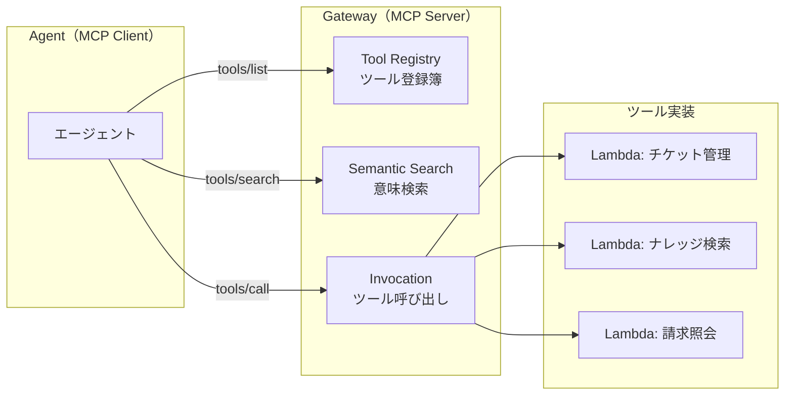
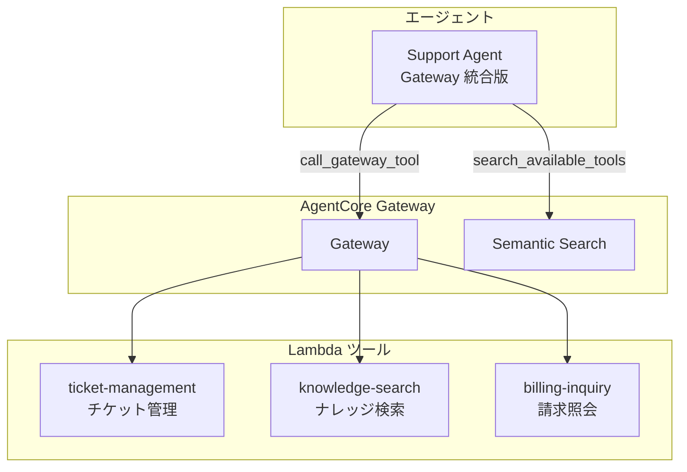

# チャプター 03: Gateway & ツール

本チャプターでは、AgentCore Gateway の概念を理解し、Lambda ツールの作成、Gateway への登録、セマンティック検索、エージェントとの統合までを行います。

## 目次

- [Gateway の基本概念](#gateway-の基本概念)
- [ステップ 1: Lambda ツールの作成](#ステップ-1-lambda-ツールの作成)
- [ステップ 2: Gateway の CDK デプロイ](#ステップ-2-gateway-の-cdk-デプロイ)
- [ステップ 3: セマンティック検索の確認](#ステップ-3-セマンティック検索の確認)
- [ステップ 4: エージェントとの統合](#ステップ-4-エージェントとの統合)
- [確認手順](#確認手順)

---

## Gateway の基本概念

### Gateway とは

AgentCore Gateway は、エージェントが利用するツール群を一元管理するコンポーネントです。**MCP（Model Context Protocol）** に準拠しており、ツールの登録・検索・呼び出しを統一的なインタフェースで行えます。

### MCP プロトコル

MCP は、LLM アプリケーションが外部ツールやデータソースに接続するための標準プロトコルです。



**MCP の主要操作:**

| 操作 | 説明 |
|------|------|
| `tools/list` | 登録済みツール一覧を取得 |
| `tools/search` | セマンティック検索でツールを検索 |
| `tools/call` | 指定したツールを実行 |

### Gateway のメリット

1. **ツールの一元管理**: 全ツールを Gateway で管理し、エージェントはツールの実装詳細を意識しない
2. **セマンティック検索**: 自然言語でツールを検索し、最適なツールを自動選択
3. **アクセス制御**: テナントごとにアクセス可能なツールを制限
4. **バージョン管理**: ツールの更新をエージェントに影響なく実施

---

## ステップ 1: Lambda ツールの作成

カスタマーサポートに必要な 3 つの Lambda ツールを作成します。

### 1.1 チケット管理ツール

`lambda/ticket_management/handler.py` を作成します。

```python
"""
チケット管理ツール
顧客の問い合わせチケットの作成・検索・更新を行う
"""

import json
from datetime import datetime


# 簡易的なインメモリデータストア（本番では DynamoDB 等を使用）
TICKETS = {
    "TKT-001": {
        "ticket_id": "TKT-001",
        "tenant_id": "tenant-a",
        "customer_name": "田中太郎",
        "subject": "商品の返品について",
        "status": "open",
        "priority": "medium",
        "created_at": "2026-03-20T10:00:00Z",
        "messages": [
            {"role": "customer", "content": "注文した商品を返品したいです", "timestamp": "2026-03-20T10:00:00Z"},
        ],
    },
    "TKT-002": {
        "ticket_id": "TKT-002",
        "tenant_id": "tenant-a",
        "customer_name": "佐藤花子",
        "subject": "配送状況の確認",
        "status": "in_progress",
        "priority": "high",
        "created_at": "2026-03-21T14:30:00Z",
        "messages": [
            {"role": "customer", "content": "注文した商品がまだ届きません", "timestamp": "2026-03-21T14:30:00Z"},
        ],
    },
    "TKT-003": {
        "ticket_id": "TKT-003",
        "tenant_id": "tenant-b",
        "customer_name": "鈴木一郎",
        "subject": "API エラーの調査依頼",
        "status": "open",
        "priority": "critical",
        "created_at": "2026-03-22T09:15:00Z",
        "messages": [
            {"role": "customer", "content": "API から 500 エラーが返されます", "timestamp": "2026-03-22T09:15:00Z"},
        ],
    },
}


def lambda_handler(event, context):
    """
    Lambda ハンドラー

    サポートされるアクション:
    - get_ticket: チケット ID でチケットを取得
    - list_tickets: テナントのチケット一覧を取得
    - create_ticket: 新規チケットを作成
    - update_ticket_status: チケットのステータスを更新
    """
    body = json.loads(event.get("body", "{}")) if isinstance(event.get("body"), str) else event
    action = body.get("action", "")
    tenant_id = body.get("tenant_id", "")

    if action == "get_ticket":
        return get_ticket(body.get("ticket_id", ""), tenant_id)

    elif action == "list_tickets":
        return list_tickets(tenant_id, body.get("status", None))

    elif action == "create_ticket":
        return create_ticket(
            tenant_id=tenant_id,
            customer_name=body.get("customer_name", ""),
            subject=body.get("subject", ""),
            message=body.get("message", ""),
            priority=body.get("priority", "medium"),
        )

    elif action == "update_ticket_status":
        return update_ticket_status(
            ticket_id=body.get("ticket_id", ""),
            tenant_id=tenant_id,
            new_status=body.get("status", ""),
        )

    else:
        return _response(400, {"error": f"Unknown action: {action}"})


def get_ticket(ticket_id: str, tenant_id: str) -> dict:
    """チケット ID とテナント ID でチケットを取得"""
    ticket = TICKETS.get(ticket_id)
    if not ticket:
        return _response(404, {"error": f"Ticket {ticket_id} not found"})

    # テナント分離: 他テナントのチケットにはアクセス不可
    if ticket["tenant_id"] != tenant_id:
        return _response(403, {"error": "Access denied: ticket belongs to another tenant"})

    return _response(200, ticket)


def list_tickets(tenant_id: str, status: str | None = None) -> dict:
    """テナントのチケット一覧を取得"""
    tickets = [t for t in TICKETS.values() if t["tenant_id"] == tenant_id]

    if status:
        tickets = [t for t in tickets if t["status"] == status]

    return _response(200, {"tickets": tickets, "count": len(tickets)})


def create_ticket(
    tenant_id: str,
    customer_name: str,
    subject: str,
    message: str,
    priority: str,
) -> dict:
    """新規チケットを作成"""
    ticket_id = f"TKT-{len(TICKETS) + 1:03d}"
    now = datetime.utcnow().isoformat() + "Z"

    ticket = {
        "ticket_id": ticket_id,
        "tenant_id": tenant_id,
        "customer_name": customer_name,
        "subject": subject,
        "status": "open",
        "priority": priority,
        "created_at": now,
        "messages": [
            {"role": "customer", "content": message, "timestamp": now},
        ],
    }

    TICKETS[ticket_id] = ticket
    return _response(201, ticket)


def update_ticket_status(ticket_id: str, tenant_id: str, new_status: str) -> dict:
    """チケットのステータスを更新"""
    valid_statuses = ["open", "in_progress", "resolved", "closed"]

    if new_status not in valid_statuses:
        return _response(400, {"error": f"Invalid status. Must be one of: {valid_statuses}"})

    ticket = TICKETS.get(ticket_id)
    if not ticket:
        return _response(404, {"error": f"Ticket {ticket_id} not found"})

    if ticket["tenant_id"] != tenant_id:
        return _response(403, {"error": "Access denied: ticket belongs to another tenant"})

    ticket["status"] = new_status
    return _response(200, {"message": f"Ticket {ticket_id} updated to {new_status}", "ticket": ticket})


def _response(status_code: int, body: dict) -> dict:
    """HTTP レスポンスを生成"""
    return {
        "statusCode": status_code,
        "headers": {"Content-Type": "application/json"},
        "body": json.dumps(body, ensure_ascii=False, default=str),
    }
```

### 1.2 ナレッジ検索ツール

`lambda/knowledge_search/handler.py` を作成します。

```python
"""
ナレッジ検索ツール
テナント固有のナレッジベースから情報を検索する
"""

import json

# テナントごとのナレッジベース（簡易版）
KNOWLEDGE_BASE = {
    "tenant-a": [
        {
            "id": "KB-A-001",
            "title": "返品ポリシー",
            "category": "返品・交換",
            "content": "商品到着後 30 日以内であれば、未使用・未開封の商品に限り返品を受け付けます。返品送料は不良品の場合は弊社負担、お客様都合の場合はお客様負担となります。返金は返品商品の到着後 5 営業日以内にご登録のお支払い方法に返金いたします。",
        },
        {
            "id": "KB-A-002",
            "title": "配送について",
            "category": "配送",
            "content": "通常配送は 3-5 営業日、お急ぎ便は翌日到着です。お急ぎ便は追加料金 500 円が発生します。配送状況は注文確認メールに記載のトラッキング番号で確認できます。離島・一部地域は追加日数がかかる場合があります。",
        },
        {
            "id": "KB-A-003",
            "title": "支払い方法",
            "category": "支払い",
            "content": "クレジットカード（Visa, Mastercard, JCB, AMEX）、デビットカード、コンビニ払い（セブン-イレブン、ローソン、ファミリーマート）、銀行振込に対応しています。分割払いはクレジットカードのみ対応（3回、6回、12回）。",
        },
    ],
    "tenant-b": [
        {
            "id": "KB-B-001",
            "title": "API レート制限",
            "category": "技術ドキュメント",
            "content": "API のレート制限は、Free プランで 100 リクエスト/分、Pro プランで 1,000 リクエスト/分、Enterprise プランで 10,000 リクエスト/分です。レート制限に達した場合、HTTP 429 エラーが返されます。Retry-After ヘッダーの値（秒）だけ待ってからリトライしてください。",
        },
        {
            "id": "KB-B-002",
            "title": "SDK セットアップガイド",
            "category": "技術ドキュメント",
            "content": "Python SDK は pip install our-service-sdk でインストールできます。初期化時に API キーが必要です。API キーはダッシュボードの「設定」>「API キー」から取得できます。環境変数 OUR_SERVICE_API_KEY に設定することを推奨します。",
        },
        {
            "id": "KB-B-003",
            "title": "プランと料金",
            "category": "請求",
            "content": "Free プラン: 無料（月 1,000 リクエストまで）。Pro プラン: 月額 9,800 円（月 100,000 リクエストまで）。Enterprise プラン: 個別見積もり。年払いの場合は 20% 割引が適用されます。プラン変更はダッシュボードからいつでも可能です。",
        },
    ],
}


def lambda_handler(event, context):
    """
    Lambda ハンドラー

    サポートされるアクション:
    - search: キーワードでナレッジを検索
    - get_article: 記事 ID で記事を取得
    - list_categories: カテゴリ一覧を取得
    """
    body = json.loads(event.get("body", "{}")) if isinstance(event.get("body"), str) else event
    action = body.get("action", "search")
    tenant_id = body.get("tenant_id", "")

    if action == "search":
        return search_knowledge(
            tenant_id=tenant_id,
            query=body.get("query", ""),
            category=body.get("category", None),
        )

    elif action == "get_article":
        return get_article(
            tenant_id=tenant_id,
            article_id=body.get("article_id", ""),
        )

    elif action == "list_categories":
        return list_categories(tenant_id=tenant_id)

    else:
        return _response(400, {"error": f"Unknown action: {action}"})


def search_knowledge(tenant_id: str, query: str, category: str | None = None) -> dict:
    """キーワードでナレッジベースを検索"""
    articles = KNOWLEDGE_BASE.get(tenant_id, [])

    if category:
        articles = [a for a in articles if a["category"] == category]

    # 簡易的なキーワードマッチ（本番ではベクトル検索を使用）
    results = []
    query_lower = query.lower()
    for article in articles:
        searchable = f"{article['title']} {article['content']}".lower()
        if any(word in searchable for word in query_lower.split()):
            results.append({
                "id": article["id"],
                "title": article["title"],
                "category": article["category"],
                "content": article["content"],
                "relevance_score": 0.85,  # 簡易スコア
            })

    return _response(200, {
        "results": results,
        "count": len(results),
        "query": query,
    })


def get_article(tenant_id: str, article_id: str) -> dict:
    """記事 ID で記事を取得"""
    articles = KNOWLEDGE_BASE.get(tenant_id, [])

    for article in articles:
        if article["id"] == article_id:
            return _response(200, article)

    return _response(404, {"error": f"Article {article_id} not found"})


def list_categories(tenant_id: str) -> dict:
    """カテゴリ一覧を取得"""
    articles = KNOWLEDGE_BASE.get(tenant_id, [])
    categories = list(set(a["category"] for a in articles))

    return _response(200, {"categories": categories})


def _response(status_code: int, body: dict) -> dict:
    """HTTP レスポンスを生成"""
    return {
        "statusCode": status_code,
        "headers": {"Content-Type": "application/json"},
        "body": json.dumps(body, ensure_ascii=False, default=str),
    }
```

### 1.3 請求照会ツール

`lambda/billing_inquiry/handler.py` を作成します。

```python
"""
請求照会ツール
テナント顧客の請求情報を照会する
"""

import json

# 簡易的な請求データ
BILLING_DATA = {
    "tenant-a": {
        "CUST-A-001": {
            "customer_id": "CUST-A-001",
            "customer_name": "田中太郎",
            "orders": [
                {"order_id": "ORD-12345", "amount": 15800, "status": "delivered", "date": "2026-03-10"},
                {"order_id": "ORD-12346", "amount": 3200, "status": "shipped", "date": "2026-03-18"},
            ],
            "total_spent": 19000,
            "payment_method": "クレジットカード（Visa **** 1234）",
        },
        "CUST-A-002": {
            "customer_id": "CUST-A-002",
            "customer_name": "佐藤花子",
            "orders": [
                {"order_id": "ORD-12400", "amount": 8900, "status": "processing", "date": "2026-03-21"},
            ],
            "total_spent": 8900,
            "payment_method": "コンビニ払い",
        },
    },
    "tenant-b": {
        "CUST-B-001": {
            "customer_id": "CUST-B-001",
            "customer_name": "鈴木一郎",
            "subscription": {
                "plan": "Pro",
                "monthly_fee": 9800,
                "billing_cycle": "monthly",
                "next_billing_date": "2026-04-01",
            },
            "invoices": [
                {"invoice_id": "INV-2026-01", "amount": 9800, "status": "paid", "date": "2026-01-01"},
                {"invoice_id": "INV-2026-02", "amount": 9800, "status": "paid", "date": "2026-02-01"},
                {"invoice_id": "INV-2026-03", "amount": 9800, "status": "paid", "date": "2026-03-01"},
            ],
            "total_spent": 29400,
            "payment_method": "クレジットカード（Mastercard **** 5678）",
        },
    },
}


def lambda_handler(event, context):
    """
    Lambda ハンドラー

    サポートされるアクション:
    - get_billing: 顧客の請求情報を取得
    - get_order: 注文詳細を取得
    - get_invoice: 請求書詳細を取得
    """
    body = json.loads(event.get("body", "{}")) if isinstance(event.get("body"), str) else event
    action = body.get("action", "")
    tenant_id = body.get("tenant_id", "")

    if action == "get_billing":
        return get_billing(
            tenant_id=tenant_id,
            customer_id=body.get("customer_id", ""),
        )

    elif action == "get_order":
        return get_order(
            tenant_id=tenant_id,
            customer_id=body.get("customer_id", ""),
            order_id=body.get("order_id", ""),
        )

    elif action == "get_invoice":
        return get_invoice(
            tenant_id=tenant_id,
            customer_id=body.get("customer_id", ""),
            invoice_id=body.get("invoice_id", ""),
        )

    else:
        return _response(400, {"error": f"Unknown action: {action}"})


def get_billing(tenant_id: str, customer_id: str) -> dict:
    """顧客の請求情報を取得"""
    tenant_data = BILLING_DATA.get(tenant_id, {})
    customer = tenant_data.get(customer_id)

    if not customer:
        return _response(404, {"error": f"Customer {customer_id} not found"})

    return _response(200, customer)


def get_order(tenant_id: str, customer_id: str, order_id: str) -> dict:
    """注文詳細を取得"""
    tenant_data = BILLING_DATA.get(tenant_id, {})
    customer = tenant_data.get(customer_id)

    if not customer:
        return _response(404, {"error": f"Customer {customer_id} not found"})

    orders = customer.get("orders", [])
    for order in orders:
        if order["order_id"] == order_id:
            return _response(200, {
                "customer_id": customer_id,
                "customer_name": customer["customer_name"],
                "order": order,
            })

    return _response(404, {"error": f"Order {order_id} not found"})


def get_invoice(tenant_id: str, customer_id: str, invoice_id: str) -> dict:
    """請求書詳細を取得"""
    tenant_data = BILLING_DATA.get(tenant_id, {})
    customer = tenant_data.get(customer_id)

    if not customer:
        return _response(404, {"error": f"Customer {customer_id} not found"})

    invoices = customer.get("invoices", [])
    for invoice in invoices:
        if invoice["invoice_id"] == invoice_id:
            return _response(200, {
                "customer_id": customer_id,
                "customer_name": customer["customer_name"],
                "invoice": invoice,
                "subscription": customer.get("subscription"),
            })

    return _response(404, {"error": f"Invoice {invoice_id} not found"})


def _response(status_code: int, body: dict) -> dict:
    """HTTP レスポンスを生成"""
    return {
        "statusCode": status_code,
        "headers": {"Content-Type": "application/json"},
        "body": json.dumps(body, ensure_ascii=False, default=str),
    }
```

---

## ステップ 2: Gateway の CDK デプロイ

Lambda ツールと Gateway を CDK でデプロイします。

### 2.1 CDK スタックの作成

`cdk/lib/gateway_stack.py` を作成します。

```python
"""
AgentCore Gateway & Lambda ツールの CDK スタック
"""

from aws_cdk import (
    Duration,
    Stack,
    aws_iam as iam,
    aws_lambda as lambda_,
)
from constructs import Construct


class GatewayToolsStack(Stack):
    def __init__(self, scope: Construct, construct_id: str, **kwargs) -> None:
        super().__init__(scope, construct_id, **kwargs)

        # Lambda 実行ロール
        lambda_role = iam.Role(
            self,
            "ToolLambdaRole",
            assumed_by=iam.ServicePrincipal("lambda.amazonaws.com"),
            managed_policies=[
                iam.ManagedPolicy.from_aws_managed_policy_name(
                    "service-role/AWSLambdaBasicExecutionRole"
                ),
            ],
        )

        # 1. チケット管理 Lambda
        self.ticket_management = lambda_.Function(
            self,
            "TicketManagement",
            function_name="ticket-management",
            runtime=lambda_.Runtime.PYTHON_3_12,
            handler="handler.lambda_handler",
            code=lambda_.Code.from_asset("../lambda/ticket_management"),
            role=lambda_role,
            timeout=Duration.seconds(30),
            memory_size=256,
            description="チケット管理ツール - 問い合わせチケットの作成・検索・更新",
        )

        # 2. ナレッジ検索 Lambda
        self.knowledge_search = lambda_.Function(
            self,
            "KnowledgeSearch",
            function_name="knowledge-search",
            runtime=lambda_.Runtime.PYTHON_3_12,
            handler="handler.lambda_handler",
            code=lambda_.Code.from_asset("../lambda/knowledge_search"),
            role=lambda_role,
            timeout=Duration.seconds(30),
            memory_size=256,
            description="ナレッジ検索ツール - FAQ やドキュメントの検索",
        )

        # 3. 請求照会 Lambda
        self.billing_inquiry = lambda_.Function(
            self,
            "BillingInquiry",
            function_name="billing-inquiry",
            runtime=lambda_.Runtime.PYTHON_3_12,
            handler="handler.lambda_handler",
            code=lambda_.Code.from_asset("../lambda/billing_inquiry"),
            role=lambda_role,
            timeout=Duration.seconds(30),
            memory_size=256,
            description="請求照会ツール - 請求情報・注文履歴の照会",
        )

        # AgentCore Gateway からの呼び出し許可
        for fn in [self.ticket_management, self.knowledge_search, self.billing_inquiry]:
            fn.grant_invoke(iam.ServicePrincipal("bedrock.amazonaws.com"))
```

### 2.2 CDK アプリケーションのエントリポイント

`cdk/app.py` を作成します。

```python
#!/usr/bin/env python3
"""CDK アプリケーションのエントリポイント"""

import aws_cdk as cdk
from lib.gateway_stack import GatewayToolsStack

app = cdk.App()

GatewayToolsStack(
    app,
    "SupportHubGatewayTools",
    env=cdk.Environment(region="us-east-1"),
    description="SupportHub - AgentCore Gateway ツール群",
)

app.synth()
```

### 2.3 CDK デプロイの実行

```bash
cd cdk
pip install aws-cdk-lib constructs
cdk synth   # テンプレートの確認
cdk deploy  # デプロイ
```

デプロイが完了すると、3 つの Lambda 関数が作成されます。

```bash
# デプロイされた Lambda の確認
aws lambda list-functions \
  --query "Functions[?starts_with(FunctionName, 'ticket') || starts_with(FunctionName, 'knowledge') || starts_with(FunctionName, 'billing')].{Name:FunctionName,Arn:FunctionArn}" \
  --output table
```

### 2.4 Gateway へのツール登録

Lambda ツールを AgentCore Gateway に登録します。

`scripts/register_tools.py` を作成します。

```python
"""
Lambda ツールを AgentCore Gateway に登録するスクリプト
"""

import boto3
import json


def register_tools():
    """3 つの Lambda ツールを Gateway に登録"""
    client = boto3.client("bedrock-agent-core", region_name="us-east-1")

    # AWS アカウント ID を取得
    sts = boto3.client("sts")
    account_id = sts.get_caller_identity()["Account"]
    region = "us-east-1"

    tools = [
        {
            "name": "ticket-management",
            "description": "カスタマーサポートのチケット管理ツールです。問い合わせチケットの作成、検索、ステータス更新ができます。顧客からの問い合わせ対応、チケットの進捗確認、エスカレーション管理に使用します。",
            "lambda_arn": f"arn:aws:lambda:{region}:{account_id}:function:ticket-management",
            "input_schema": {
                "type": "object",
                "properties": {
                    "action": {
                        "type": "string",
                        "enum": ["get_ticket", "list_tickets", "create_ticket", "update_ticket_status"],
                        "description": "実行するアクション",
                    },
                    "tenant_id": {"type": "string", "description": "テナント ID"},
                    "ticket_id": {"type": "string", "description": "チケット ID（get_ticket, update_ticket_status 時）"},
                    "customer_name": {"type": "string", "description": "顧客名（create_ticket 時）"},
                    "subject": {"type": "string", "description": "件名（create_ticket 時）"},
                    "message": {"type": "string", "description": "メッセージ（create_ticket 時）"},
                    "priority": {"type": "string", "enum": ["low", "medium", "high", "critical"], "description": "優先度"},
                    "status": {"type": "string", "enum": ["open", "in_progress", "resolved", "closed"], "description": "ステータス"},
                },
                "required": ["action", "tenant_id"],
            },
        },
        {
            "name": "knowledge-search",
            "description": "ナレッジベース検索ツールです。FAQ、ヘルプ記事、技術ドキュメントからキーワードで情報を検索します。顧客の質問に回答するための情報収集に使用します。",
            "lambda_arn": f"arn:aws:lambda:{region}:{account_id}:function:knowledge-search",
            "input_schema": {
                "type": "object",
                "properties": {
                    "action": {
                        "type": "string",
                        "enum": ["search", "get_article", "list_categories"],
                        "description": "実行するアクション",
                    },
                    "tenant_id": {"type": "string", "description": "テナント ID"},
                    "query": {"type": "string", "description": "検索クエリ（search 時）"},
                    "article_id": {"type": "string", "description": "記事 ID（get_article 時）"},
                    "category": {"type": "string", "description": "カテゴリでフィルタ（オプション）"},
                },
                "required": ["action", "tenant_id"],
            },
        },
        {
            "name": "billing-inquiry",
            "description": "請求照会ツールです。顧客の請求情報、注文履歴、請求書の詳細を照会します。支払い状況の確認や請求に関する問い合わせ対応に使用します。",
            "lambda_arn": f"arn:aws:lambda:{region}:{account_id}:function:billing-inquiry",
            "input_schema": {
                "type": "object",
                "properties": {
                    "action": {
                        "type": "string",
                        "enum": ["get_billing", "get_order", "get_invoice"],
                        "description": "実行するアクション",
                    },
                    "tenant_id": {"type": "string", "description": "テナント ID"},
                    "customer_id": {"type": "string", "description": "顧客 ID"},
                    "order_id": {"type": "string", "description": "注文 ID（get_order 時）"},
                    "invoice_id": {"type": "string", "description": "請求書 ID（get_invoice 時）"},
                },
                "required": ["action", "tenant_id", "customer_id"],
            },
        },
    ]

    # Gateway にツールを登録
    for tool_def in tools:
        print(f"ツール登録中: {tool_def['name']}...")

        response = client.create_gateway_tool(
            name=tool_def["name"],
            description=tool_def["description"],
            lambdaFunction={
                "lambdaArn": tool_def["lambda_arn"],
            },
            inputSchema={"json": json.dumps(tool_def["input_schema"])},
        )

        tool_id = response["toolId"]
        print(f"  登録完了: {tool_def['name']} (ID: {tool_id})")

    # 登録済みツール一覧の確認
    print("\n=== 登録済みツール一覧 ===")
    tools_response = client.list_gateway_tools()
    for tool in tools_response.get("tools", []):
        print(f"  - {tool['name']} (ID: {tool['toolId']})")


if __name__ == "__main__":
    register_tools()
```

### 2.5 ツール登録の実行

```bash
python scripts/register_tools.py
```

期待される出力:

```
ツール登録中: ticket-management...
  登録完了: ticket-management (ID: tool-xxxxxxxxxxxx)
ツール登録中: knowledge-search...
  登録完了: knowledge-search (ID: tool-yyyyyyyyyyyy)
ツール登録中: billing-inquiry...
  登録完了: billing-inquiry (ID: tool-zzzzzzzzzzzz)

=== 登録済みツール一覧 ===
  - ticket-management (ID: tool-xxxxxxxxxxxx)
  - knowledge-search (ID: tool-yyyyyyyyyyyy)
  - billing-inquiry (ID: tool-zzzzzzzzzzzz)
```

---

## ステップ 3: セマンティック検索の確認

Gateway のセマンティック検索機能を使って、自然言語でツールを検索します。

### 3.1 セマンティック検索のテスト

`scripts/test_semantic_search.py` を作成します。

```python
"""
Gateway のセマンティック検索をテストするスクリプト
自然言語のクエリから最適なツールを検索する
"""

import boto3
import json


def search_tools(query: str, max_results: int = 3):
    """セマンティック検索でツールを検索"""
    client = boto3.client("bedrock-agent-core", region_name="us-east-1")

    response = client.search_gateway_tools(
        query=query,
        maxResults=max_results,
    )

    return response.get("tools", [])


def main():
    test_queries = [
        "注文した商品を返品したいのですが",
        "API のレート制限について教えてください",
        "先月の請求書を確認したい",
        "チケットのステータスを更新して",
        "配送状況を知りたいです",
        "サブスクリプションのプランを変更したい",
    ]

    for query in test_queries:
        print(f"\n🔍 クエリ: 「{query}」")
        print("-" * 50)

        results = search_tools(query)

        if not results:
            print("  ツールが見つかりませんでした")
            continue

        for i, tool in enumerate(results, 1):
            print(f"  {i}. {tool['name']}")
            print(f"     スコア: {tool.get('relevanceScore', 'N/A')}")
            print(f"     説明: {tool['description'][:60]}...")


if __name__ == "__main__":
    main()
```

### 3.2 実行

```bash
python scripts/test_semantic_search.py
```

### 3.3 期待される出力

```
🔍 クエリ: 「注文した商品を返品したいのですが」
--------------------------------------------------
  1. knowledge-search
     スコア: 0.92
     説明: ナレッジベース検索ツールです。FAQ、ヘルプ記事、技術ドキュメントからキ...
  2. ticket-management
     スコア: 0.78
     説明: カスタマーサポートのチケット管理ツールです。問い合わせチケットの作成、検...

🔍 クエリ: 「先月の請求書を確認したい」
--------------------------------------------------
  1. billing-inquiry
     スコア: 0.95
     説明: 請求照会ツールです。顧客の請求情報、注文履歴、請求書の詳細を照会します...
```

セマンティック検索により、自然言語のクエリから適切なツールが高いスコアで返されることを確認してください。

---

## ステップ 4: エージェントとの統合

Gateway のツールをエージェントに統合します。チャプター 02 で作成したエージェントを更新し、ローカルのツール定義を Gateway 経由に置き換えます。

### 4.1 Gateway 統合エージェントの作成

`agents/support_agent_with_gateway.py` を作成します。

```python
"""
Gateway 統合版カスタマーサポートエージェント
ツールを AgentCore Gateway 経由で取得・実行する
"""

import json
import boto3
from strands import Agent, tool
from strands.models.bedrock import BedrockModel


# Gateway クライアント
agentcore_client = boto3.client("bedrock-agent-core", region_name="us-east-1")


@tool
def call_gateway_tool(tool_name: str, parameters: str) -> str:
    """
    AgentCore Gateway 経由でツールを呼び出すメタツール。
    利用可能なツール:
    - ticket-management: チケットの作成・検索・更新（action: get_ticket, list_tickets, create_ticket, update_ticket_status）
    - knowledge-search: ナレッジベースの検索（action: search, get_article, list_categories）
    - billing-inquiry: 請求情報の照会（action: get_billing, get_order, get_invoice）

    Args:
        tool_name: 呼び出すツール名
        parameters: ツールに渡す JSON パラメータ文字列
    """
    try:
        params = json.loads(parameters)
    except json.JSONDecodeError:
        return json.dumps({"error": "Invalid JSON parameters"}, ensure_ascii=False)

    response = agentcore_client.invoke_gateway_tool(
        toolName=tool_name,
        input=json.dumps(params),
    )

    result = json.loads(response["output"])
    return json.dumps(result, ensure_ascii=False, indent=2)


@tool
def search_available_tools(query: str) -> str:
    """
    利用可能なツールをセマンティック検索で探す。
    ユーザーの質問に対して最適なツールを見つけるために使用する。

    Args:
        query: 検索クエリ（自然言語）
    """
    response = agentcore_client.search_gateway_tools(
        query=query,
        maxResults=3,
    )

    tools = []
    for t in response.get("tools", []):
        tools.append({
            "name": t["name"],
            "description": t["description"],
            "relevance_score": t.get("relevanceScore", 0),
        })

    return json.dumps(tools, ensure_ascii=False, indent=2)


SYSTEM_PROMPT = """あなたは SupportHub のカスタマーサポートエージェントです。

## 利用可能なツール

以下のツールを使って顧客対応を行います:

1. **search_available_tools**: 顧客の質問に対して最適なツールを検索します。どのツールを使うべきか分からない場合に使用してください。
2. **call_gateway_tool**: Gateway 経由でツールを実行します。tool_name と parameters（JSON 文字列）を指定してください。

## 対応フロー

1. 顧客の問い合わせ内容を理解する
2. 必要に応じて search_available_tools で適切なツールを見つける
3. call_gateway_tool でツールを実行し、結果を取得する
4. 結果を分かりやすく顧客に伝える

## 注意事項

- 常に丁寧な日本語で応答すること
- ツール呼び出し時は必ず tenant_id を含めること
- 個人情報の取り扱いには十分注意すること
- 解決できない場合は人間のオペレーターへのエスカレーションを案内すること
"""


def create_agent_with_gateway(tenant_id: str = "tenant-a") -> Agent:
    """Gateway 統合版エージェントを作成"""
    model = BedrockModel(
        model_id="us.anthropic.claude-sonnet-4-6",
        region_name="us-east-1",
    )

    # テナント ID をシステムプロンプトに含める
    prompt = SYSTEM_PROMPT + f"\n\n## テナント情報\n現在のテナント ID: {tenant_id}"

    agent = Agent(
        model=model,
        system_prompt=prompt,
        tools=[call_gateway_tool, search_available_tools],
    )

    return agent


if __name__ == "__main__":
    # テナント A でのテスト
    print("=== テナント A ===")
    agent_a = create_agent_with_gateway("tenant-a")
    response = agent_a("注文番号 ORD-12345 の返品手続きについて教えてください")
    print(response)

    print("\n" + "=" * 50)

    # テナント B でのテスト
    print("\n=== テナント B ===")
    agent_b = create_agent_with_gateway("tenant-b")
    response = agent_b("API のレート制限について教えてください")
    print(response)
```

### 4.2 BedrockAgentCoreApp の更新

`agents/app.py` を更新して Gateway 統合版のエージェントを使用します。

```python
"""
AgentCore Runtime 用のエントリポイント（Gateway 統合版）
"""

from bedrock_agentcore.runtime import BedrockAgentCoreApp
from support_agent_with_gateway import create_agent_with_gateway

app = BedrockAgentCoreApp()


@app.handler
def handler(event: dict) -> dict:
    """Runtime からのリクエストを処理するハンドラー"""
    prompt = event.get("prompt", "")
    session_id = event.get("session_id", None)
    tenant_id = event.get("tenant_id", "tenant-a")

    print(f"[INFO] Tenant: {tenant_id}, Prompt: {prompt[:50]}...")

    # テナント ID に基づいてエージェントを作成
    agent = create_agent_with_gateway(tenant_id)

    # エージェントの実行
    response = agent(prompt)

    return {
        "response": str(response),
        "session_id": session_id,
        "tenant_id": tenant_id,
    }


if __name__ == "__main__":
    app.run()
```

### 4.3 ローカルテスト

```bash
cd agents
agentcore run
```

別ターミナルから Gateway 統合版をテストします。

```bash
# テナント A: 返品に関する問い合わせ
curl -X POST http://localhost:8080/invoke \
  -H "Content-Type: application/json" \
  -d '{
    "prompt": "チケット TKT-001 の状況を教えてください",
    "tenant_id": "tenant-a"
  }'

# テナント B: 技術サポート
curl -X POST http://localhost:8080/invoke \
  -H "Content-Type: application/json" \
  -d '{
    "prompt": "API のレート制限に引っかかっています。対処法を教えてください",
    "tenant_id": "tenant-b"
  }'

# テナント分離の確認: テナント A からテナント B のチケットにアクセス（拒否されるべき）
curl -X POST http://localhost:8080/invoke \
  -H "Content-Type: application/json" \
  -d '{
    "prompt": "チケット TKT-003 の詳細を教えてください",
    "tenant_id": "tenant-a"
  }'
```

### 4.4 再デプロイ

テストが成功したら再デプロイします。

```bash
cd agents
agentcore deploy
```

---

## 確認手順

本チャプターで実施した内容を振り返ります。

### チェックリスト

- [ ] 3 つの Lambda ツール（チケット管理、ナレッジ検索、請求照会）を作成した
- [ ] CDK で Lambda ツールをデプロイした
- [ ] Gateway にツールを登録した
- [ ] セマンティック検索で自然言語からツールを検索できることを確認した
- [ ] Gateway 統合版エージェントを作成した
- [ ] テナント A / B それぞれで適切なツールが呼び出されることを確認した
- [ ] テナント分離が機能していることを確認した（他テナントのチケットにアクセスできない）
- [ ] Gateway 統合版エージェントを Runtime に再デプロイした

### トラブルシューティング

| 問題 | 対処方法 |
|------|---------|
| CDK デプロイが失敗する | CDK ブートストラップが完了しているか確認。`cdk bootstrap` を再実行 |
| Lambda 呼び出しでエラー | Lambda の実行ロールに適切な権限があるか確認 |
| Gateway ツール登録が失敗 | `BedrockAgentCoreFullAccess` ポリシーがアタッチされているか確認 |
| セマンティック検索でツールが見つからない | ツール登録後、インデックス構築に数分かかる場合がある |
| テナント分離が機能しない | Lambda のコードで `tenant_id` のチェックが正しく実装されているか確認 |

### アーキテクチャの振り返り

本チャプターで構築した構成を図で確認します。



### 次のステップ

Gateway とツールの統合が完了しました。以降のチャプターでは、Memory によるテナント別会話履歴管理、Identity / Policy によるテナント分離の強化、Observability によるモニタリングを実装していきます。
