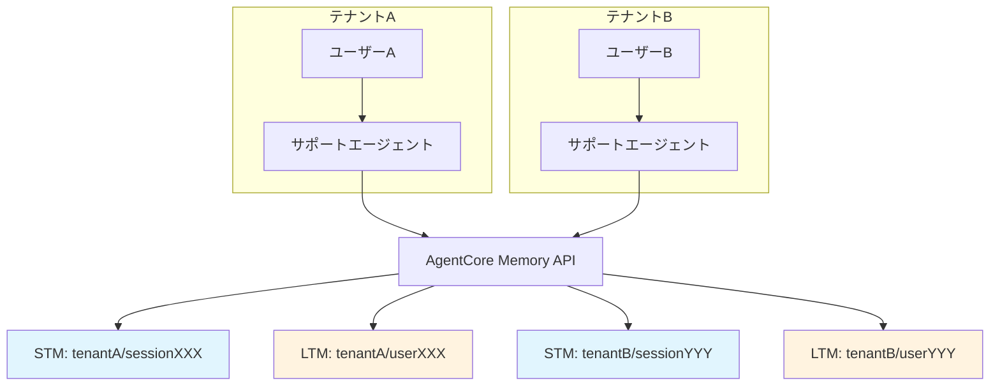
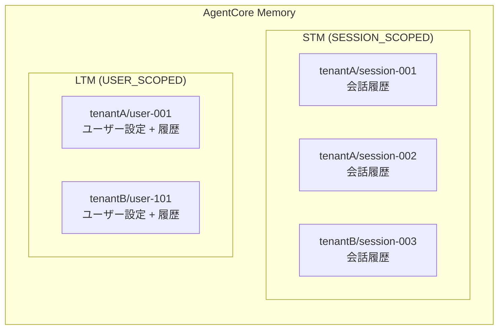

# 第4章: メモリ (短期メモリ & 長期メモリ)

## 概要

Amazon Bedrock AgentCore のメモリ機能を活用して、マルチテナント SaaS カスタマーサポートエージェントに会話コンテキストの保持とユーザー情報の永続化を実装します。

本章では以下を学びます:

- 短期メモリ (STM): セッション内の会話コンテキスト管理
- 長期メモリ (LTM): セッションをまたぐユーザー情報の永続化
- テナント分離されたメモリ名前空間の設計
- CDK による Memory リソースのプロビジョニング
- Strands Agent との統合

## アーキテクチャ



---

## 4.1 短期メモリ (Short-Term Memory)

### 短期メモリとは

短期メモリは、1つのセッション内での会話コンテキストを管理します。ユーザーが「さっき聞いた件だけど」と言った場合に、直前の会話内容を参照できるようにする仕組みです。

AgentCore の STM は **SESSION_SCOPED** として構成され、以下の2つのメモリ戦略を持ちます:

| 戦略 | 名前 | 説明 |
|---|---|---|
| semanticMemoryStrategy | `stm-semantic` | 直近の会話ターンに対するセマンティック検索 |
| summaryMemoryStrategy | `stm-summary` | 会話コンテキストのローリング要約 |

### セッションスコープの設計

マルチテナント環境では、セッションIDにテナントIDを含めることで名前空間を分離します。

```
セッションID形式: {tenantId}/{userId}/{sessionId}
例: tenant-acme/user-001/session-2026-03-23-001
```

---

## 4.2 長期メモリ (Long-Term Memory)

### 長期メモリとは

長期メモリは、セッションをまたいで永続化される情報を管理します。以下のようなデータを保存します:

| データ種別 | 例 | 用途 |
|---|---|---|
| ユーザー設定 | 言語設定、通知設定 | パーソナライズ |
| 過去の問い合わせ要約 | 「先月の請求問題は解決済み」 | コンテキスト提供 |
| ユーザー属性 | プラン種別、契約期間 | 対応方針の判断 |
| エージェント学習データ | 頻出質問パターン | 応答品質の向上 |

AgentCore の LTM は **USER_SCOPED** として構成され、以下の2つのメモリ戦略を持ちます:

| 戦略 | 名前 | 説明 |
|---|---|---|
| semanticMemoryStrategy | `ltm-semantic` | セッションをまたぐ永続的セマンティックメモリ |
| userPreferenceMemoryStrategy | `ltm-preferences` | ユーザーの好みやパターンの抽出・保存 |

---

## 4.3 agentcore CLI によるメモリの設定

### メモリモードの設定

`agentcore configure` コマンドを使い、エージェントの `.bedrock_agentcore.yaml` にメモリ設定を書き込みます。

```bash
cd agents/customer_support

# メモリ設定の対話型構成
agentcore configure
```

`agentcore configure` を実行すると、メモリモードなどの項目を対話的に設定できます。設定結果は `agents/customer_support/.bedrock_agentcore.yaml` に保存されます。

現在のデフォルト設定 (メモリ無効):

```yaml
# agents/customer_support/.bedrock_agentcore.yaml (抜粋)
memory:
  mode: NO_MEMORY
  memory_id: null
  memory_arn: null
  memory_name: null
  event_expiry_days: 30
  first_invoke_memory_check_done: false
  was_created_by_toolkit: false
```

メモリを有効化するには、`mode` を変更し、デプロイ済みのメモリ ID を設定します。

### agentcore memory コマンド

`agentcore memory` サブコマンドでメモリリソースの管理ができます。

```bash
# メモリ関連のヘルプを表示
agentcore memory --help

# メモリの一覧を表示
agentcore memory list

# メモリの詳細を表示
agentcore memory get --memory-id <memory-id>
```

---

## 4.4 CDK によるメモリリソースのプロビジョニング

このハンズオンでは、CDK カスタムリソース経由で STM と LTM のメモリ名前空間を作成します。

### MemoryStack の構成

ファイル: `cdk/stacks/memory_stack.py`

```python
# cdk/stacks/memory_stack.py (抜粋: カスタムリソース Lambda 内のメモリ作成ロジック)

client = boto3.client('bedrock-agentcore')

# Short-Term Memory (STM) の作成
stm_response = client.create_memory(
    name=props['StmName'],                     # "agentcore-mt-stm"
    description='Short-term conversation memory for active sessions',
    agentRuntimeId=props['RuntimeId'],
    memoryStrategies=[
        {
            'semanticMemoryStrategy': {
                'name': 'stm-semantic',
                'description': 'Semantic search over recent conversation turns',
                'model': 'us.anthropic.claude-sonnet-4-6',
                'namespaceConfiguration': {
                    'type': 'SESSION_SCOPED',
                },
            },
        },
        {
            'summaryMemoryStrategy': {
                'name': 'stm-summary',
                'description': 'Rolling summary of conversation context',
                'model': 'us.anthropic.claude-sonnet-4-6',
                'namespaceConfiguration': {
                    'type': 'SESSION_SCOPED',
                },
            },
        },
    ],
)

# Long-Term Memory (LTM) の作成
ltm_response = client.create_memory(
    name=props['LtmName'],                     # "agentcore-mt-ltm"
    description='Long-term memory for user preferences and knowledge',
    agentRuntimeId=props['RuntimeId'],
    memoryStrategies=[
        {
            'semanticMemoryStrategy': {
                'name': 'ltm-semantic',
                'description': 'Persistent semantic memory across sessions',
                'model': 'us.anthropic.claude-sonnet-4-6',
                'namespaceConfiguration': {
                    'type': 'USER_SCOPED',
                },
            },
        },
        {
            'userPreferenceMemoryStrategy': {
                'name': 'ltm-preferences',
                'description': 'Extracted user preferences and patterns',
                'model': 'us.anthropic.claude-sonnet-4-6',
                'namespaceConfiguration': {
                    'type': 'USER_SCOPED',
                },
            },
        },
    ],
)
```

### 主要なポイント

- **boto3 サービス名**: `bedrock-agentcore` (注意: `bedrock-agent-core` や `bedrock-agentcore-memory` ではありません)
- **モデル ID**: `us.anthropic.claude-sonnet-4-6` (メモリ戦略内でセマンティック検索・要約に使用)
- **STM 名前空間名**: `agentcore-mt-stm`
- **LTM 名前空間名**: `agentcore-mt-ltm`
- **CDK スタックの場所**: `cdk/stacks/memory_stack.py`

### デプロイ

```bash
cd cdk
cdk deploy MemoryStack
```

デプロイ後、CloudFormation の出力に STM と LTM のメモリ ID が表示されます:

| 出力キー | 説明 |
|---|---|
| `StmMemoryId` | 短期メモリ名前空間 ID |
| `LtmMemoryId` | 長期メモリ名前空間 ID |

---

## 4.5 エージェントへのメモリ統合

### エージェントコード

ファイル: `agents/customer_support/src/main.py`

エージェントのシステムプロンプトには、メモリの活用方針が明記されています:

```
5. **メモリ活用 / Memory Usage**:
   - 短期記憶で会話のコンテキストを維持してください。
   - Use short-term memory to maintain conversation context.
   - 重要な顧客の好みや過去のやり取りは長期記憶に保存してください。
   - Store important customer preferences and past interactions in long-term memory.
```

エージェントはセッション ID とユーザー ID をペイロードから取得し、テナントコンテキストと組み合わせてメモリのスコーピングに使用します:

```python
# agents/customer_support/src/main.py (抜粋)

@app.entrypoint
async def invoke(payload, context):
    session_id = getattr(context, 'session_id', 'default')
    user_id = payload.get("user_id") or 'default-user'

    # テナントコンテキストの抽出
    tenant_context = extract_tenant_context(payload)
    tenant_id = tenant_context.get("tenant_id", "unknown")
```

### .bedrock_agentcore.yaml の更新

メモリを有効化するには、デプロイ後に出力されたメモリ ID を `.bedrock_agentcore.yaml` に反映します:

```yaml
# agents/customer_support/.bedrock_agentcore.yaml (メモリ有効化後)
memory:
  mode: MEMORY_ENABLED        # NO_MEMORY から変更
  memory_id: <StmMemoryId>    # デプロイ後の出力値
  memory_arn: null
  memory_name: agentcore-mt-stm
  event_expiry_days: 30
  first_invoke_memory_check_done: false
  was_created_by_toolkit: false
```

設定の更新後、エージェントを再デプロイします:

```bash
cd agents/customer_support
agentcore deploy
```

---

## 4.6 テナント分離されたメモリ名前空間

### 名前空間設計



### メモリ戦略の種類と役割

| メモリ名前空間 | 戦略 | スコープ | 用途 |
|---|---|---|---|
| STM | semanticMemoryStrategy | SESSION_SCOPED | 直近の会話からの意味検索 |
| STM | summaryMemoryStrategy | SESSION_SCOPED | 会話のローリング要約 |
| LTM | semanticMemoryStrategy | USER_SCOPED | セッション横断の永続的知識 |
| LTM | userPreferenceMemoryStrategy | USER_SCOPED | ユーザーの好み・パターン抽出 |

### テナント分離の保証

- **SESSION_SCOPED** メモリはセッション ID にテナント ID を含むことで自動的に分離
- **USER_SCOPED** メモリはユーザー ID とテナント ID の組み合わせで分離
- Gateway Interceptor がテナント ID をリクエストに注入するため、エージェントは常に正しいテナントスコープでメモリにアクセス

---

## 4.7 検証

### ステップ 1: メモリリソースの確認

```bash
# agentcore CLI でメモリ一覧を確認
agentcore memory list
```

### ステップ 2: マルチターン会話テスト

```bash
# エージェントを起動してローカルで検証
cd agents/customer_support
agentcore dev
```

別のターミナルから会話を行います:

```bash
# 1ターン目
agentcore invoke --payload '{
  "prompt": "注文番号 ORD-12345 のステータスを教えてください",
  "user_id": "user-001"
}'

# 2ターン目 (コンテキスト保持の確認)
agentcore invoke --payload '{
  "prompt": "その注文のキャンセルはできますか？",
  "user_id": "user-001"
}'
```

2ターン目の応答が ORD-12345 に関する内容であれば、短期メモリによるコンテキスト保持が正常に機能しています。

### ステップ 3: テナント間のメモリ分離確認

テナントAのユーザーとしてメモリに情報を保存した後、テナントBのユーザーとしてアクセスし、テナントAの情報が見えないことを確認します。

```bash
# テナントAとして問い合わせ
agentcore invoke --payload '{
  "prompt": "プレミアムプランへのアップグレードについて教えてください",
  "user_id": "user-001",
  "sessionAttributes": {"tenantId": "tenant-a"}
}'

# テナントBとして同じ内容を問い合わせ (テナントAの履歴は見えない)
agentcore invoke --payload '{
  "prompt": "先ほどのアップグレードの件",
  "user_id": "user-101",
  "sessionAttributes": {"tenantId": "tenant-b"}
}'
```

テナントBの応答に「先ほどのアップグレードの件」に関するコンテキストが含まれなければ、テナント分離は正常です。

---

## まとめ

| 項目 | 短期メモリ (STM) | 長期メモリ (LTM) |
|---|---|---|
| スコープ | SESSION_SCOPED | USER_SCOPED |
| 保存期間 | セッション終了まで | 明示的削除まで永続 |
| 用途 | 会話コンテキスト保持 | ユーザー設定、履歴要約 |
| メモリ名前空間名 | `agentcore-mt-stm` | `agentcore-mt-ltm` |
| テナント分離 | セッション ID にテナント ID 含有 | ユーザー ID + テナント ID |
| メモリ戦略 | semantic + summary | semantic + userPreference |

## 主要ファイル

| ファイル | 役割 |
|---|---|
| `cdk/stacks/memory_stack.py` | メモリ名前空間の CDK プロビジョニング |
| `agents/customer_support/src/main.py` | エージェントのメモリ統合コード |
| `agents/customer_support/.bedrock_agentcore.yaml` | エージェントのメモリ設定 |

## 次のステップ

[第5章: Identity & Cognito](./05-identity.md) では、OAuth 認証フローとテナント属性を含む JWT トークンの設定を行います。
