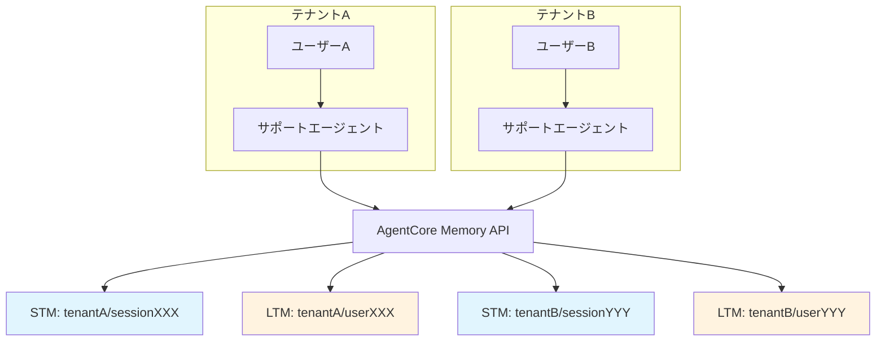
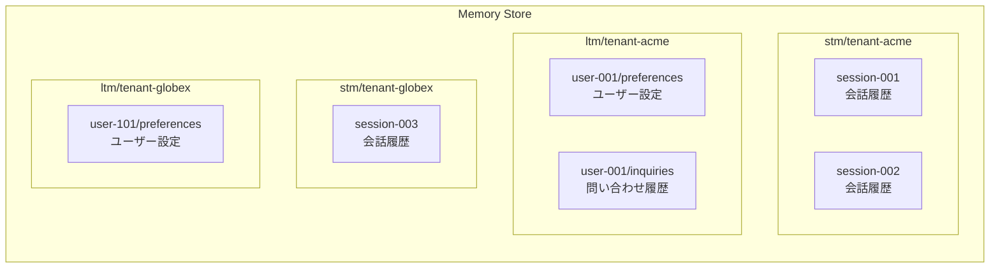

# 第3章: メモリ (短期メモリ & 長期メモリ)

## 概要

Amazon Bedrock AgentCore のメモリ機能を活用して、マルチテナント SaaS カスタマーサポートエージェントに会話コンテキストの保持とユーザー情報の永続化を実装します。

本章では以下を学びます:

- 短期メモリ (STM): セッション内の会話コンテキスト管理
- 長期メモリ (LTM): セッションをまたぐユーザー情報の永続化
- テナント分離されたメモリ名前空間の設計
- Strands Agent との統合

## アーキテクチャ



---

## 3.1 短期メモリ (Short-Term Memory)

### 短期メモリとは

短期メモリは、1つのセッション内での会話コンテキストを管理します。ユーザーが「さっき聞いた件だけど」と言った場合に、直前の会話内容を参照できるようにする仕組みです。

### セッションスコープの設計

マルチテナント環境では、セッションIDにテナントIDを含めることで名前空間を分離します。

```
セッションID形式: {tenantId}/{userId}/{sessionId}
例: tenant-acme/user-001/session-2026-03-23-001
```

### Memory Store の作成

```bash
# メモリストアの作成
aws bedrock-agentcore create-memory-store \
  --name "customer-support-memory" \
  --description "マルチテナントカスタマーサポート用メモリストア"
```

レスポンス例:

```json
{
  "memoryStoreId": "ms-xxxxxxxxxxxx",
  "name": "customer-support-memory",
  "status": "ACTIVE"
}
```

### 短期メモリの設定

```python
import boto3
import json
from datetime import datetime

# AgentCore Memory クライアントの初期化
bedrock_memory = boto3.client("bedrock-agentcore-memory")

MEMORY_STORE_ID = "ms-xxxxxxxxxxxx"  # 作成したメモリストアID


def create_session(tenant_id: str, user_id: str) -> str:
    """テナント分離されたセッションを作成する"""
    session_id = f"{tenant_id}/{user_id}/session-{datetime.now().strftime('%Y%m%d-%H%M%S')}"
    return session_id


def add_conversation_turn(
    session_id: str,
    role: str,
    content: str,
    tenant_id: str,
):
    """会話ターンを短期メモリに追加する"""
    namespace = f"stm/{tenant_id}"

    response = bedrock_memory.create_memory(
        memoryStoreId=MEMORY_STORE_ID,
        namespace=namespace,
        content={
            "sessionId": session_id,
            "role": role,
            "content": content,
            "timestamp": datetime.now().isoformat(),
        },
        ttl=3600,  # 1時間で自動削除
    )
    return response


def get_conversation_history(session_id: str, tenant_id: str) -> list:
    """セッションの会話履歴を取得する"""
    namespace = f"stm/{tenant_id}"

    response = bedrock_memory.search_memories(
        memoryStoreId=MEMORY_STORE_ID,
        namespace=namespace,
        filter={
            "sessionId": session_id,
        },
        maxResults=50,
        sortOrder="ASCENDING",
    )
    return response.get("memories", [])
```

---

## 3.2 長期メモリ (Long-Term Memory)

### 長期メモリとは

長期メモリは、セッションをまたいで永続化される情報を管理します。以下のようなデータを保存します:

| データ種別 | 例 | 用途 |
|---|---|---|
| ユーザー設定 | 言語設定、通知設定 | パーソナライズ |
| 過去の問い合わせ要約 | 「先月の請求問題は解決済み」 | コンテキスト提供 |
| ユーザー属性 | プラン種別、契約期間 | 対応方針の判断 |
| エージェント学習データ | 頻出質問パターン | 応答品質の向上 |

### 長期メモリの実装

```python
def store_user_preference(
    tenant_id: str,
    user_id: str,
    preference_key: str,
    preference_value: str,
):
    """ユーザー設定を長期メモリに保存する"""
    namespace = f"ltm/{tenant_id}"
    memory_id = f"{user_id}/preferences/{preference_key}"

    response = bedrock_memory.create_memory(
        memoryStoreId=MEMORY_STORE_ID,
        namespace=namespace,
        memoryId=memory_id,
        content={
            "userId": user_id,
            "tenantId": tenant_id,
            "type": "user_preference",
            "key": preference_key,
            "value": preference_value,
            "updatedAt": datetime.now().isoformat(),
        },
        # TTLなし = 永続保存
    )
    return response


def store_inquiry_summary(
    tenant_id: str,
    user_id: str,
    session_id: str,
    summary: str,
    resolution: str,
):
    """問い合わせ要約を長期メモリに保存する"""
    namespace = f"ltm/{tenant_id}"
    memory_id = f"{user_id}/inquiries/{session_id}"

    response = bedrock_memory.create_memory(
        memoryStoreId=MEMORY_STORE_ID,
        namespace=namespace,
        memoryId=memory_id,
        content={
            "userId": user_id,
            "tenantId": tenant_id,
            "type": "inquiry_summary",
            "sessionId": session_id,
            "summary": summary,
            "resolution": resolution,
            "createdAt": datetime.now().isoformat(),
        },
    )
    return response


def get_user_context(tenant_id: str, user_id: str) -> dict:
    """ユーザーの長期メモリからコンテキストを取得する"""
    namespace = f"ltm/{tenant_id}"

    # ユーザー設定の取得
    preferences = bedrock_memory.search_memories(
        memoryStoreId=MEMORY_STORE_ID,
        namespace=namespace,
        filter={
            "userId": user_id,
            "type": "user_preference",
        },
        maxResults=20,
    )

    # 過去の問い合わせ要約の取得 (直近5件)
    inquiries = bedrock_memory.search_memories(
        memoryStoreId=MEMORY_STORE_ID,
        namespace=namespace,
        filter={
            "userId": user_id,
            "type": "inquiry_summary",
        },
        maxResults=5,
        sortOrder="DESCENDING",
    )

    return {
        "preferences": preferences.get("memories", []),
        "recent_inquiries": inquiries.get("memories", []),
    }
```

---

## 3.3 テナント分離されたメモリ名前空間

### 名前空間設計



### 名前空間のアクセス制御

テナントAのエージェントがテナントBのメモリにアクセスできないよう、名前空間レベルで制御します。

```python
class TenantMemoryManager:
    """テナント分離を保証するメモリマネージャー"""

    def __init__(self, memory_store_id: str, tenant_id: str):
        self.memory_store_id = memory_store_id
        self.tenant_id = tenant_id
        self.client = boto3.client("bedrock-agentcore-memory")

    def _validate_namespace(self, namespace: str):
        """名前空間がこのテナントに属することを検証する"""
        allowed_prefixes = [
            f"stm/{self.tenant_id}",
            f"ltm/{self.tenant_id}",
        ]
        if not any(namespace.startswith(prefix) for prefix in allowed_prefixes):
            raise PermissionError(
                f"テナント '{self.tenant_id}' は名前空間 '{namespace}' にアクセスできません"
            )

    def create_memory(self, namespace: str, **kwargs):
        self._validate_namespace(namespace)
        return self.client.create_memory(
            memoryStoreId=self.memory_store_id,
            namespace=namespace,
            **kwargs,
        )

    def search_memories(self, namespace: str, **kwargs):
        self._validate_namespace(namespace)
        return self.client.search_memories(
            memoryStoreId=self.memory_store_id,
            namespace=namespace,
            **kwargs,
        )

    def delete_memory(self, namespace: str, memory_id: str):
        """GDPR対応: ユーザーデータの削除"""
        self._validate_namespace(namespace)
        return self.client.delete_memory(
            memoryStoreId=self.memory_store_id,
            namespace=namespace,
            memoryId=memory_id,
        )
```

---

## 3.4 Strands Agent との統合

### メモリ対応エージェントの構築

Strands Agent にメモリ機能を組み込み、会話コンテキストを自動的に管理するエージェントを構築します。

```python
# agents/customer_support/agent_with_memory.py

from strands import Agent
from strands.models.bedrock import BedrockModel
import boto3
import json

MEMORY_STORE_ID = "ms-xxxxxxxxxxxx"
bedrock_memory = boto3.client("bedrock-agentcore-memory")


def build_system_prompt_with_context(tenant_id: str, user_id: str) -> str:
    """長期メモリからユーザーコンテキストを取得してシステムプロンプトに反映する"""
    context = get_user_context(tenant_id, user_id)

    # ユーザー設定の組み立て
    pref_text = ""
    for pref in context["preferences"]:
        content = pref.get("content", {})
        pref_text += f"- {content.get('key')}: {content.get('value')}\n"

    # 過去の問い合わせ要約の組み立て
    inquiry_text = ""
    for inquiry in context["recent_inquiries"]:
        content = inquiry.get("content", {})
        inquiry_text += f"- {content.get('summary')} (結果: {content.get('resolution')})\n"

    system_prompt = f"""あなたはカスタマーサポートエージェントです。
テナント: {tenant_id}

## ユーザー情報
ユーザーID: {user_id}

## ユーザー設定
{pref_text if pref_text else "設定情報なし"}

## 過去の問い合わせ履歴
{inquiry_text if inquiry_text else "問い合わせ履歴なし"}

## 対応ガイドライン
- 丁寧で正確な対応を心がけてください
- 過去の問い合わせ履歴を踏まえた対応をしてください
- テナント固有のポリシーに従ってください
"""
    return system_prompt


class MemoryEnabledSupportAgent:
    """メモリ機能を統合したカスタマーサポートエージェント"""

    def __init__(self, tenant_id: str, user_id: str):
        self.tenant_id = tenant_id
        self.user_id = user_id
        self.session_id = create_session(tenant_id, user_id)
        self.memory_manager = TenantMemoryManager(
            MEMORY_STORE_ID, tenant_id
        )

        # システムプロンプトにユーザーコンテキストを反映
        system_prompt = build_system_prompt_with_context(tenant_id, user_id)

        # Strands Agent の初期化
        self.model = BedrockModel(
            model_id="us.anthropic.claude-sonnet-4-20250514",
            region_name="us-east-1",
        )
        self.agent = Agent(
            model=self.model,
            system_prompt=system_prompt,
        )

        # セッションの会話履歴を保持
        self.conversation_history = []

    def chat(self, user_message: str) -> str:
        """ユーザーメッセージを処理して応答を返す"""
        # 短期メモリに保存
        add_conversation_turn(
            session_id=self.session_id,
            role="user",
            content=user_message,
            tenant_id=self.tenant_id,
        )

        # 会話履歴を含めてエージェントに送信
        self.conversation_history.append({
            "role": "user",
            "content": user_message,
        })

        # エージェントの応答を取得
        response = self.agent(user_message)
        assistant_message = str(response)

        # 短期メモリに応答を保存
        add_conversation_turn(
            session_id=self.session_id,
            role="assistant",
            content=assistant_message,
            tenant_id=self.tenant_id,
        )

        self.conversation_history.append({
            "role": "assistant",
            "content": assistant_message,
        })

        return assistant_message

    def end_session(self, summary: str = None, resolution: str = None):
        """セッション終了時に長期メモリへ要約を保存する"""
        if summary:
            store_inquiry_summary(
                tenant_id=self.tenant_id,
                user_id=self.user_id,
                session_id=self.session_id,
                summary=summary,
                resolution=resolution or "未解決",
            )
```

### エージェントの使用例

```python
# テナントAのユーザーがサポートに問い合わせ
agent = MemoryEnabledSupportAgent(
    tenant_id="tenant-acme",
    user_id="user-001",
)

# 1ターン目
response1 = agent.chat("先月の請求書について質問があります")
print(response1)

# 2ターン目 (前の会話コンテキストを保持)
response2 = agent.chat("その件で、返金は可能ですか？")
print(response2)

# 3ターン目
response3 = agent.chat("わかりました。ありがとうございます")
print(response3)

# セッション終了時に要約を長期メモリに保存
agent.end_session(
    summary="先月の請求書に関する問い合わせ。返金手続きについて案内済み。",
    resolution="解決済み",
)
```

---

## 3.5 検証: マルチターン会話コンテキスト保持テスト

### テスト1: セッション内コンテキスト保持

```python
# tests/test_memory_context.py

def test_short_term_memory_context():
    """短期メモリによる会話コンテキスト保持をテストする"""
    agent = MemoryEnabledSupportAgent(
        tenant_id="tenant-acme",
        user_id="user-test-001",
    )

    # 1ターン目: 具体的な情報を伝える
    response1 = agent.chat("注文番号 ORD-12345 のステータスを教えてください")
    print(f"[1ターン目] {response1}")

    # 2ターン目: 代名詞で参照 (コンテキスト保持の確認)
    response2 = agent.chat("その注文のキャンセルはできますか？")
    print(f"[2ターン目] {response2}")

    # 検証: 2ターン目の応答が ORD-12345 に関する内容であること
    assert "ORD-12345" in response2 or "注文" in response2, \
        "コンテキストが保持されていません"

    # 3ターン目: さらに続けて参照
    response3 = agent.chat("キャンセル後の返金はいつ頃になりますか？")
    print(f"[3ターン目] {response3}")

    print("短期メモリテスト: PASSED")
```

### テスト2: セッション間の長期メモリ保持

```python
def test_long_term_memory_persistence():
    """長期メモリによるセッション間の情報保持をテストする"""
    tenant_id = "tenant-acme"
    user_id = "user-test-002"

    # --- セッション1 ---
    agent1 = MemoryEnabledSupportAgent(
        tenant_id=tenant_id,
        user_id=user_id,
    )

    # ユーザー設定を保存
    store_user_preference(
        tenant_id=tenant_id,
        user_id=user_id,
        preference_key="preferred_language",
        preference_value="ja",
    )

    agent1.chat("プレミアムプランへのアップグレードについて教えてください")
    agent1.end_session(
        summary="プレミアムプランへのアップグレード方法を案内。検討中。",
        resolution="対応中",
    )

    # --- セッション2 (新しいセッション) ---
    agent2 = MemoryEnabledSupportAgent(
        tenant_id=tenant_id,
        user_id=user_id,
    )

    # 長期メモリから前回の問い合わせ情報が反映されていることを確認
    context = get_user_context(tenant_id, user_id)
    assert len(context["recent_inquiries"]) > 0, \
        "過去の問い合わせ履歴が保存されていません"
    assert context["preferences"][0]["content"]["value"] == "ja", \
        "ユーザー設定が保存されていません"

    response = agent2.chat("先日のアップグレードの件ですが、決めました")
    print(f"[セッション2] {response}")

    print("長期メモリテスト: PASSED")
```

### テスト3: テナント分離の検証

```python
def test_tenant_memory_isolation():
    """異なるテナント間でメモリが分離されていることをテストする"""

    # テナントAのメモリマネージャー
    manager_a = TenantMemoryManager(MEMORY_STORE_ID, "tenant-acme")

    # テナントBのメモリマネージャー
    manager_b = TenantMemoryManager(MEMORY_STORE_ID, "tenant-globex")

    # テナントAがデータを保存
    manager_a.create_memory(
        namespace="ltm/tenant-acme",
        memoryId="user-001/test",
        content={"data": "テナントAの機密データ"},
    )

    # テナントBがテナントAの名前空間にアクセスを試みる
    try:
        manager_b.search_memories(
            namespace="ltm/tenant-acme",  # テナントAの名前空間
            filter={"userId": "user-001"},
        )
        assert False, "テナント分離が機能していません！"
    except PermissionError as e:
        print(f"期待通りアクセス拒否: {e}")

    print("テナント分離テスト: PASSED")
```

### テスト実行

```bash
# テストの実行
cd /path/to/project
python -m pytest tests/test_memory_context.py -v

# 出力例:
# tests/test_memory_context.py::test_short_term_memory_context PASSED
# tests/test_memory_context.py::test_long_term_memory_persistence PASSED
# tests/test_memory_context.py::test_tenant_memory_isolation PASSED
```

---

## まとめ

| 項目 | 短期メモリ (STM) | 長期メモリ (LTM) |
|---|---|---|
| スコープ | セッション内 | セッション間 |
| 保存期間 | TTLで自動削除 (例: 1時間) | 永続 (明示的削除まで) |
| 用途 | 会話コンテキスト保持 | ユーザー設定、履歴要約 |
| 名前空間 | `stm/{tenantId}` | `ltm/{tenantId}` |
| テナント分離 | 名前空間 + バリデーション | 名前空間 + バリデーション |

## 次のステップ

[第4章: Identity & Cognito](./05-identity.md) では、OAuth認証フローとテナント属性を含むJWTトークンの設定を行います。
