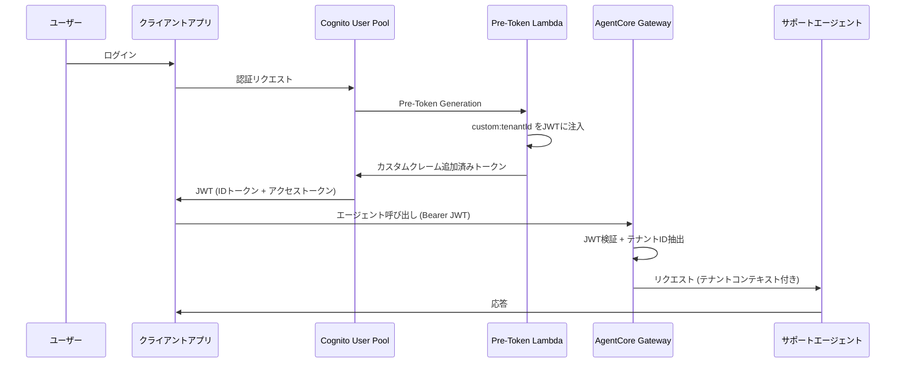
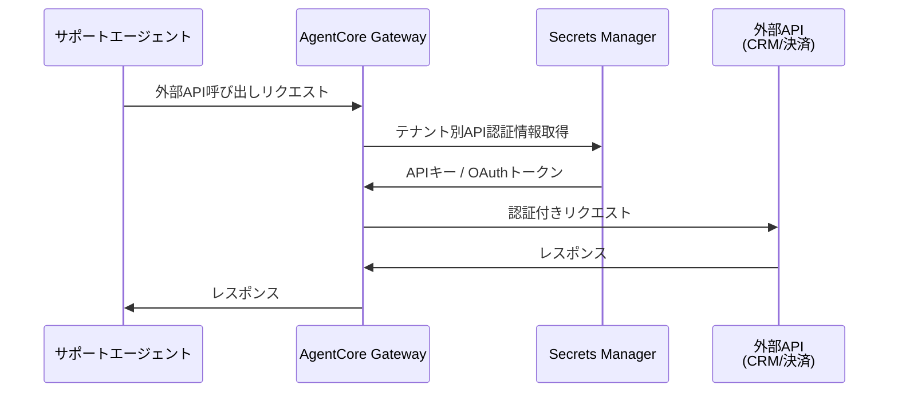
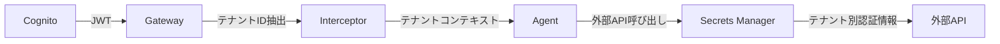

# 第4章: Identity & Cognito

## 概要

Amazon Bedrock AgentCore の Identity 機能と Amazon Cognito を統合し、マルチテナント SaaS 環境での認証・認可基盤を構築します。

本章では以下を学びます:

- OAuth 認証フローの設計と実装
- Cognito User Pool にカスタムテナント属性を追加
- Pre-Token Generation Lambda でJWTにテナントIDを注入
- AgentCore Runtime の OAuth 設定
- Gateway でのカスタムJWT認証
- 外部API向けのアウトバウンド認証

---

## アーキテクチャ



---

## 4.1 Cognito User Pool の構築

### CDK スタック定義

```typescript
// cdk/stacks/cognito-stack.ts

import * as cdk from "aws-cdk-lib";
import * as cognito from "aws-cdk-lib/aws-cognito";
import * as lambda from "aws-cdk-lib/aws-lambda";
import { Construct } from "constructs";

export class CognitoStack extends cdk.Stack {
  public readonly userPool: cognito.UserPool;
  public readonly userPoolClient: cognito.UserPoolClient;
  public readonly userPoolDomain: cognito.UserPoolDomain;

  constructor(scope: Construct, id: string, props?: cdk.StackProps) {
    super(scope, id, props);

    // Pre-Token Generation Lambda
    const preTokenLambda = new lambda.Function(
      this,
      "PreTokenGenerationLambda",
      {
        runtime: lambda.Runtime.PYTHON_3_12,
        handler: "index.handler",
        code: lambda.Code.fromAsset("../lambda/cognito_triggers"),
        functionName: "agentcore-pre-token-generation",
        description:
          "JWTトークンにカスタムテナント属性を注入するLambda",
      }
    );

    // Cognito User Pool
    this.userPool = new cognito.UserPool(this, "MultiTenantUserPool", {
      userPoolName: "agentcore-multi-tenant-pool",
      selfSignUpEnabled: false, // 管理者のみユーザー作成可能
      signInAliases: {
        email: true,
      },
      standardAttributes: {
        email: {
          required: true,
          mutable: false,
        },
      },
      customAttributes: {
        tenantId: new cognito.StringAttribute({
          mutable: false,
          minLen: 1,
          maxLen: 64,
        }),
        tenantPlan: new cognito.StringAttribute({
          mutable: true,
          minLen: 1,
          maxLen: 32,
        }),
        tenantRole: new cognito.StringAttribute({
          mutable: true,
          minLen: 1,
          maxLen: 32,
        }),
      },
      lambdaTriggers: {
        preTokenGeneration: preTokenLambda,
      },
      passwordPolicy: {
        minLength: 12,
        requireUppercase: true,
        requireLowercase: true,
        requireDigits: true,
        requireSymbols: true,
      },
      accountRecovery: cognito.AccountRecovery.EMAIL_ONLY,
      removalPolicy: cdk.RemovalPolicy.DESTROY,
    });

    // リソースサーバー (OAuth スコープ定義)
    const resourceServer = this.userPool.addResourceServer(
      "AgentCoreResourceServer",
      {
        identifier: "agentcore",
        scopes: [
          {
            scopeName: "support.read",
            scopeDescription: "サポート情報の読み取り",
          },
          {
            scopeName: "support.write",
            scopeDescription: "サポート情報の書き込み",
          },
          {
            scopeName: "admin",
            scopeDescription: "管理者操作",
          },
        ],
      }
    );

    // User Pool Client
    this.userPoolClient = this.userPool.addClient("AgentCoreClient", {
      userPoolClientName: "agentcore-support-client",
      generateSecret: true,
      authFlows: {
        userPassword: true,
        userSrp: true,
      },
      oAuth: {
        flows: {
          authorizationCodeGrant: true,
        },
        scopes: [
          cognito.OAuthScope.OPENID,
          cognito.OAuthScope.EMAIL,
          cognito.OAuthScope.PROFILE,
          cognito.OAuthScope.resourceServer(resourceServer, {
            scopeName: "support.read",
            scopeDescription: "サポート情報の読み取り",
          }),
          cognito.OAuthScope.resourceServer(resourceServer, {
            scopeName: "support.write",
            scopeDescription: "サポート情報の書き込み",
          }),
        ],
        callbackUrls: ["https://localhost:3000/callback"],
        logoutUrls: ["https://localhost:3000/logout"],
      },
      accessTokenValidity: cdk.Duration.hours(1),
      idTokenValidity: cdk.Duration.hours(1),
      refreshTokenValidity: cdk.Duration.days(30),
    });

    // User Pool Domain
    this.userPoolDomain = this.userPool.addDomain("AgentCoreDomain", {
      cognitoDomain: {
        domainPrefix: "agentcore-multi-tenant",
      },
    });

    // Outputs
    new cdk.CfnOutput(this, "UserPoolId", {
      value: this.userPool.userPoolId,
    });
    new cdk.CfnOutput(this, "UserPoolClientId", {
      value: this.userPoolClient.userPoolClientId,
    });
    new cdk.CfnOutput(this, "UserPoolDomain", {
      value: this.userPoolDomain.domainName,
    });
  }
}
```

### デプロイ

```bash
cd cdk
npx cdk deploy CognitoStack
```

---

## 4.2 Pre-Token Generation Lambda

JWTトークンにカスタムテナント属性を注入する Lambda 関数を実装します。

```python
# lambda/cognito_triggers/index.py

import json
import logging

logger = logging.getLogger()
logger.setLevel(logging.INFO)


def handler(event, context):
    """
    Cognito Pre-Token Generation トリガー
    ユーザーのカスタム属性からテナント情報をJWTクレームに注入する
    """
    logger.info(f"Event: {json.dumps(event)}")

    trigger_source = event.get("triggerSource")
    user_attributes = event["request"]["userAttributes"]

    # カスタム属性からテナント情報を取得
    tenant_id = user_attributes.get("custom:tenantId", "")
    tenant_plan = user_attributes.get("custom:tenantPlan", "basic")
    tenant_role = user_attributes.get("custom:tenantRole", "user")

    if not tenant_id:
        logger.error("テナントIDが設定されていません")
        raise Exception("テナントIDが必須です")

    # JWTクレームにテナント情報を追加
    event["response"] = {
        "claimsOverrideDetails": {
            "claimsToAddOrOverride": {
                "custom:tenantId": tenant_id,
                "custom:tenantPlan": tenant_plan,
                "custom:tenantRole": tenant_role,
            },
            "claimsToSuppress": [],
        }
    }

    logger.info(
        f"テナント情報をJWTに注入: tenantId={tenant_id}, "
        f"plan={tenant_plan}, role={tenant_role}"
    )

    return event
```

### JWT トークンの構造

Pre-Token Generation Lambda により、以下のクレームがJWTに含まれます:

```json
{
  "sub": "user-uuid-xxx",
  "email": "user@acme.com",
  "custom:tenantId": "tenant-acme",
  "custom:tenantPlan": "premium",
  "custom:tenantRole": "admin",
  "iss": "https://cognito-idp.us-east-1.amazonaws.com/us-east-1_XXXXX",
  "aud": "client-id-xxx",
  "exp": 1711180800,
  "iat": 1711177200,
  "token_use": "id"
}
```

---

## 4.3 テストユーザーの作成

```bash
USER_POOL_ID="us-east-1_XXXXX"  # デプロイ後の出力値を設定

# テナントA (ACME社) - Premium プラン
aws cognito-idp admin-create-user \
  --user-pool-id $USER_POOL_ID \
  --username "admin@acme.com" \
  --user-attributes \
    Name=email,Value=admin@acme.com \
    Name=email_verified,Value=true \
    Name=custom:tenantId,Value=tenant-acme \
    Name=custom:tenantPlan,Value=premium \
    Name=custom:tenantRole,Value=admin \
  --temporary-password "TempPass123!"

aws cognito-idp admin-create-user \
  --user-pool-id $USER_POOL_ID \
  --username "user1@acme.com" \
  --user-attributes \
    Name=email,Value=user1@acme.com \
    Name=email_verified,Value=true \
    Name=custom:tenantId,Value=tenant-acme \
    Name=custom:tenantPlan,Value=premium \
    Name=custom:tenantRole,Value=user \
  --temporary-password "TempPass123!"

# テナントB (Globex社) - Basic プラン
aws cognito-idp admin-create-user \
  --user-pool-id $USER_POOL_ID \
  --username "admin@globex.com" \
  --user-attributes \
    Name=email,Value=admin@globex.com \
    Name=email_verified,Value=true \
    Name=custom:tenantId,Value=tenant-globex \
    Name=custom:tenantPlan,Value=basic \
    Name=custom:tenantRole,Value=admin \
  --temporary-password "TempPass123!"

aws cognito-idp admin-create-user \
  --user-pool-id $USER_POOL_ID \
  --username "user1@globex.com" \
  --user-attributes \
    Name=email,Value=user1@globex.com \
    Name=email_verified,Value=true \
    Name=custom:tenantId,Value=tenant-globex \
    Name=custom:tenantPlan,Value=basic \
    Name=custom:tenantRole,Value=user \
  --temporary-password "TempPass123!"
```

---

## 4.4 AgentCore Runtime OAuth 設定

### OAuth プロバイダーの登録

```bash
# AgentCore に Cognito を OAuth プロバイダーとして登録
aws bedrock-agentcore create-oauth-provider \
  --name "cognito-multi-tenant" \
  --provider-type "COGNITO" \
  --configuration '{
    "userPoolId": "us-east-1_XXXXX",
    "clientId": "your-client-id",
    "clientSecret": "your-client-secret",
    "issuer": "https://cognito-idp.us-east-1.amazonaws.com/us-east-1_XXXXX",
    "authorizationEndpoint": "https://agentcore-multi-tenant.auth.us-east-1.amazoncognito.com/oauth2/authorize",
    "tokenEndpoint": "https://agentcore-multi-tenant.auth.us-east-1.amazoncognito.com/oauth2/token",
    "jwksUri": "https://cognito-idp.us-east-1.amazonaws.com/us-east-1_XXXXX/.well-known/jwks.json"
  }'
```

### Gateway でのカスタム JWT 認証設定

```python
# Gateway のJWT認証設定
gateway_config = {
    "authentication": {
        "type": "JWT",
        "jwtConfiguration": {
            "issuer": "https://cognito-idp.us-east-1.amazonaws.com/us-east-1_XXXXX",
            "audience": ["your-client-id"],
            "claimsMapping": {
                "tenantId": "custom:tenantId",
                "tenantPlan": "custom:tenantPlan",
                "tenantRole": "custom:tenantRole",
                "userId": "sub",
                "email": "email",
            },
        },
    },
}
```

---

## 4.5 アウトバウンド認証 (外部API連携)

エージェントが外部APIを呼び出す際の認証情報管理です。



### テナント別外部API認証の設定

```python
# lambda/gateway_tools/outbound_auth.py

import boto3
import json

secrets_client = boto3.client("secretsmanager")


def get_tenant_api_credentials(tenant_id: str, service_name: str) -> dict:
    """テナント別の外部API認証情報を取得する"""
    secret_name = f"agentcore/{tenant_id}/api-credentials/{service_name}"

    try:
        response = secrets_client.get_secret_value(SecretId=secret_name)
        return json.loads(response["SecretString"])
    except secrets_client.exceptions.ResourceNotFoundException:
        raise ValueError(
            f"テナント '{tenant_id}' のサービス '{service_name}' の"
            f"認証情報が見つかりません"
        )


def configure_outbound_auth(tenant_id: str) -> dict:
    """テナントの外部API認証を設定する"""
    return {
        "crm": {
            "type": "API_KEY",
            "credentials": get_tenant_api_credentials(tenant_id, "crm"),
        },
        "payment": {
            "type": "OAUTH2",
            "credentials": get_tenant_api_credentials(tenant_id, "payment"),
        },
        "ticketing": {
            "type": "BASIC_AUTH",
            "credentials": get_tenant_api_credentials(
                tenant_id, "ticketing"
            ),
        },
    }
```

### Secrets Manager へのシークレット登録

```bash
# テナントAのCRM API認証情報
aws secretsmanager create-secret \
  --name "agentcore/tenant-acme/api-credentials/crm" \
  --secret-string '{"apiKey": "acme-crm-api-key-xxx", "baseUrl": "https://api.crm.example.com/v1"}'

# テナントBのCRM API認証情報
aws secretsmanager create-secret \
  --name "agentcore/tenant-globex/api-credentials/crm" \
  --secret-string '{"apiKey": "globex-crm-api-key-yyy", "baseUrl": "https://api.crm.example.com/v1"}'
```

---

## 4.6 検証

### テスト1: JWT トークンの検査

```bash
# トークン取得
CLIENT_ID="your-client-id"
CLIENT_SECRET="your-client-secret"
USER_POOL_DOMAIN="agentcore-multi-tenant"
REGION="us-east-1"

# ユーザー認証 (テナントA管理者)
TOKEN_RESPONSE=$(aws cognito-idp initiate-auth \
  --client-id $CLIENT_ID \
  --auth-flow USER_PASSWORD_AUTH \
  --auth-parameters \
    USERNAME=admin@acme.com,PASSWORD=YourPassword123! \
  --region $REGION)

ID_TOKEN=$(echo $TOKEN_RESPONSE | jq -r '.AuthenticationResult.IdToken')

# JWTトークンのデコード (ペイロード部分)
echo $ID_TOKEN | cut -d. -f2 | base64 -d 2>/dev/null | jq .
```

期待される出力:

```json
{
  "sub": "xxxxxxxx-xxxx-xxxx-xxxx-xxxxxxxxxxxx",
  "email": "admin@acme.com",
  "custom:tenantId": "tenant-acme",
  "custom:tenantPlan": "premium",
  "custom:tenantRole": "admin",
  "iss": "https://cognito-idp.us-east-1.amazonaws.com/us-east-1_XXXXX",
  "token_use": "id",
  "exp": 1711180800
}
```

### テスト2: 認証付きエージェント呼び出し

```bash
# テナントAとしてエージェント呼び出し
curl -X POST https://your-gateway-endpoint/invoke \
  -H "Authorization: Bearer $ID_TOKEN" \
  -H "Content-Type: application/json" \
  -d '{
    "message": "請求書の確認をお願いします"
  }'
```

### テスト3: 無効なトークンの拒否

```bash
# 無効なトークンでリクエスト
curl -X POST https://your-gateway-endpoint/invoke \
  -H "Authorization: Bearer invalid-token-xxx" \
  -H "Content-Type: application/json" \
  -d '{
    "message": "テスト"
  }'

# 期待される応答: 401 Unauthorized
# {"error": "Unauthorized", "message": "Invalid or expired token"}
```

### テスト4: トークン切れの確認

```python
# tests/test_identity.py

import time
import jwt
import requests


def test_expired_token_rejected():
    """期限切れトークンが拒否されることを確認する"""
    # 1時間以上前のトークンを使用
    expired_token = "eyJ..."  # 期限切れのトークン

    response = requests.post(
        "https://your-gateway-endpoint/invoke",
        headers={"Authorization": f"Bearer {expired_token}"},
        json={"message": "テスト"},
    )

    assert response.status_code == 401
    print("期限切れトークン拒否テスト: PASSED")


def test_tenant_claims_present():
    """JWTにテナントクレームが含まれることを確認する"""
    token = get_valid_token("admin@acme.com", "YourPassword123!")

    # トークンをデコード (検証なし、クレーム確認のため)
    decoded = jwt.decode(token, options={"verify_signature": False})

    assert "custom:tenantId" in decoded
    assert decoded["custom:tenantId"] == "tenant-acme"
    assert "custom:tenantPlan" in decoded
    assert decoded["custom:tenantPlan"] == "premium"
    print("テナントクレーム確認テスト: PASSED")
```

---

## まとめ

| コンポーネント | 役割 |
|---|---|
| Cognito User Pool | ユーザー管理・認証 |
| カスタム属性 | tenantId, tenantPlan, tenantRole |
| Pre-Token Lambda | JWTにテナント情報を注入 |
| Gateway JWT認証 | リクエスト時のトークン検証 |
| Secrets Manager | テナント別外部API認証情報 |



## 次のステップ

[第5章: マルチテナント分離](./06-multi-tenant-isolation.md) では、Defense-in-Depth アプローチによるテナント間のデータ分離を実装します。
