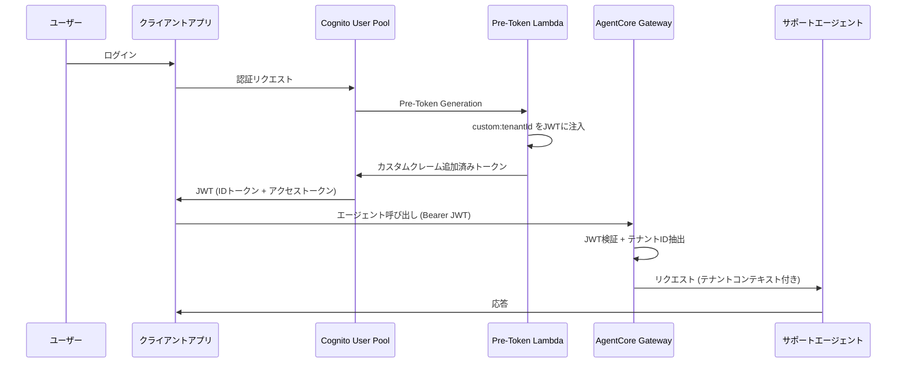
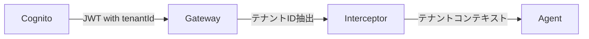

# 第5章: Identity & Cognito

## 概要

Amazon Bedrock AgentCore の Identity 機能と Amazon Cognito を統合し、マルチテナント SaaS 環境での認証・認可基盤を構築します。

本章では以下を学びます:

- Cognito User Pool にカスタムテナント属性 (`custom:tenantId`) を追加
- Pre-Token Generation Lambda で JWT にテナント ID を注入
- CDK スタック (Python) による Cognito リソースのプロビジョニング
- `agentcore identity` CLI によるアイデンティティ管理
- テストユーザーの作成と JWT トークンの検証

---

## アーキテクチャ



---

## 5.1 Cognito User Pool の構築 (CDK)

### CDK スタック定義

ファイル: `cdk/stacks/cognito_stack.py`

```python
# cdk/stacks/cognito_stack.py

from aws_cdk import (
    Stack,
    CfnOutput,
    Duration,
    RemovalPolicy,
    aws_cognito as cognito,
    aws_lambda as lambda_,
    aws_logs as logs,
)
from constructs import Construct


class CognitoStack(Stack):
    """Cognito User Pool for multi-tenant authentication."""

    def __init__(self, scope: Construct, construct_id: str, **kwargs) -> None:
        super().__init__(scope, construct_id, **kwargs)

        # Pre-Token Generation Lambda Trigger
        pre_token_lambda = lambda_.Function(
            self,
            "PreTokenGenerationLambda",
            function_name="agentcore-pre-token-generation",
            runtime=lambda_.Runtime.PYTHON_3_13,
            handler="index.handler",
            code=lambda_.Code.from_inline("""..."""),  # インライン Lambda (後述)
            timeout=Duration.seconds(10),
            memory_size=128,
            log_retention=logs.RetentionDays.ONE_WEEK,
        )

        # Cognito User Pool
        self.user_pool = cognito.UserPool(
            self,
            "AgentCoreUserPool",
            user_pool_name="agentcore-multi-tenant-pool",
            self_sign_up_enabled=False,           # 管理者のみユーザー作成可能
            sign_in_aliases=cognito.SignInAliases(
                email=True,
                username=True,
            ),
            standard_attributes=cognito.StandardAttributes(
                email=cognito.StandardAttribute(required=True, mutable=True),
            ),
            custom_attributes={
                "tenantId": cognito.StringAttribute(    # カスタム属性は tenantId のみ
                    min_len=1,
                    max_len=64,
                    mutable=False,                      # テナントバインディングは不変
                ),
            },
            password_policy=cognito.PasswordPolicy(
                min_length=8,
                require_lowercase=True,
                require_uppercase=True,
                require_digits=True,
                require_symbols=False,                  # 記号は不要
            ),
            account_recovery=cognito.AccountRecovery.EMAIL_ONLY,
            removal_policy=RemovalPolicy.DESTROY,       # ハンズオン用: 簡単にクリーンアップ
            lambda_triggers=cognito.UserPoolTriggers(
                pre_token_generation=pre_token_lambda,
            ),
        )

        # App Client
        self.user_pool_client = self.user_pool.add_client(
            "AgentCoreAppClient",
            user_pool_client_name="agentcore-app-client",
            auth_flows=cognito.AuthFlow(
                user_password=True,     # ハンズオン CLI テスト用
                user_srp=True,
            ),
            generate_secret=False,      # パブリッククライアント
            access_token_validity=Duration.hours(1),
            id_token_validity=Duration.hours(1),
            refresh_token_validity=Duration.days(7),
        )

        # Resource Server (OAuth2 スコープ定義)
        resource_server = self.user_pool.add_resource_server(
            "AgentCoreResourceServer",
            identifier="agentcore-api",
            scopes=[
                cognito.ResourceServerScope(
                    scope_name="agent.invoke",
                    scope_description="Invoke agent operations",
                ),
                cognito.ResourceServerScope(
                    scope_name="tickets.read",
                    scope_description="Read support tickets",
                ),
                cognito.ResourceServerScope(
                    scope_name="tickets.write",
                    scope_description="Create and update support tickets",
                ),
            ],
        )

        # User Groups (テナント分離デモ用)
        cognito.CfnUserPoolGroup(
            self, "TenantAGroup",
            user_pool_id=self.user_pool.user_pool_id,
            group_name="tenant-a",
            description="Users belonging to Tenant A",
        )
        cognito.CfnUserPoolGroup(
            self, "TenantBGroup",
            user_pool_id=self.user_pool.user_pool_id,
            group_name="tenant-b",
            description="Users belonging to Tenant B",
        )

        # Outputs
        CfnOutput(self, "UserPoolId",
                  value=self.user_pool.user_pool_id,
                  export_name="AgentCoreUserPoolId")
        CfnOutput(self, "UserPoolArn",
                  value=self.user_pool.user_pool_arn,
                  export_name="AgentCoreUserPoolArn")
        CfnOutput(self, "UserPoolClientId",
                  value=self.user_pool_client.user_pool_client_id,
                  export_name="AgentCoreUserPoolClientId")
```

### 実コードとの違いに注意

| 項目 | 実際のコード | 旧ドキュメント (誤り) |
|---|---|---|
| CDK 言語 | **Python** | TypeScript |
| CDK スタックパス | `cdk/stacks/cognito_stack.py` | `cdk/stacks/cognito-stack.ts` |
| カスタム属性 | `tenantId` のみ | tenantId, tenantPlan, tenantRole |
| `generate_secret` | `False` (パブリッククライアント) | `True` |
| OAuth フロー設定 | なし (App Client に直接設定なし) | authorizationCodeGrant |
| パスワードポリシー | 最低8文字、記号不要 | 最低12文字、記号必要 |
| User Pool Domain | なし | あり |

### デプロイ

```bash
cd cdk
cdk deploy CognitoStack
```

---

## 5.2 Pre-Token Generation Lambda

### CDK インライン Lambda (cognito_stack.py 内)

`cdk/stacks/cognito_stack.py` では、Pre-Token Generation Lambda がインラインコードとして定義されています:

```python
# cognito_stack.py 内のインライン Lambda コード

def handler(event, context):
    """
    Pre-Token Generation trigger.
    Copies custom:tenantId into the access token claims
    so that AgentCore interceptor can extract tenant context.
    """
    tenant_id = event['request']['userAttributes'].get('custom:tenantId', '')

    event['response'] = {
        'claimsOverrideDetails': {
            'claimsToAddOrOverride': {
                'custom:tenantId': tenant_id,
            },
        },
    }
    print(f"Pre-token generation: tenantId={tenant_id}, user={event['userName']}")
    return event
```

このインライン Lambda はシンプルで、`custom:tenantId` のみをトークンクレームに追加します。

### 拡張版 Lambda (外部ファイル)

ファイル: `lambda/cognito_triggers/pre_token_generation/handler.py`

より高機能な外部 Lambda も用意されています。こちらは DynamoDB からテナント情報を補完するフォールバック機能を持ちます:

```python
# lambda/cognito_triggers/pre_token_generation/handler.py (抜粋)

def lambda_handler(event, context):
    user_attributes = event["request"].get("userAttributes", {})
    user_sub = user_attributes.get("sub", "")

    # まずユーザー属性から tenantId を取得
    tenant_id = user_attributes.get("custom:tenantId", "")

    # ユーザー属性にない場合は DynamoDB から取得
    if not tenant_id:
        tenant_info = get_tenant_info(user_sub, username)
        tenant_id = tenant_info.get("tenantId", "")

    # カスタムクレームをトークンに追加
    event["response"]["claimsOverrideDetails"] = {
        "claimsToAddOrOverride": {
            "custom:tenantId": tenant_id,
            "custom:tenantName": tenant_name,
            "custom:tenantPlan": tenant_plan,
        },
        "claimsToSuppress": [],
    }
    return event
```

### JWT トークンの構造

Pre-Token Generation Lambda により、以下のクレームが JWT に含まれます:

```json
{
  "sub": "xxxxxxxx-xxxx-xxxx-xxxx-xxxxxxxxxxxx",
  "email": "user@acme.com",
  "custom:tenantId": "tenant-a",
  "iss": "https://cognito-idp.us-east-1.amazonaws.com/us-east-1_XXXXX",
  "aud": "client-id-xxx",
  "exp": 1711180800,
  "iat": 1711177200,
  "token_use": "id"
}
```

---

## 5.3 テストユーザーの作成

```bash
USER_POOL_ID="us-east-1_XXXXX"  # CognitoStack デプロイ後の出力値

# テナントA (Acme Corp) のユーザー
aws cognito-idp admin-create-user \
  --user-pool-id $USER_POOL_ID \
  --username "admin@acme.com" \
  --user-attributes \
    Name=email,Value=admin@acme.com \
    Name=email_verified,Value=true \
    Name=custom:tenantId,Value=tenant-a \
  --temporary-password "TempPass123!"

aws cognito-idp admin-create-user \
  --user-pool-id $USER_POOL_ID \
  --username "user1@acme.com" \
  --user-attributes \
    Name=email,Value=user1@acme.com \
    Name=email_verified,Value=true \
    Name=custom:tenantId,Value=tenant-a \
  --temporary-password "TempPass123!"

# テナントB (GlobalTech) のユーザー
aws cognito-idp admin-create-user \
  --user-pool-id $USER_POOL_ID \
  --username "admin@globaltech.com" \
  --user-attributes \
    Name=email,Value=admin@globaltech.com \
    Name=email_verified,Value=true \
    Name=custom:tenantId,Value=tenant-b \
  --temporary-password "TempPass123!"

aws cognito-idp admin-create-user \
  --user-pool-id $USER_POOL_ID \
  --username "user1@globaltech.com" \
  --user-attributes \
    Name=email,Value=user1@globaltech.com \
    Name=email_verified,Value=true \
    Name=custom:tenantId,Value=tenant-b \
  --temporary-password "TempPass123!"
```

テナント ID には、`database/seed_data.sql` で定義されている UUID を使用します:

| テナント | UUID | 名前 | プラン |
|---|---|---|---|
| Tenant A | `tenant-a` | Acme Corp | enterprise |
| Tenant B | `tenant-b` | GlobalTech | professional |

---

## 5.4 agentcore identity CLI

`agentcore identity` コマンドで、エージェントのアイデンティティ設定を管理できます。

```bash
# identity 関連のヘルプを表示
agentcore identity --help

# エージェントの identity 設定を確認
cd agents/customer_support
cat .bedrock_agentcore.yaml
```

現在の `.bedrock_agentcore.yaml` の identity 関連設定:

```yaml
# agents/customer_support/.bedrock_agentcore.yaml (抜粋)
identity:
  credential_providers: []
  workload: null
aws_jwt:
  enabled: false
  audiences: []
  signing_algorithm: ES384
  issuer_url: null
  duration_seconds: 300
authorizer_configuration: null
```

JWT 認証を有効化するには、`agentcore identity` でプロバイダーを設定するか、`.bedrock_agentcore.yaml` を直接編集します。

---

## 5.5 Gateway での JWT 認証設定

Gateway スタック (`cdk/stacks/gateway_stack.py`) では、Cognito の OIDC ディスカバリ URL を使って JWT 検証を構成しています:

```python
# cdk/stacks/gateway_stack.py (抜粋: Gateway カスタムリソース内)

response = client.create_gateway(
    name=props['GatewayName'],
    description=props.get('Description', ''),
    roleArn=props['RoleArn'],
    authorizationConfiguration={
        'authorizationType': 'CUSTOM_JWT',
        'customJWTAuthorizationConfiguration': {
            'discoveryUrl': props['DiscoveryUrl'],     # Cognito OIDC ディスカバリ URL
            'allowedAudiences': [props['AllowedAudience']],
            'allowedClients': [props['AllowedClient']],
        }
    },
)
```

`discoveryUrl` は Cognito User Pool の OIDC 設定 URL です:

```
https://cognito-idp.{region}.amazonaws.com/{user_pool_id}/.well-known/openid-configuration
```

---

## 5.6 検証

### テスト 1: JWT トークンの取得と検査

```bash
CLIENT_ID="your-client-id"   # CognitoStack の UserPoolClientId 出力値
REGION="us-east-1"

# ユーザー認証 (テナントA)
TOKEN_RESPONSE=$(aws cognito-idp initiate-auth \
  --client-id $CLIENT_ID \
  --auth-flow USER_PASSWORD_AUTH \
  --auth-parameters \
    USERNAME=admin@acme.com,PASSWORD=YourPassword123! \
  --region $REGION)

ID_TOKEN=$(echo $TOKEN_RESPONSE | jq -r '.AuthenticationResult.IdToken')

# JWT トークンのデコード (ペイロード部分)
echo $ID_TOKEN | cut -d. -f2 | base64 -d 2>/dev/null | jq .
```

期待される出力:

```json
{
  "sub": "xxxxxxxx-xxxx-xxxx-xxxx-xxxxxxxxxxxx",
  "email": "admin@acme.com",
  "custom:tenantId": "tenant-a",
  "iss": "https://cognito-idp.us-east-1.amazonaws.com/us-east-1_XXXXX",
  "token_use": "id",
  "exp": 1711180800
}
```

### テスト 2: 認証付きエージェント呼び出し

```bash
# テナントAとしてエージェント呼び出し
agentcore invoke --payload '{
  "prompt": "請求書の確認をお願いします",
  "user_id": "admin@acme.com"
}'
```

### テスト 3: 無効なトークンの拒否

```bash
# 無効なトークンでリクエスト (401 エラーが期待される)
curl -X POST https://your-gateway-endpoint/invoke \
  -H "Authorization: Bearer invalid-token-xxx" \
  -H "Content-Type: application/json" \
  -d '{
    "message": "テスト"
  }'

# 期待される応答: 401 Unauthorized
```

---

## まとめ

| コンポーネント | 役割 |
|---|---|
| Cognito User Pool | ユーザー管理・認証 |
| カスタム属性 | `tenantId` のみ (不変) |
| Pre-Token Lambda | JWT に `custom:tenantId` を注入 |
| App Client | `generate_secret=False`、USER_PASSWORD_AUTH + USER_SRP_AUTH |
| User Groups | `tenant-a`, `tenant-b` |
| Gateway JWT 認証 | CUSTOM_JWT + Cognito OIDC ディスカバリ URL |



## 主要ファイル

| ファイル | 役割 |
|---|---|
| `cdk/stacks/cognito_stack.py` | Cognito User Pool の CDK スタック (Python) |
| `lambda/cognito_triggers/pre_token_generation/handler.py` | Pre-Token Generation Lambda (拡張版) |
| `cdk/stacks/gateway_stack.py` | Gateway の JWT 認証設定 |
| `agents/customer_support/.bedrock_agentcore.yaml` | エージェントの identity 設定 |

## 次のステップ

[第6章: マルチテナント分離](./06-multi-tenant-isolation.md) では、Defense-in-Depth アプローチによるテナント間のデータ分離を実装します。
