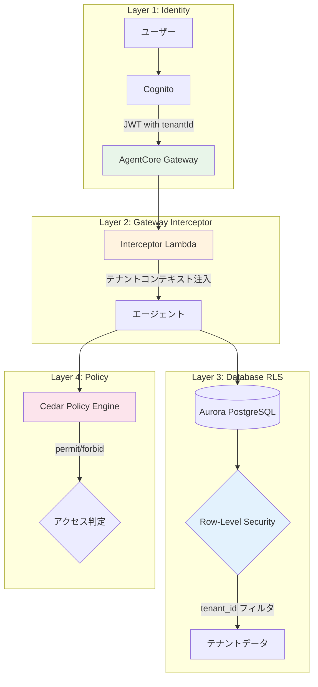
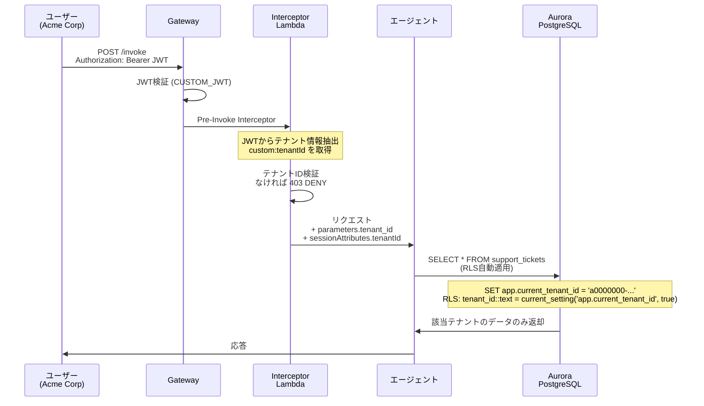
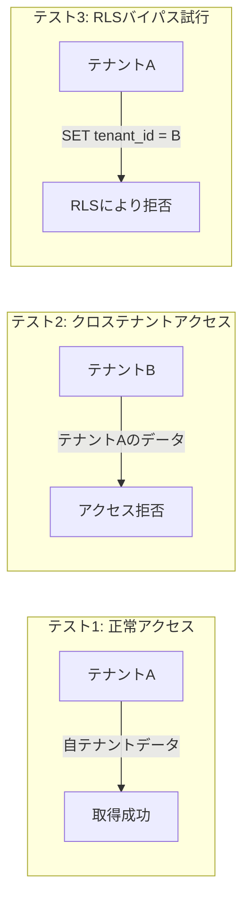
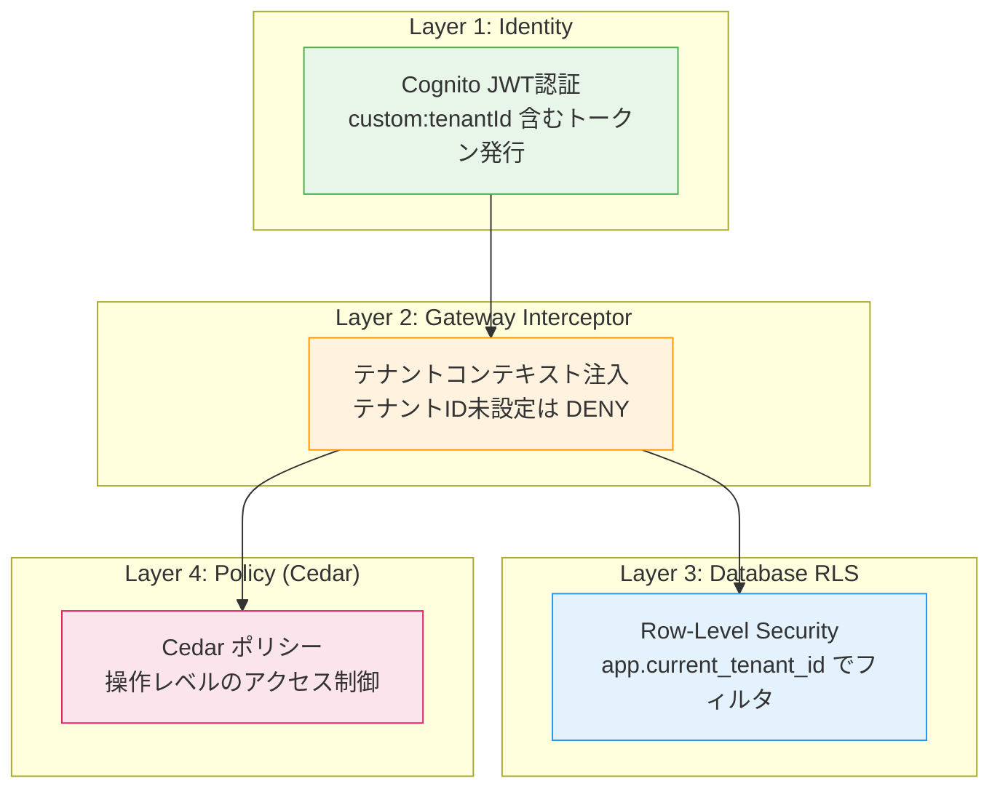

# 第6章: マルチテナント分離

## 概要

マルチテナント SaaS における最も重要な要件はテナント間のデータ分離です。本章では、Defense-in-Depth (多層防御) アプローチにより、複数のレイヤーでテナント分離を実現します。

| レイヤー | コンポーネント | 役割 |
|---|---|---|
| 1. Identity | Cognito + JWT | 認証とテナント ID 付与 |
| 2. Gateway Interceptor | Lambda | テナントコンテキストの注入・検証 |
| 3. Database RLS | Aurora PostgreSQL | 行レベルセキュリティ |
| 4. Policy | Cedar | ポリシーベースのアクセス制御 |

---

## アーキテクチャ全体図



---

## 6.1 リクエストフロー詳細



---

## 6.2 データベーススキーマ

### テーブル構造

ファイル: `database/schema.sql`

データベースには以下の5つのテーブルが定義されています。すべてのテナントスコープテーブルに `tenant_id` カラムがあります:

| テーブル | 説明 | 主要カラム |
|---|---|---|
| `tenants` | テナント (組織) 情報 | `id` (UUID PK), `name`, `plan` |
| `customers` | テナントに属する顧客 | `id`, `tenant_id`, `name`, `email`, `plan` |
| `support_tickets` | サポートチケット | `id`, `tenant_id`, `customer_id`, `subject`, `description`, `status`, `priority`, `resolution` |
| `knowledge_articles` | ナレッジベース記事 | `id`, `tenant_id`, `title`, `content`, `category`, `tags` |
| `billing_records` | 請求・返金レコード | `id`, `tenant_id`, `customer_id`, `amount`, `type`, `status`, `description` |

### スキーマの詳細

```sql
-- database/schema.sql (抜粋)

CREATE EXTENSION IF NOT EXISTS "uuid-ossp";

-- テナントテーブル
CREATE TABLE tenants (
    id          UUID PRIMARY KEY DEFAULT uuid_generate_v4(),
    name        VARCHAR(255) NOT NULL,
    plan        VARCHAR(50) NOT NULL CHECK (plan IN ('basic', 'professional', 'enterprise')),
    created_at  TIMESTAMP WITH TIME ZONE DEFAULT NOW()
);

-- 顧客テーブル
CREATE TABLE customers (
    id          UUID PRIMARY KEY DEFAULT uuid_generate_v4(),
    tenant_id   UUID NOT NULL REFERENCES tenants(id) ON DELETE CASCADE,
    name        VARCHAR(255) NOT NULL,
    email       VARCHAR(255) NOT NULL,
    plan        VARCHAR(50) NOT NULL CHECK (plan IN ('free', 'starter', 'business', 'enterprise')),
    created_at  TIMESTAMP WITH TIME ZONE DEFAULT NOW()
);

-- サポートチケットテーブル
CREATE TABLE support_tickets (
    id          UUID PRIMARY KEY DEFAULT uuid_generate_v4(),
    tenant_id   UUID NOT NULL REFERENCES tenants(id) ON DELETE CASCADE,
    customer_id UUID NOT NULL REFERENCES customers(id) ON DELETE CASCADE,
    subject     VARCHAR(500) NOT NULL,
    description TEXT NOT NULL,
    status      VARCHAR(50) NOT NULL DEFAULT 'open'
                CHECK (status IN ('open', 'in_progress', 'waiting_on_customer', 'resolved', 'closed')),
    priority    VARCHAR(20) NOT NULL DEFAULT 'medium'
                CHECK (priority IN ('low', 'medium', 'high', 'critical')),
    created_at  TIMESTAMP WITH TIME ZONE DEFAULT NOW(),
    updated_at  TIMESTAMP WITH TIME ZONE DEFAULT NOW(),
    resolution  TEXT
);

-- ナレッジ記事テーブル
CREATE TABLE knowledge_articles (
    id          UUID PRIMARY KEY DEFAULT uuid_generate_v4(),
    tenant_id   UUID NOT NULL REFERENCES tenants(id) ON DELETE CASCADE,
    title       VARCHAR(500) NOT NULL,
    content     TEXT NOT NULL,
    category    VARCHAR(100) NOT NULL,
    tags        TEXT[] DEFAULT '{}',
    created_at  TIMESTAMP WITH TIME ZONE DEFAULT NOW(),
    updated_at  TIMESTAMP WITH TIME ZONE DEFAULT NOW()
);

-- 請求レコードテーブル
CREATE TABLE billing_records (
    id          UUID PRIMARY KEY DEFAULT uuid_generate_v4(),
    tenant_id   UUID NOT NULL REFERENCES tenants(id) ON DELETE CASCADE,
    customer_id UUID NOT NULL REFERENCES customers(id) ON DELETE CASCADE,
    amount      DECIMAL(10, 2) NOT NULL,
    type        VARCHAR(50) NOT NULL CHECK (type IN ('charge', 'refund', 'credit', 'adjustment')),
    status      VARCHAR(50) NOT NULL DEFAULT 'pending'
                CHECK (status IN ('pending', 'completed', 'failed', 'cancelled')),
    description TEXT,
    created_at  TIMESTAMP WITH TIME ZONE DEFAULT NOW()
);
```

---

## 6.3 Row-Level Security (RLS) の設定

### RLS ポリシー

ファイル: `database/rls_policies.sql`

すべてのテナントスコープテーブルに対して RLS を有効化し、`app.current_tenant_id` セッション変数でフィルタリングします。

```sql
-- database/rls_policies.sql (抜粋)

-- アプリケーションロール作成
DO $$
BEGIN
    IF NOT EXISTS (SELECT FROM pg_roles WHERE rolname = 'app_user') THEN
        CREATE ROLE app_user LOGIN;
    END IF;
END
$$;

-- テーブル権限付与
GRANT SELECT, INSERT, UPDATE, DELETE ON ALL TABLES IN SCHEMA public TO app_user;
GRANT USAGE ON SCHEMA public TO app_user;

-- RLS 有効化
ALTER TABLE tenants ENABLE ROW LEVEL SECURITY;
ALTER TABLE customers ENABLE ROW LEVEL SECURITY;
ALTER TABLE support_tickets ENABLE ROW LEVEL SECURITY;
ALTER TABLE knowledge_articles ENABLE ROW LEVEL SECURITY;
ALTER TABLE billing_records ENABLE ROW LEVEL SECURITY;
```

### RLS ポリシーの定義パターン

各テーブルに対して SELECT / INSERT / UPDATE ポリシーが定義されています。すべて同じパターンです:

```sql
-- tenants テーブルの例
CREATE POLICY tenants_select_policy ON tenants
    FOR SELECT
    TO app_user
    USING (id::text = current_setting('app.current_tenant_id', true));

-- customers テーブルの例
CREATE POLICY customers_select_policy ON customers
    FOR SELECT
    TO app_user
    USING (tenant_id::text = current_setting('app.current_tenant_id', true));

CREATE POLICY customers_insert_policy ON customers
    FOR INSERT
    TO app_user
    WITH CHECK (tenant_id::text = current_setting('app.current_tenant_id', true));

CREATE POLICY customers_update_policy ON customers
    FOR UPDATE
    TO app_user
    USING (tenant_id::text = current_setting('app.current_tenant_id', true))
    WITH CHECK (tenant_id::text = current_setting('app.current_tenant_id', true));
```

### 重要なポイント

- **RLS 変数名**: `app.current_tenant_id` (`app.current_tenant` ではない)
- **関数**: `current_setting('app.current_tenant_id', true)` --- 第2引数 `true` は変数未設定時にエラーではなく空文字を返す
- **型変換**: `tenant_id::text` で UUID を文字列に変換して比較
- **tenants テーブル**: `id::text` で比較 (他テーブルは `tenant_id::text`)
- **操作別ポリシー**: SELECT, INSERT, UPDATE をそれぞれ個別に定義

---

## 6.4 テストデータ

### シードデータ

ファイル: `database/seed_data.sql`

2つのテナントに対してテストデータが用意されています:

```sql
-- database/seed_data.sql (抜粋)

-- テナント (UUID形式のID)
INSERT INTO tenants (id, name, plan) VALUES
    ('tenant-a', 'Acme Corp', 'enterprise'),
    ('tenant-b', 'GlobalTech', 'professional');

-- 顧客 (各テナント5名)
INSERT INTO customers (id, tenant_id, name, email, plan) VALUES
    ('cust-a-001', 'tenant-a',
     'Alice Johnson', 'alice@acmecorp.example.com', 'starter'),
    -- ... (省略)
    ('cust-b-001', 'tenant-b',
     'Frank Miller', 'frank@globaltech.example.com', 'business');
```

### テナント別データ概要

| テナント | UUID | 名前 | プラン | 顧客数 | チケット数 | 記事数 | 請求レコード数 |
|---|---|---|---|---|---|---|---|
| Tenant A | `tenant-a` | Acme Corp | enterprise | 5 | 10 | 5 | 10 |
| Tenant B | `tenant-b` | GlobalTech | professional | 5 | 10 | 5 | 10 |

### チケットのステータスバリエーション

テストデータには以下のステータスが含まれています:

- `open`, `in_progress`, `waiting_on_customer`, `resolved`, `closed`

### 請求レコードのタイプ

- `charge` (請求), `refund` (返金), `credit` (クレジット), `adjustment` (調整)

---

## 6.5 Gateway Interceptor Lambda

### Interceptor の実装

ファイル: `lambda/interceptors/tenant_interceptor/handler.py`

この Lambda は AgentCore Gateway パイプライン内で実行され、すべてのリクエストにテナントコンテキストを注入します。

```python
# lambda/interceptors/tenant_interceptor/handler.py (抜粋)

def lambda_handler(event, context):
    """
    AWS Lambda handler for the tenant interceptor.
    - REQUEST: JWT から tenant_id を抽出し、ツールパラメータに注入
    - RESPONSE: レスポンスのパススルー (必要に応じてフィルタリング)
    """
    direction = event.get("direction", "REQUEST")
    tenant_info = extract_tenant_from_event(event)
    tenant_id = tenant_info.get("tenant_id", "")

    if direction == "REQUEST":
        # テナントコンテキストが存在しない場合は拒否
        if not tenant_id:
            return {
                "statusCode": 403,
                "action": "DENY",
                "body": json.dumps({
                    "error": "Tenant context is required for all tool invocations.",
                    "error_ja": "すべてのツール呼び出しにテナントコンテキストが必要です。",
                }),
            }

        # tenant_id をツール入力パラメータに注入
        parameters = event.get("parameters", {})
        parameters["tenant_id"] = tenant_id

        # セッション属性にも注入
        session_attrs = event.get("sessionAttributes", {})
        session_attrs["tenantId"] = tenant_id

        return {
            "statusCode": 200,
            "action": "ALLOW",
            "parameters": parameters,
            "sessionAttributes": session_attrs,
        }

    elif direction == "RESPONSE":
        return {
            "statusCode": 200,
            "action": "ALLOW",
            "responseBody": event.get("responseBody", {}),
        }
```

### テナント情報の抽出方法 (優先順位)

Interceptor は以下の順序でテナント情報を抽出します:

1. **sessionAttributes**: 既に AgentCore が抽出済みのセッション属性
2. **authorizer claims**: Cognito Authorizer が付与した JWT クレーム
3. **Authorization header**: JWT トークンを直接デコード (Base64)

```python
# lambda/interceptors/tenant_interceptor/handler.py (抜粋)

def extract_tenant_from_event(event: dict) -> dict:
    # 1. セッション属性
    session_attrs = event.get("sessionAttributes", {})
    if session_attrs.get("tenantId"):
        return {"tenant_id": session_attrs["tenantId"], ...}

    # 2. Cognito Authorizer クレーム
    claims = event.get("requestContext", {}).get("authorizer", {}).get("claims", {})
    if claims.get("custom:tenantId"):
        return {"tenant_id": claims["custom:tenantId"], ...}

    # 3. JWT 直接デコード
    auth_header = event.get("headers", {}).get("Authorization", "")
    if auth_header:
        token = auth_header.replace("Bearer ", "")
        claims = decode_jwt_claims(token)
        if claims.get("custom:tenantId"):
            return {"tenant_id": claims["custom:tenantId"], ...}
```

### 監査ログ

Interceptor はすべてのリクエスト/レスポンスに対して監査ログを出力します:

```python
def log_audit_event(tenant_info, event, direction):
    audit_entry = {
        "timestamp": datetime.now(timezone.utc).isoformat(),
        "direction": direction,
        "tenant_id": tenant_info.get("tenant_id", "unknown"),
        "action": event.get("action", "unknown"),
        "tool_name": event.get("toolName", "unknown"),
        "session_id": event.get("sessionId", "unknown"),
    }
    logger.info(f"AUDIT: {json.dumps(audit_entry)}")
```

---

## 6.6 Database Stack (CDK)

### Aurora Serverless v2 の構成

ファイル: `cdk/stacks/database_stack.py`

```python
# cdk/stacks/database_stack.py (抜粋)

class DatabaseStack(Stack):
    """Aurora Serverless v2 PostgreSQL with RLS for tenant isolation."""

    def __init__(self, scope, construct_id, vpc, aurora_security_group,
                 lambda_security_group, **kwargs):
        super().__init__(scope, construct_id, **kwargs)

        # Database credentials (Secrets Manager)
        self.db_secret = rds.DatabaseSecret(
            self, "AuroraSecret",
            username="agentcore_admin",
            secret_name="agentcore/aurora/credentials",
        )

        # Aurora Serverless v2 PostgreSQL 16.6
        self.cluster = rds.DatabaseCluster(
            self, "AuroraCluster",
            cluster_identifier="agentcore-multi-tenant",
            engine=rds.DatabaseClusterEngine.aurora_postgres(
                version=rds.AuroraPostgresEngineVersion.VER_16_6,
            ),
            credentials=rds.Credentials.from_secret(self.db_secret),
            default_database_name="agentcore",
            vpc=vpc,
            vpc_subnets=ec2.SubnetSelection(
                subnet_type=ec2.SubnetType.PRIVATE_ISOLATED,
            ),
            serverless_v2_min_capacity=0.5,
            serverless_v2_max_capacity=4,
            storage_encrypted=True,
            removal_policy=RemovalPolicy.DESTROY,
        )
```

### スキーマ初期化 (カスタムリソース)

`database_stack.py` にはスキーマ初期化用の Lambda カスタムリソースも含まれています。この Lambda は RDS Data API を使ってテーブル作成と RLS ポリシーの設定を行います:

```python
# カスタムリソース Lambda 内の SQL 実行
rds_client = boto3.client('rds-data')

# テナントコンテキスト設定 (ツール Lambda での使用例)
rds_client.execute_statement(
    resourceArn=cluster_arn,
    secretArn=secret_arn,
    database=database,
    sql="SET app.current_tenant_id = :tenant_id",
    parameters=[{
        'name': 'tenant_id',
        'value': {'stringValue': tenant_id}
    }],
)
```

### デプロイ

```bash
cd cdk
cdk deploy DatabaseStack
```

---

## 6.7 ツール Lambda でのテナント分離

Gateway Stack (`cdk/stacks/gateway_stack.py`) には、テナント分離されたツール Lambda が定義されています。各ツール Lambda は、Interceptor から注入された `tenant_id` を使って RLS コンテキストを設定します:

```python
# cdk/stacks/gateway_stack.py 内のツール Lambda (例: チケット管理)

def handler(event, context):
    tenant_id = event.get('tenant_id', '')
    action = event.get('action', 'list_tickets')

    # RLS 用にテナントコンテキストを設定
    execute_sql(f"SET app.current_tenant_id = '{tenant_id}'")

    if action == 'list_tickets':
        # RLS により自動的にテナントのデータのみ返却される
        result = execute_sql(
            "SELECT * FROM support_tickets ORDER BY created_at DESC LIMIT 50"
        )
        return {'statusCode': 200, 'body': json.dumps({...})}
```

---

## 6.8 クロステナントデータ漏洩テスト

### テストシナリオ



### テスト実装

```python
# tests/test_tenant_isolation.py

import psycopg2


DB_CONFIG = {
    "host": "your-aurora-endpoint",
    "port": 5432,
    "database": "agentcore",
    "user": "app_user",
    "password": "from-secrets-manager",
}

TENANT_A_ID = "tenant-a"
TENANT_B_ID = "tenant-b"


class TestTenantIsolation:
    """テナント分離の統合テスト"""

    def test_tenant_can_access_own_data(self):
        """テナントAが自テナントのデータにアクセスできることを確認"""
        conn = psycopg2.connect(**DB_CONFIG)
        try:
            with conn.cursor() as cur:
                cur.execute(
                    "SET app.current_tenant_id = %s", (TENANT_A_ID,)
                )
                conn.commit()

                cur.execute("SELECT count(*) FROM support_tickets")
                count = cur.fetchone()[0]

                assert count == 10, (
                    f"テナントAのチケットは10件のはず。実際: {count}"
                )
                print(f"テナントA チケット数: {count} - PASSED")
        finally:
            conn.close()

    def test_tenant_cannot_access_other_tenant_data(self):
        """テナントBがテナントAのデータにアクセスできないことを確認"""
        conn = psycopg2.connect(**DB_CONFIG)
        try:
            with conn.cursor() as cur:
                cur.execute(
                    "SET app.current_tenant_id = %s", (TENANT_B_ID,)
                )
                conn.commit()

                # テナントAのチケットを直接指定しても RLS により除外される
                cur.execute(
                    "SELECT count(*) FROM support_tickets "
                    "WHERE tenant_id = %s",
                    (TENANT_A_ID,),
                )
                count = cur.fetchone()[0]

                assert count == 0, (
                    f"テナントBからテナントAのデータは見えないはず。実際: {count}"
                )
                print("クロステナントアクセス拒否: PASSED")
        finally:
            conn.close()

    def test_billing_isolation(self):
        """請求情報のテナント分離を確認"""
        conn = psycopg2.connect(**DB_CONFIG)
        try:
            with conn.cursor() as cur:
                # テナントAのコンテキスト
                cur.execute(
                    "SET app.current_tenant_id = %s", (TENANT_A_ID,)
                )
                conn.commit()

                cur.execute(
                    "SELECT amount, type, status FROM billing_records"
                )
                acme_records = cur.fetchall()
                assert len(acme_records) == 10, (
                    f"テナントAの請求レコードは10件のはず。実際: {len(acme_records)}"
                )
                print(f"テナントA 請求レコード数: {len(acme_records)} - PASSED")

                # テナントBに切り替え
                cur.execute(
                    "SET app.current_tenant_id = %s", (TENANT_B_ID,)
                )
                conn.commit()

                cur.execute(
                    "SELECT amount, type, status FROM billing_records"
                )
                globaltech_records = cur.fetchall()
                assert len(globaltech_records) == 10, (
                    f"テナントBの請求レコードは10件のはず。実際: {len(globaltech_records)}"
                )
                print(f"テナントB 請求レコード数: {len(globaltech_records)} - PASSED")
        finally:
            conn.close()

    def test_rls_bypass_attempt(self):
        """RLSバイパスの試行が失敗することを確認"""
        conn = psycopg2.connect(**DB_CONFIG)
        try:
            with conn.cursor() as cur:
                # テナントBとして接続
                cur.execute(
                    "SET app.current_tenant_id = %s", (TENANT_B_ID,)
                )
                conn.commit()

                # テナントAのデータを INSERT しようとする
                try:
                    cur.execute(
                        """INSERT INTO support_tickets
                        (tenant_id, customer_id, subject, description)
                        VALUES (%s, %s, %s, %s)""",
                        (
                            TENANT_A_ID,
                            'cust-a-001',
                            '不正アクセス',
                            'テスト',
                        ),
                    )
                    conn.commit()
                    assert False, "RLSバイパスが成功してしまいました！"
                except Exception:
                    conn.rollback()
                    print("RLSバイパスINSERT拒否: PASSED")
        finally:
            conn.close()
```

### テスト実行

```bash
cd /path/to/project
python -m pytest tests/test_tenant_isolation.py -v

# 期待される出力:
# tests/test_tenant_isolation.py::TestTenantIsolation::test_tenant_can_access_own_data PASSED
# tests/test_tenant_isolation.py::TestTenantIsolation::test_tenant_cannot_access_other_tenant_data PASSED
# tests/test_tenant_isolation.py::TestTenantIsolation::test_billing_isolation PASSED
# tests/test_tenant_isolation.py::TestTenantIsolation::test_rls_bypass_attempt PASSED
```

---

## 6.9 Defense-in-Depth まとめ



各レイヤーの役割:

| レイヤー | 防御対象 | 失敗時のフォールバック |
|---|---|---|
| Identity (Cognito) | 未認証アクセス | リクエスト拒否 (401) |
| Interceptor | テナントコンテキスト欠如 | DENY (403) |
| Database RLS | SQL インジェクション等 | データ返却なし (空結果) |
| Cedar Policy | 権限外操作 | 操作拒否 |

単一のレイヤーが突破されても、次のレイヤーでブロックされるため、データ漏洩のリスクを最小化できます。

---

## 主要ファイル

| ファイル | 役割 |
|---|---|
| `database/schema.sql` | テーブル定義 (UUID PK, tenant_id FK) |
| `database/rls_policies.sql` | RLS ポリシー (`app.current_tenant_id`) |
| `database/seed_data.sql` | テスト用シードデータ (2テナント) |
| `cdk/stacks/database_stack.py` | Aurora Serverless v2 CDK スタック (Python) |
| `cdk/stacks/gateway_stack.py` | Gateway + ツール Lambda + Interceptor (Python) |
| `lambda/interceptors/tenant_interceptor/handler.py` | テナント Interceptor Lambda |

## 次のステップ

[第7章: Policy & Cedar](./07-policy-cedar.md) では、Cedar ポリシー言語を使ったきめ細かなアクセス制御を実装します。
