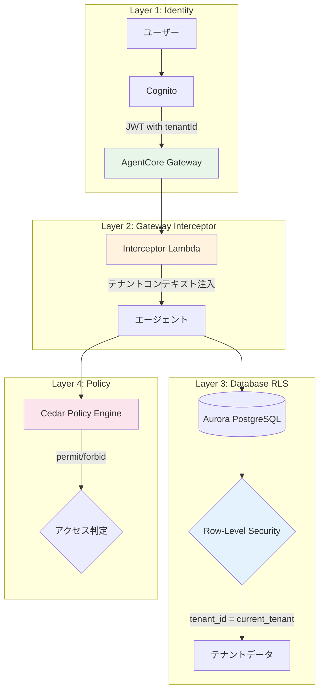
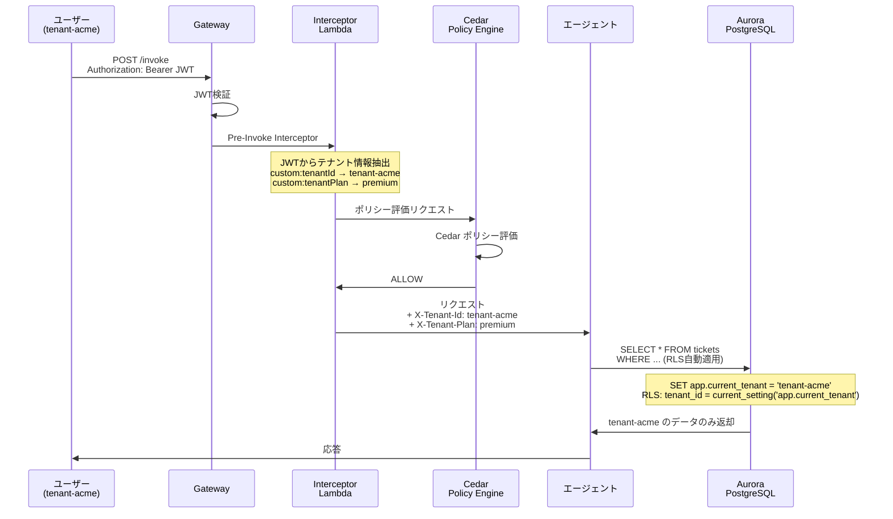
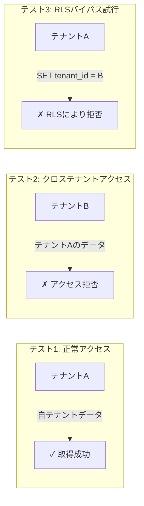
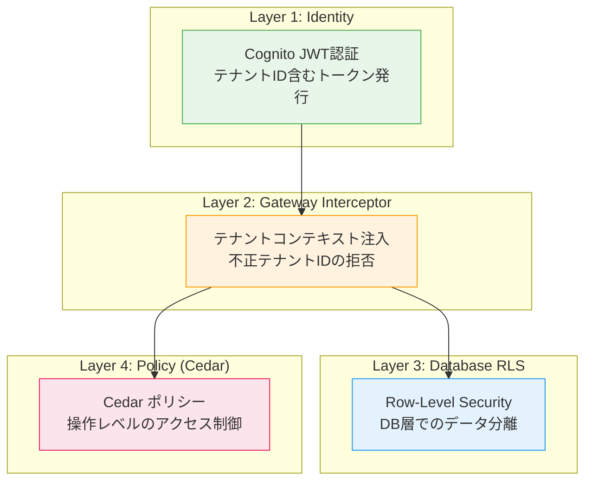

# 第5章: マルチテナント分離

## 概要

マルチテナント SaaS における最も重要な要件はテナント間のデータ分離です。本章では、Defense-in-Depth (多層防御) アプローチにより、4つのレイヤーでテナント分離を実現します。

| レイヤー | コンポーネント | 役割 |
|---|---|---|
| 1. Identity | Cognito + JWT | 認証とテナントID付与 |
| 2. Gateway Interceptor | Lambda | テナントコンテキストの注入 |
| 3. Database RLS | Aurora PostgreSQL | 行レベルセキュリティ |
| 4. Policy | Cedar | ポリシーベースのアクセス制御 |

---

## アーキテクチャ全体図



---

## 5.1 リクエストフロー詳細



---

## 5.2 Aurora PostgreSQL + Row-Level Security セットアップ

### データベース作成

```sql
-- database/init.sql

-- データベース作成
CREATE DATABASE agentcore_support;
\c agentcore_support;

-- テナントテーブル
CREATE TABLE tenants (
    tenant_id VARCHAR(64) PRIMARY KEY,
    tenant_name VARCHAR(255) NOT NULL,
    plan VARCHAR(32) NOT NULL DEFAULT 'basic',
    created_at TIMESTAMP DEFAULT CURRENT_TIMESTAMP
);

-- サポートチケットテーブル
CREATE TABLE support_tickets (
    ticket_id SERIAL PRIMARY KEY,
    tenant_id VARCHAR(64) NOT NULL REFERENCES tenants(tenant_id),
    user_email VARCHAR(255) NOT NULL,
    subject VARCHAR(500) NOT NULL,
    description TEXT,
    status VARCHAR(32) DEFAULT 'open',
    priority VARCHAR(32) DEFAULT 'medium',
    created_at TIMESTAMP DEFAULT CURRENT_TIMESTAMP,
    updated_at TIMESTAMP DEFAULT CURRENT_TIMESTAMP
);

-- 請求情報テーブル
CREATE TABLE billing_info (
    billing_id SERIAL PRIMARY KEY,
    tenant_id VARCHAR(64) NOT NULL REFERENCES tenants(tenant_id),
    user_email VARCHAR(255) NOT NULL,
    invoice_number VARCHAR(64) NOT NULL,
    amount DECIMAL(10, 2) NOT NULL,
    currency VARCHAR(3) DEFAULT 'USD',
    status VARCHAR(32) DEFAULT 'pending',
    due_date DATE,
    created_at TIMESTAMP DEFAULT CURRENT_TIMESTAMP
);

-- 返金履歴テーブル
CREATE TABLE refund_history (
    refund_id SERIAL PRIMARY KEY,
    tenant_id VARCHAR(64) NOT NULL REFERENCES tenants(tenant_id),
    ticket_id INTEGER REFERENCES support_tickets(ticket_id),
    user_email VARCHAR(255) NOT NULL,
    amount DECIMAL(10, 2) NOT NULL,
    reason TEXT,
    status VARCHAR(32) DEFAULT 'pending',
    approved_by VARCHAR(255),
    created_at TIMESTAMP DEFAULT CURRENT_TIMESTAMP
);

-- インデックス
CREATE INDEX idx_tickets_tenant ON support_tickets(tenant_id);
CREATE INDEX idx_billing_tenant ON billing_info(tenant_id);
CREATE INDEX idx_refund_tenant ON refund_history(tenant_id);
```

### Row-Level Security の設定

```sql
-- database/rls_setup.sql

-- アプリケーションロール作成
CREATE ROLE app_user LOGIN PASSWORD 'secure-password-here';

-- RLS 有効化
ALTER TABLE support_tickets ENABLE ROW LEVEL SECURITY;
ALTER TABLE billing_info ENABLE ROW LEVEL SECURITY;
ALTER TABLE refund_history ENABLE ROW LEVEL SECURITY;

-- RLS ポリシー: support_tickets
CREATE POLICY tenant_isolation_tickets ON support_tickets
    FOR ALL
    TO app_user
    USING (tenant_id = current_setting('app.current_tenant', true))
    WITH CHECK (tenant_id = current_setting('app.current_tenant', true));

-- RLS ポリシー: billing_info
CREATE POLICY tenant_isolation_billing ON billing_info
    FOR ALL
    TO app_user
    USING (tenant_id = current_setting('app.current_tenant', true))
    WITH CHECK (tenant_id = current_setting('app.current_tenant', true));

-- RLS ポリシー: refund_history
CREATE POLICY tenant_isolation_refunds ON refund_history
    FOR ALL
    TO app_user
    USING (tenant_id = current_setting('app.current_tenant', true))
    WITH CHECK (tenant_id = current_setting('app.current_tenant', true));

-- テーブル権限付与
GRANT SELECT, INSERT, UPDATE ON support_tickets TO app_user;
GRANT SELECT ON billing_info TO app_user;
GRANT SELECT, INSERT ON refund_history TO app_user;
GRANT USAGE, SELECT ON ALL SEQUENCES IN SCHEMA public TO app_user;
```

### テナントコンテキストの設定方法

```python
# database/tenant_db.py

import psycopg2
from contextlib import contextmanager


class TenantDatabase:
    """テナント分離されたデータベースアクセスクラス"""

    def __init__(self, db_config: dict):
        self.db_config = db_config

    @contextmanager
    def tenant_connection(self, tenant_id: str):
        """テナントコンテキストが設定されたDB接続を返す"""
        conn = psycopg2.connect(
            host=self.db_config["host"],
            port=self.db_config["port"],
            database=self.db_config["database"],
            user=self.db_config["user"],
            password=self.db_config["password"],
        )
        try:
            with conn.cursor() as cur:
                # テナントコンテキストを設定 (RLSが参照する)
                cur.execute(
                    "SET app.current_tenant = %s", (tenant_id,)
                )
            conn.commit()
            yield conn
        finally:
            conn.close()

    def get_tickets(self, tenant_id: str, status: str = None) -> list:
        """テナントのサポートチケットを取得する"""
        with self.tenant_connection(tenant_id) as conn:
            with conn.cursor() as cur:
                if status:
                    cur.execute(
                        "SELECT * FROM support_tickets WHERE status = %s "
                        "ORDER BY created_at DESC",
                        (status,),
                    )
                else:
                    cur.execute(
                        "SELECT * FROM support_tickets "
                        "ORDER BY created_at DESC"
                    )
                columns = [desc[0] for desc in cur.description]
                return [dict(zip(columns, row)) for row in cur.fetchall()]

    def get_billing(self, tenant_id: str, user_email: str = None) -> list:
        """テナントの請求情報を取得する"""
        with self.tenant_connection(tenant_id) as conn:
            with conn.cursor() as cur:
                if user_email:
                    cur.execute(
                        "SELECT * FROM billing_info WHERE user_email = %s "
                        "ORDER BY due_date DESC",
                        (user_email,),
                    )
                else:
                    cur.execute(
                        "SELECT * FROM billing_info ORDER BY due_date DESC"
                    )
                columns = [desc[0] for desc in cur.description]
                return [dict(zip(columns, row)) for row in cur.fetchall()]
```

---

## 5.3 Gateway Interceptor Lambda

### Interceptor の実装

```python
# lambda/interceptors/tenant_context_interceptor.py

import json
import logging
import jwt
import boto3

logger = logging.getLogger()
logger.setLevel(logging.INFO)


def handler(event, context):
    """
    Gateway Interceptor: JWTからテナント情報を抽出し、
    リクエストコンテキストに注入する
    """
    logger.info(f"Interceptor event: {json.dumps(event)}")

    # JWTトークンの取得
    headers = event.get("headers", {})
    auth_header = headers.get("Authorization", "")

    if not auth_header.startswith("Bearer "):
        return {
            "statusCode": 401,
            "body": json.dumps({
                "error": "Unauthorized",
                "message": "Bearer token required",
            }),
        }

    token = auth_header.replace("Bearer ", "")

    try:
        # JWTデコード (Gatewayで検証済みのため署名検証はスキップ)
        decoded = jwt.decode(token, options={"verify_signature": False})

        tenant_id = decoded.get("custom:tenantId")
        tenant_plan = decoded.get("custom:tenantPlan", "basic")
        tenant_role = decoded.get("custom:tenantRole", "user")
        user_id = decoded.get("sub")
        email = decoded.get("email")

        if not tenant_id:
            return {
                "statusCode": 403,
                "body": json.dumps({
                    "error": "Forbidden",
                    "message": "Tenant ID not found in token",
                }),
            }

        # テナントコンテキストをリクエストに注入
        tenant_context = {
            "tenantId": tenant_id,
            "tenantPlan": tenant_plan,
            "tenantRole": tenant_role,
            "userId": user_id,
            "email": email,
        }

        logger.info(f"Tenant context injected: {json.dumps(tenant_context)}")

        return {
            "statusCode": 200,
            "headers": {
                "X-Tenant-Id": tenant_id,
                "X-Tenant-Plan": tenant_plan,
                "X-Tenant-Role": tenant_role,
                "X-User-Id": user_id,
                "X-User-Email": email,
            },
            "body": json.dumps({
                "action": "CONTINUE",
                "tenantContext": tenant_context,
            }),
        }

    except jwt.DecodeError as e:
        logger.error(f"JWT decode error: {e}")
        return {
            "statusCode": 401,
            "body": json.dumps({
                "error": "Unauthorized",
                "message": "Invalid token format",
            }),
        }
    except Exception as e:
        logger.error(f"Interceptor error: {e}")
        return {
            "statusCode": 500,
            "body": json.dumps({
                "error": "Internal Server Error",
                "message": str(e),
            }),
        }
```

### CDK での Interceptor 登録

```typescript
// cdk/stacks/interceptor-stack.ts

import * as cdk from "aws-cdk-lib";
import * as lambda from "aws-cdk-lib/aws-lambda";
import { Construct } from "constructs";

export class InterceptorStack extends cdk.Stack {
  constructor(scope: Construct, id: string, props?: cdk.StackProps) {
    super(scope, id, props);

    // Interceptor Lambda
    const interceptor = new lambda.Function(this, "TenantInterceptor", {
      runtime: lambda.Runtime.PYTHON_3_12,
      handler: "tenant_context_interceptor.handler",
      code: lambda.Code.fromAsset("../lambda/interceptors"),
      functionName: "agentcore-tenant-interceptor",
      description: "テナントコンテキストを注入する Gateway Interceptor",
      timeout: cdk.Duration.seconds(10),
      memorySize: 256,
      environment: {
        LOG_LEVEL: "INFO",
      },
    });

    new cdk.CfnOutput(this, "InterceptorArn", {
      value: interceptor.functionArn,
    });
  }
}
```

---

## 5.4 テストデータの投入

### テナント別テストデータ

```sql
-- database/seed_data.sql

-- テナント登録
INSERT INTO tenants (tenant_id, tenant_name, plan)
VALUES
  ('tenant-acme', 'ACME Corporation', 'premium'),
  ('tenant-globex', 'Globex Corporation', 'basic');

-- テナントA (ACME) のサポートチケット
INSERT INTO support_tickets (tenant_id, user_email, subject, description, status, priority)
VALUES
  ('tenant-acme', 'user1@acme.com', 'ログインできない',
   'パスワードリセット後もログインできません。エラーコード: AUTH-500', 'open', 'high'),
  ('tenant-acme', 'user1@acme.com', 'APIレート制限について',
   'Premium プランのAPIレート制限を引き上げたい', 'in_progress', 'medium'),
  ('tenant-acme', 'admin@acme.com', 'データエクスポート機能',
   'CSVエクスポートが途中で停止する', 'open', 'high');

-- テナントB (Globex) のサポートチケット
INSERT INTO support_tickets (tenant_id, user_email, subject, description, status, priority)
VALUES
  ('tenant-globex', 'user1@globex.com', 'プランのアップグレード',
   'Basic から Premium へのアップグレード方法を教えてください', 'open', 'low'),
  ('tenant-globex', 'admin@globex.com', '請求書の再発行',
   '2月分の請求書を再発行してほしい', 'open', 'medium');

-- テナントA (ACME) の請求情報
INSERT INTO billing_info (tenant_id, user_email, invoice_number, amount, currency, status, due_date)
VALUES
  ('tenant-acme', 'admin@acme.com', 'INV-2026-001', 5000.00, 'USD', 'paid', '2026-01-31'),
  ('tenant-acme', 'admin@acme.com', 'INV-2026-002', 5000.00, 'USD', 'paid', '2026-02-28'),
  ('tenant-acme', 'admin@acme.com', 'INV-2026-003', 5000.00, 'USD', 'pending', '2026-03-31');

-- テナントB (Globex) の請求情報
INSERT INTO billing_info (tenant_id, user_email, invoice_number, amount, currency, status, due_date)
VALUES
  ('tenant-globex', 'admin@globex.com', 'INV-2026-G001', 500.00, 'USD', 'paid', '2026-01-31'),
  ('tenant-globex', 'admin@globex.com', 'INV-2026-G002', 500.00, 'USD', 'overdue', '2026-02-28'),
  ('tenant-globex', 'admin@globex.com', 'INV-2026-G003', 500.00, 'USD', 'pending', '2026-03-31');
```

---

## 5.5 クロステナントデータ漏洩テスト

### テストシナリオ



### テスト実装

```python
# tests/test_tenant_isolation.py

import psycopg2
import requests
import json


DB_CONFIG = {
    "host": "your-aurora-endpoint",
    "port": 5432,
    "database": "agentcore_support",
    "user": "app_user",
    "password": "secure-password-here",
}


class TestTenantIsolation:
    """テナント分離の統合テスト"""

    def test_tenant_can_access_own_data(self):
        """テナントAが自テナントのデータにアクセスできることを確認"""
        conn = psycopg2.connect(**DB_CONFIG)
        try:
            with conn.cursor() as cur:
                # テナントAのコンテキスト設定
                cur.execute("SET app.current_tenant = 'tenant-acme'")
                conn.commit()

                cur.execute("SELECT count(*) FROM support_tickets")
                count = cur.fetchone()[0]

                assert count == 3, (
                    f"テナントAのチケットは3件のはず。実際: {count}"
                )
                print(f"テナントA チケット数: {count} - PASSED")
        finally:
            conn.close()

    def test_tenant_cannot_access_other_tenant_data(self):
        """テナントBがテナントAのデータにアクセスできないことを確認"""
        conn = psycopg2.connect(**DB_CONFIG)
        try:
            with conn.cursor() as cur:
                # テナントBのコンテキスト設定
                cur.execute("SET app.current_tenant = 'tenant-globex'")
                conn.commit()

                # テナントAのチケットを直接指定してもRLSにより除外される
                cur.execute(
                    "SELECT count(*) FROM support_tickets "
                    "WHERE tenant_id = 'tenant-acme'"
                )
                count = cur.fetchone()[0]

                assert count == 0, (
                    f"テナントBからテナントAのデータは見えないはず。実際: {count}"
                )
                print("クロステナントアクセス拒否: PASSED")
        finally:
            conn.close()

    def test_billing_isolation(self):
        """請求情報のテナント分離を確認"""
        conn = psycopg2.connect(**DB_CONFIG)
        try:
            with conn.cursor() as cur:
                # テナントAのコンテキスト
                cur.execute("SET app.current_tenant = 'tenant-acme'")
                conn.commit()

                cur.execute("SELECT invoice_number, amount FROM billing_info")
                acme_invoices = cur.fetchall()

                # テナントAの請求書のみ取得されること
                for inv_num, _ in acme_invoices:
                    assert inv_num.startswith("INV-2026-0"), (
                        f"テナントAの請求書番号パターンに合致しません: {inv_num}"
                    )

                print(f"テナントA 請求書数: {len(acme_invoices)} - PASSED")

                # テナントBに切り替え
                cur.execute("SET app.current_tenant = 'tenant-globex'")
                conn.commit()

                cur.execute("SELECT invoice_number, amount FROM billing_info")
                globex_invoices = cur.fetchall()

                for inv_num, _ in globex_invoices:
                    assert inv_num.startswith("INV-2026-G"), (
                        f"テナントBの請求書番号パターンに合致しません: {inv_num}"
                    )

                print(f"テナントB 請求書数: {len(globex_invoices)} - PASSED")
        finally:
            conn.close()

    def test_rls_bypass_attempt(self):
        """RLSバイパスの試行が失敗することを確認"""
        conn = psycopg2.connect(**DB_CONFIG)
        try:
            with conn.cursor() as cur:
                # テナントBとしてログイン
                cur.execute("SET app.current_tenant = 'tenant-globex'")
                conn.commit()

                # テナントAのデータをINSERTしようとする
                try:
                    cur.execute(
                        "INSERT INTO support_tickets "
                        "(tenant_id, user_email, subject, description) "
                        "VALUES ('tenant-acme', 'hacker@globex.com', "
                        "'不正アクセス', 'テスト')"
                    )
                    conn.commit()
                    assert False, "RLSバイパスが成功してしまいました！"
                except psycopg2.errors.CheckViolation:
                    conn.rollback()
                    print("RLSバイパスINSERT拒否: PASSED")

        finally:
            conn.close()

    def test_api_cross_tenant_access_denied(self):
        """API経由でのクロステナントアクセスが拒否されることを確認"""
        gateway_url = "https://your-gateway-endpoint"

        # テナントBのトークンを取得
        token_b = get_token_for_tenant("tenant-globex")

        # テナントBのトークンでテナントAのデータにアクセス試行
        response = requests.post(
            f"{gateway_url}/invoke",
            headers={"Authorization": f"Bearer {token_b}"},
            json={
                "message": "テナントACMEのチケット一覧を見せて"
            },
        )

        result = response.json()

        # エージェントの応答にテナントAの具体的なデータが含まれないこと
        assert "INV-2026-001" not in json.dumps(result), (
            "テナントAの請求書番号がレスポンスに含まれています！"
        )
        assert "AUTH-500" not in json.dumps(result), (
            "テナントAのチケット詳細がレスポンスに含まれています！"
        )

        print("API クロステナントアクセス拒否: PASSED")
```

### テスト実行

```bash
# テストの実行
cd /path/to/project
python -m pytest tests/test_tenant_isolation.py -v

# 期待される出力:
# tests/test_tenant_isolation.py::TestTenantIsolation::test_tenant_can_access_own_data PASSED
# tests/test_tenant_isolation.py::TestTenantIsolation::test_tenant_cannot_access_other_tenant_data PASSED
# tests/test_tenant_isolation.py::TestTenantIsolation::test_billing_isolation PASSED
# tests/test_tenant_isolation.py::TestTenantIsolation::test_rls_bypass_attempt PASSED
# tests/test_tenant_isolation.py::TestTenantIsolation::test_api_cross_tenant_access_denied PASSED
```

---

## 5.6 Defense-in-Depth まとめ



各レイヤーの役割:

| レイヤー | 防御対象 | 失敗時のフォールバック |
|---|---|---|
| Identity | 未認証アクセス | リクエスト拒否 (401) |
| Interceptor | テナントコンテキスト改ざん | リクエスト拒否 (403) |
| Database RLS | SQLインジェクション等 | データ返却なし |
| Cedar Policy | 権限外操作 | 操作拒否 |

単一のレイヤーが突破されても、次のレイヤーでブロックされるため、データ漏洩のリスクを最小化できます。

---

## 次のステップ

[第6章: Policy & Cedar](./07-policy-cedar.md) では、Cedar ポリシー言語を使ったきめ細かなアクセス制御を実装します。
