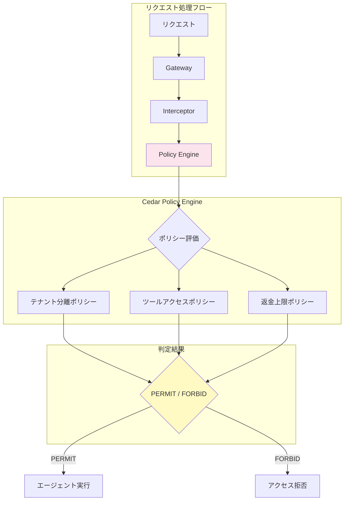
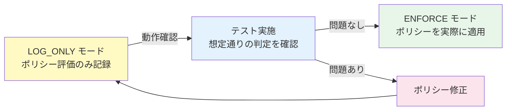
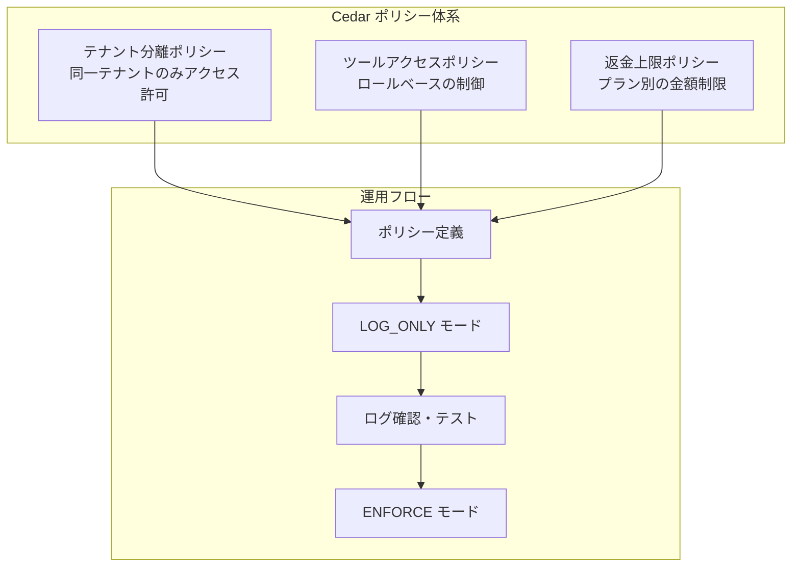

# 第6章: Policy & Cedar

## 概要

Amazon Bedrock AgentCore の Policy Engine と Cedar ポリシー言語を使い、マルチテナント SaaS カスタマーサポートエージェントにきめ細かなアクセス制御を実装します。

本章では以下を学びます:

- Cedar ポリシー言語の基礎
- AgentCore Policy Engine との統合
- テナント分離ポリシー
- ツールアクセス制御ポリシー
- プラン別返金上限ポリシー
- 自然言語からCedarポリシーへの変換
- LOG_ONLY から ENFORCE モードへの切り替え
- ポリシーのテストとデバッグ

---

## アーキテクチャ



---

## 6.1 Cedar ポリシー言語の基礎

### Cedar の概念

Cedar は Amazon が開発した宣言的なポリシー言語で、以下の3つの要素でアクセス制御を定義します:

| 要素 | 説明 | 例 |
|---|---|---|
| **Principal** | アクションを行う主体 | ユーザー、エージェント |
| **Action** | 実行される操作 | read, write, refund |
| **Resource** | 操作対象のリソース | チケット、請求情報 |

### 基本構文

```cedar
// 許可ポリシー
permit (
    principal,        // 誰が
    action,           // 何を
    resource          // 何に対して
) when {
    // 条件
};

// 拒否ポリシー (許可より優先)
forbid (
    principal,
    action,
    resource
) when {
    // 条件
};
```

---

## 6.2 エンティティスキーマ定義

### スキーマファイル

```json
// policies/cedar/schema.json
{
  "AgentCore::Support": {
    "entityTypes": {
      "Tenant": {
        "shape": {
          "type": "Record",
          "attributes": {
            "plan": { "type": "String" },
            "name": { "type": "String" }
          }
        }
      },
      "User": {
        "shape": {
          "type": "Record",
          "attributes": {
            "email": { "type": "String" },
            "role": { "type": "String" },
            "tenant": {
              "type": "Entity",
              "name": "Tenant"
            }
          }
        },
        "memberOfTypes": ["Tenant"]
      },
      "Ticket": {
        "shape": {
          "type": "Record",
          "attributes": {
            "tenant": {
              "type": "Entity",
              "name": "Tenant"
            },
            "status": { "type": "String" },
            "priority": { "type": "String" }
          }
        }
      },
      "BillingRecord": {
        "shape": {
          "type": "Record",
          "attributes": {
            "tenant": {
              "type": "Entity",
              "name": "Tenant"
            },
            "amount": { "type": "Long" }
          }
        }
      },
      "RefundRequest": {
        "shape": {
          "type": "Record",
          "attributes": {
            "tenant": {
              "type": "Entity",
              "name": "Tenant"
            },
            "amount": { "type": "Long" },
            "ticketId": { "type": "String" }
          }
        }
      },
      "Tool": {
        "shape": {
          "type": "Record",
          "attributes": {
            "name": { "type": "String" },
            "category": { "type": "String" }
          }
        }
      }
    },
    "actions": {
      "ReadTicket": {
        "appliesTo": {
          "principalTypes": ["User"],
          "resourceTypes": ["Ticket"]
        }
      },
      "UpdateTicket": {
        "appliesTo": {
          "principalTypes": ["User"],
          "resourceTypes": ["Ticket"]
        }
      },
      "ReadBilling": {
        "appliesTo": {
          "principalTypes": ["User"],
          "resourceTypes": ["BillingRecord"]
        }
      },
      "RequestRefund": {
        "appliesTo": {
          "principalTypes": ["User"],
          "resourceTypes": ["RefundRequest"]
        }
      },
      "UseTool": {
        "appliesTo": {
          "principalTypes": ["User"],
          "resourceTypes": ["Tool"]
        }
      }
    }
  }
}
```

---

## 6.3 テナント分離ポリシー

### ポリシー定義

```cedar
// policies/cedar/tenant_isolation.cedar

// ポリシー1: テナント分離 - ユーザーは自テナントのチケットのみ読み取り可能
permit (
    principal is AgentCore::Support::User,
    action == AgentCore::Support::Action::"ReadTicket",
    resource is AgentCore::Support::Ticket
) when {
    principal.tenant == resource.tenant
};

// ポリシー2: テナント分離 - ユーザーは自テナントのチケットのみ更新可能
permit (
    principal is AgentCore::Support::User,
    action == AgentCore::Support::Action::"UpdateTicket",
    resource is AgentCore::Support::Ticket
) when {
    principal.tenant == resource.tenant
};

// ポリシー3: テナント分離 - ユーザーは自テナントの請求情報のみ読み取り可能
permit (
    principal is AgentCore::Support::User,
    action == AgentCore::Support::Action::"ReadBilling",
    resource is AgentCore::Support::BillingRecord
) when {
    principal.tenant == resource.tenant
};

// ポリシー4: クロステナントアクセスの明示的拒否
forbid (
    principal is AgentCore::Support::User,
    action,
    resource
) when {
    principal has tenant &&
    resource has tenant &&
    principal.tenant != resource.tenant
};
```

---

## 6.4 ツールアクセス制御ポリシー

### ロールベースのツールアクセス

```cedar
// policies/cedar/tool_access.cedar

// 管理者は全ツール使用可能
permit (
    principal is AgentCore::Support::User,
    action == AgentCore::Support::Action::"UseTool",
    resource is AgentCore::Support::Tool
) when {
    principal.role == "admin"
};

// 一般ユーザーは読み取り系ツールのみ使用可能
permit (
    principal is AgentCore::Support::User,
    action == AgentCore::Support::Action::"UseTool",
    resource is AgentCore::Support::Tool
) when {
    principal.role == "user" &&
    resource.category == "readonly"
};

// 一般ユーザーの書き込み系ツール使用を禁止
forbid (
    principal is AgentCore::Support::User,
    action == AgentCore::Support::Action::"UseTool",
    resource is AgentCore::Support::Tool
) when {
    principal.role == "user" &&
    resource.category == "write"
};
```

### ツールカテゴリの定義

| カテゴリ | ツール例 | ロール |
|---|---|---|
| `readonly` | チケット検索、請求書表示 | user, admin |
| `write` | チケット更新、ステータス変更 | admin |
| `financial` | 返金処理、割引適用 | admin (+ ポリシー制限) |

---

## 6.5 返金上限ポリシー

### プラン別返金制限

ビジネスルール:
- **Basic プラン**: 1回の返金上限 $100
- **Premium プラン**: 1回の返金上限 $1,000

```cedar
// policies/cedar/refund_limits.cedar

// Premium プラン: $1000 以下の返金を許可
permit (
    principal is AgentCore::Support::User,
    action == AgentCore::Support::Action::"RequestRefund",
    resource is AgentCore::Support::RefundRequest
) when {
    principal.tenant == resource.tenant &&
    principal.role == "admin" &&
    principal.tenant.plan == "premium" &&
    resource.amount <= 100000   // 金額はセント単位 ($1000 = 100000)
};

// Basic プラン: $100 以下の返金を許可
permit (
    principal is AgentCore::Support::User,
    action == AgentCore::Support::Action::"RequestRefund",
    resource is AgentCore::Support::RefundRequest
) when {
    principal.tenant == resource.tenant &&
    principal.role == "admin" &&
    principal.tenant.plan == "basic" &&
    resource.amount <= 10000    // 金額はセント単位 ($100 = 10000)
};

// 上限超過の返金を明示的に拒否 (Premium)
forbid (
    principal is AgentCore::Support::User,
    action == AgentCore::Support::Action::"RequestRefund",
    resource is AgentCore::Support::RefundRequest
) when {
    principal.tenant.plan == "premium" &&
    resource.amount > 100000
};

// 上限超過の返金を明示的に拒否 (Basic)
forbid (
    principal is AgentCore::Support::User,
    action == AgentCore::Support::Action::"RequestRefund",
    resource is AgentCore::Support::RefundRequest
) when {
    principal.tenant.plan == "basic" &&
    resource.amount > 10000
};

// 一般ユーザーの返金リクエストを禁止
forbid (
    principal is AgentCore::Support::User,
    action == AgentCore::Support::Action::"RequestRefund",
    resource is AgentCore::Support::RefundRequest
) when {
    principal.role != "admin"
};
```

---

## 6.6 AgentCore Policy Engine との統合

### Policy Engine への登録

```python
# scripts/register_policies.py

import boto3
import json
from pathlib import Path

bedrock_agentcore = boto3.client("bedrock-agentcore")

POLICY_DIR = Path("policies/cedar")


def register_policy_store():
    """ポリシーストアを作成する"""
    # スキーマの読み込み
    schema = json.loads((POLICY_DIR / "schema.json").read_text())

    response = bedrock_agentcore.create_policy_store(
        name="customer-support-policies",
        description="マルチテナントカスタマーサポートのポリシーストア",
        schema={
            "cedarJson": json.dumps(schema),
        },
        # 初期状態は LOG_ONLY モード
        enforcementMode="LOG_ONLY",
    )

    policy_store_id = response["policyStoreId"]
    print(f"Policy Store 作成完了: {policy_store_id}")
    return policy_store_id


def register_policies(policy_store_id: str):
    """Cedar ポリシーを登録する"""
    policy_files = [
        "tenant_isolation.cedar",
        "tool_access.cedar",
        "refund_limits.cedar",
    ]

    for policy_file in policy_files:
        policy_path = POLICY_DIR / policy_file
        policy_content = policy_path.read_text()

        response = bedrock_agentcore.create_policy(
            policyStoreId=policy_store_id,
            name=policy_file.replace(".cedar", ""),
            description=f"ポリシー: {policy_file}",
            policyType="CEDAR",
            policyBody=policy_content,
        )

        print(
            f"ポリシー登録完了: {policy_file} "
            f"(ID: {response['policyId']})"
        )


if __name__ == "__main__":
    store_id = register_policy_store()
    register_policies(store_id)
```

### エージェントからのポリシー評価呼び出し

```python
# agents/customer_support/policy_evaluator.py

import boto3
import json
import logging

logger = logging.getLogger(__name__)

bedrock_agentcore = boto3.client("bedrock-agentcore")

POLICY_STORE_ID = "ps-xxxxxxxxxxxx"


def evaluate_policy(
    tenant_id: str,
    tenant_plan: str,
    user_id: str,
    user_role: str,
    action: str,
    resource_type: str,
    resource_id: str,
    resource_tenant_id: str,
    resource_attributes: dict = None,
) -> dict:
    """Cedar ポリシーを評価する"""
    request = {
        "policyStoreId": POLICY_STORE_ID,
        "principal": {
            "entityType": "AgentCore::Support::User",
            "entityId": user_id,
            "attributes": {
                "role": user_role,
                "tenant": {
                    "entityType": "AgentCore::Support::Tenant",
                    "entityId": tenant_id,
                    "attributes": {
                        "plan": tenant_plan,
                    },
                },
            },
        },
        "action": {
            "actionType": "AgentCore::Support::Action",
            "actionId": action,
        },
        "resource": {
            "entityType": f"AgentCore::Support::{resource_type}",
            "entityId": resource_id,
            "attributes": {
                "tenant": {
                    "entityType": "AgentCore::Support::Tenant",
                    "entityId": resource_tenant_id,
                },
                **(resource_attributes or {}),
            },
        },
    }

    response = bedrock_agentcore.evaluate_policy(**request)

    decision = response["decision"]  # "ALLOW" or "DENY"
    reasons = response.get("reasons", [])

    logger.info(
        f"Policy evaluation: action={action}, "
        f"decision={decision}, reasons={reasons}"
    )

    return {
        "decision": decision,
        "reasons": reasons,
        "request": request,
    }


def check_refund_allowed(
    tenant_id: str,
    tenant_plan: str,
    user_id: str,
    user_role: str,
    refund_amount_cents: int,
    ticket_id: str,
) -> dict:
    """返金リクエストが許可されるかチェックする"""
    result = evaluate_policy(
        tenant_id=tenant_id,
        tenant_plan=tenant_plan,
        user_id=user_id,
        user_role=user_role,
        action="RequestRefund",
        resource_type="RefundRequest",
        resource_id=f"refund-{ticket_id}",
        resource_tenant_id=tenant_id,
        resource_attributes={
            "amount": refund_amount_cents,
            "ticketId": ticket_id,
        },
    )

    if result["decision"] == "DENY":
        if tenant_plan == "basic":
            limit = "$100"
        else:
            limit = "$1,000"
        result["message"] = (
            f"返金金額が{tenant_plan}プランの上限 ({limit}) を超えています"
        )

    return result
```

---

## 6.7 自然言語から Cedar への変換

AgentCore では、自然言語でポリシーを記述し、Cedar に自動変換する機能を活用できます。

### 変換例

**入力 (自然言語):**

```
Basicプランのテナントは、1回あたり100ドル以下の返金のみリクエストできる。
Premiumプランのテナントは、1回あたり1000ドル以下の返金をリクエストできる。
返金をリクエストできるのは管理者ロールのユーザーのみ。
```

**出力 (Cedar):**

```cedar
// 自動生成されたCedarポリシー
permit (
    principal is AgentCore::Support::User,
    action == AgentCore::Support::Action::"RequestRefund",
    resource is AgentCore::Support::RefundRequest
) when {
    principal.role == "admin" &&
    principal.tenant.plan == "basic" &&
    resource.amount <= 10000
};

permit (
    principal is AgentCore::Support::User,
    action == AgentCore::Support::Action::"RequestRefund",
    resource is AgentCore::Support::RefundRequest
) when {
    principal.role == "admin" &&
    principal.tenant.plan == "premium" &&
    resource.amount <= 100000
};
```

### 変換の実行

```python
# scripts/nl_to_cedar.py

import boto3

bedrock_agentcore = boto3.client("bedrock-agentcore")


def convert_natural_language_to_cedar(
    policy_store_id: str,
    natural_language_policy: str,
) -> str:
    """自然言語のポリシーをCedarに変換する"""
    response = bedrock_agentcore.generate_policy(
        policyStoreId=policy_store_id,
        naturalLanguagePolicy=natural_language_policy,
        outputFormat="CEDAR",
    )

    cedar_policy = response["generatedPolicy"]
    print("生成されたCedarポリシー:")
    print(cedar_policy)
    return cedar_policy


# 使用例
nl_policy = """
Basicプランのテナントは、1回あたり100ドル以下の返金のみリクエストできる。
Premiumプランのテナントは、1回あたり1000ドル以下の返金をリクエストできる。
返金をリクエストできるのは管理者ロールのユーザーのみ。
異なるテナントのリソースへのアクセスは常に拒否する。
"""

cedar_output = convert_natural_language_to_cedar("ps-xxxxxxxxxxxx", nl_policy)
```

---

## 6.8 LOG_ONLY から ENFORCE モードへの切り替え

### 段階的なポリシー適用



### LOG_ONLY モードでの動作確認

```python
# scripts/switch_enforcement_mode.py

import boto3
import json
import time

bedrock_agentcore = boto3.client("bedrock-agentcore")
cloudwatch_logs = boto3.client("logs")

POLICY_STORE_ID = "ps-xxxxxxxxxxxx"


def get_current_mode(policy_store_id: str) -> str:
    """現在のエンフォースメントモードを取得する"""
    response = bedrock_agentcore.get_policy_store(
        policyStoreId=policy_store_id
    )
    mode = response["enforcementMode"]
    print(f"現在のモード: {mode}")
    return mode


def check_log_only_results(log_group: str, hours: int = 1):
    """LOG_ONLY モードのログを確認する"""
    end_time = int(time.time() * 1000)
    start_time = end_time - (hours * 3600 * 1000)

    response = cloudwatch_logs.filter_log_events(
        logGroupName=log_group,
        startTime=start_time,
        endTime=end_time,
        filterPattern='"POLICY_EVALUATION"',
    )

    results = {"ALLOW": 0, "DENY": 0, "errors": []}

    for event in response["events"]:
        message = json.loads(event["message"])
        decision = message.get("decision")
        if decision == "ALLOW":
            results["ALLOW"] += 1
        elif decision == "DENY":
            results["DENY"] += 1

            # DENY の詳細を記録
            results["errors"].append({
                "timestamp": event["timestamp"],
                "principal": message.get("principal"),
                "action": message.get("action"),
                "resource": message.get("resource"),
                "reasons": message.get("reasons"),
            })

    print(f"\n=== LOG_ONLY モード評価結果 (過去{hours}時間) ===")
    print(f"ALLOW: {results['ALLOW']} 件")
    print(f"DENY:  {results['DENY']} 件")

    if results["errors"]:
        print(f"\n--- DENY 詳細 ---")
        for err in results["errors"]:
            print(json.dumps(err, indent=2, ensure_ascii=False))

    return results


def switch_to_enforce(policy_store_id: str):
    """ENFORCE モードに切り替える"""
    # まず LOG_ONLY の結果を確認
    results = check_log_only_results(
        f"/aws/bedrock-agentcore/policy/{policy_store_id}"
    )

    if results["DENY"] > 0:
        print(
            f"\n警告: {results['DENY']} 件の DENY が記録されています。"
            f"ENFORCE に切り替える前に確認してください。"
        )
        confirm = input("ENFORCE モードに切り替えますか？ (yes/no): ")
        if confirm != "yes":
            print("切り替えをキャンセルしました")
            return

    response = bedrock_agentcore.update_policy_store(
        policyStoreId=policy_store_id,
        enforcementMode="ENFORCE",
    )

    print(f"\nENFORCE モードに切り替えました")
    print(f"Policy Store: {policy_store_id}")


if __name__ == "__main__":
    import sys

    if len(sys.argv) < 2:
        print("Usage: python switch_enforcement_mode.py [check|enforce]")
        sys.exit(1)

    command = sys.argv[1]

    if command == "check":
        get_current_mode(POLICY_STORE_ID)
        check_log_only_results(
            f"/aws/bedrock-agentcore/policy/{POLICY_STORE_ID}"
        )
    elif command == "enforce":
        switch_to_enforce(POLICY_STORE_ID)
    else:
        print(f"不明なコマンド: {command}")
```

### 切り替え手順

```bash
# 1. 現在のモードとログを確認
python scripts/switch_enforcement_mode.py check

# 出力例:
# 現在のモード: LOG_ONLY
# === LOG_ONLY モード評価結果 (過去1時間) ===
# ALLOW: 142 件
# DENY:  3 件
# --- DENY 詳細 ---
# ...

# 2. DENY の内容を確認し、問題ない場合は ENFORCE に切り替え
python scripts/switch_enforcement_mode.py enforce
```

---

## 6.9 検証: ポリシーエンフォースメントのテスト

### テストシナリオ一覧

| # | シナリオ | Principal | Action | Resource | 期待結果 |
|---|---|---|---|---|---|
| 1 | テナントAが自テナントのチケットを読む | tenant-acme/admin | ReadTicket | tenant-acme/ticket-1 | ALLOW |
| 2 | テナントAがテナントBのチケットを読む | tenant-acme/admin | ReadTicket | tenant-globex/ticket-1 | DENY |
| 3 | 一般ユーザーが書き込みツールを使う | tenant-acme/user | UseTool | write-tool | DENY |
| 4 | 管理者が書き込みツールを使う | tenant-acme/admin | UseTool | write-tool | ALLOW |
| 5 | Premium管理者が$500の返金 | tenant-acme/admin (premium) | RequestRefund | $500 | ALLOW |
| 6 | Premium管理者が$1500の返金 | tenant-acme/admin (premium) | RequestRefund | $1500 | DENY |
| 7 | Basic管理者が$50の返金 | tenant-globex/admin (basic) | RequestRefund | $50 | ALLOW |
| 8 | Basic管理者が$200の返金 | tenant-globex/admin (basic) | RequestRefund | $200 | DENY |
| 9 | 一般ユーザーの返金リクエスト | tenant-acme/user | RequestRefund | $10 | DENY |

### テスト実装

```python
# tests/test_cedar_policies.py

import pytest


POLICY_STORE_ID = "ps-xxxxxxxxxxxx"


class TestTenantIsolationPolicy:
    """テナント分離ポリシーのテスト"""

    def test_allow_same_tenant_ticket_read(self):
        """テナントAが自テナントのチケットを読める"""
        result = evaluate_policy(
            tenant_id="tenant-acme",
            tenant_plan="premium",
            user_id="admin@acme.com",
            user_role="admin",
            action="ReadTicket",
            resource_type="Ticket",
            resource_id="ticket-001",
            resource_tenant_id="tenant-acme",
        )
        assert result["decision"] == "ALLOW"
        print("テスト1 (同一テナント読み取り): PASSED")

    def test_deny_cross_tenant_ticket_read(self):
        """テナントAがテナントBのチケットを読めない"""
        result = evaluate_policy(
            tenant_id="tenant-acme",
            tenant_plan="premium",
            user_id="admin@acme.com",
            user_role="admin",
            action="ReadTicket",
            resource_type="Ticket",
            resource_id="ticket-101",
            resource_tenant_id="tenant-globex",  # 別テナント
        )
        assert result["decision"] == "DENY"
        print("テスト2 (クロステナント読み取り拒否): PASSED")

    def test_deny_cross_tenant_billing_read(self):
        """テナントAがテナントBの請求情報を読めない"""
        result = evaluate_policy(
            tenant_id="tenant-acme",
            tenant_plan="premium",
            user_id="admin@acme.com",
            user_role="admin",
            action="ReadBilling",
            resource_type="BillingRecord",
            resource_id="billing-G001",
            resource_tenant_id="tenant-globex",
        )
        assert result["decision"] == "DENY"
        print("テスト3 (クロステナント請求情報拒否): PASSED")


class TestToolAccessPolicy:
    """ツールアクセスポリシーのテスト"""

    def test_deny_user_write_tool(self):
        """一般ユーザーが書き込みツールを使えない"""
        result = evaluate_policy(
            tenant_id="tenant-acme",
            tenant_plan="premium",
            user_id="user1@acme.com",
            user_role="user",
            action="UseTool",
            resource_type="Tool",
            resource_id="ticket-updater",
            resource_tenant_id="tenant-acme",
            resource_attributes={
                "name": "ticket-updater",
                "category": "write",
            },
        )
        assert result["decision"] == "DENY"
        print("テスト4 (一般ユーザー書き込みツール拒否): PASSED")

    def test_allow_admin_write_tool(self):
        """管理者が書き込みツールを使える"""
        result = evaluate_policy(
            tenant_id="tenant-acme",
            tenant_plan="premium",
            user_id="admin@acme.com",
            user_role="admin",
            action="UseTool",
            resource_type="Tool",
            resource_id="ticket-updater",
            resource_tenant_id="tenant-acme",
            resource_attributes={
                "name": "ticket-updater",
                "category": "write",
            },
        )
        assert result["decision"] == "ALLOW"
        print("テスト5 (管理者書き込みツール許可): PASSED")

    def test_allow_user_readonly_tool(self):
        """一般ユーザーが読み取りツールを使える"""
        result = evaluate_policy(
            tenant_id="tenant-acme",
            tenant_plan="premium",
            user_id="user1@acme.com",
            user_role="user",
            action="UseTool",
            resource_type="Tool",
            resource_id="ticket-viewer",
            resource_tenant_id="tenant-acme",
            resource_attributes={
                "name": "ticket-viewer",
                "category": "readonly",
            },
        )
        assert result["decision"] == "ALLOW"
        print("テスト6 (一般ユーザー読み取りツール許可): PASSED")


class TestRefundLimitPolicy:
    """返金上限ポリシーのテスト"""

    def test_allow_premium_refund_within_limit(self):
        """Premiumプラン管理者が上限内の返金をリクエストできる"""
        result = check_refund_allowed(
            tenant_id="tenant-acme",
            tenant_plan="premium",
            user_id="admin@acme.com",
            user_role="admin",
            refund_amount_cents=50000,  # $500
            ticket_id="ticket-001",
        )
        assert result["decision"] == "ALLOW"
        print("テスト7 (Premium $500 返金許可): PASSED")

    def test_deny_premium_refund_over_limit(self):
        """Premiumプラン管理者が上限超過の返金を拒否される"""
        result = check_refund_allowed(
            tenant_id="tenant-acme",
            tenant_plan="premium",
            user_id="admin@acme.com",
            user_role="admin",
            refund_amount_cents=150000,  # $1500
            ticket_id="ticket-002",
        )
        assert result["decision"] == "DENY"
        assert "$1,000" in result.get("message", "")
        print("テスト8 (Premium $1500 返金拒否): PASSED")

    def test_allow_basic_refund_within_limit(self):
        """Basicプラン管理者が上限内の返金をリクエストできる"""
        result = check_refund_allowed(
            tenant_id="tenant-globex",
            tenant_plan="basic",
            user_id="admin@globex.com",
            user_role="admin",
            refund_amount_cents=5000,  # $50
            ticket_id="ticket-101",
        )
        assert result["decision"] == "ALLOW"
        print("テスト9 (Basic $50 返金許可): PASSED")

    def test_deny_basic_refund_over_limit(self):
        """Basicプラン管理者が上限超過の返金を拒否される"""
        result = check_refund_allowed(
            tenant_id="tenant-globex",
            tenant_plan="basic",
            user_id="admin@globex.com",
            user_role="admin",
            refund_amount_cents=20000,  # $200
            ticket_id="ticket-102",
        )
        assert result["decision"] == "DENY"
        assert "$100" in result.get("message", "")
        print("テスト10 (Basic $200 返金拒否): PASSED")

    def test_deny_user_refund_request(self):
        """一般ユーザーの返金リクエストが拒否される"""
        result = check_refund_allowed(
            tenant_id="tenant-acme",
            tenant_plan="premium",
            user_id="user1@acme.com",
            user_role="user",
            refund_amount_cents=1000,  # $10
            ticket_id="ticket-003",
        )
        assert result["decision"] == "DENY"
        print("テスト11 (一般ユーザー返金拒否): PASSED")

    def test_boundary_premium_exact_limit(self):
        """Premiumプランの上限ちょうどの返金が許可される"""
        result = check_refund_allowed(
            tenant_id="tenant-acme",
            tenant_plan="premium",
            user_id="admin@acme.com",
            user_role="admin",
            refund_amount_cents=100000,  # $1000 (上限ちょうど)
            ticket_id="ticket-004",
        )
        assert result["decision"] == "ALLOW"
        print("テスト12 (Premium $1000 境界値許可): PASSED")

    def test_boundary_basic_over_by_one(self):
        """Basicプランの上限を$0.01超過した返金が拒否される"""
        result = check_refund_allowed(
            tenant_id="tenant-globex",
            tenant_plan="basic",
            user_id="admin@globex.com",
            user_role="admin",
            refund_amount_cents=10001,  # $100.01 (上限+$0.01)
            ticket_id="ticket-103",
        )
        assert result["decision"] == "DENY"
        print("テスト13 (Basic $100.01 境界値拒否): PASSED")
```

### テスト実行

```bash
# 全テスト実行
cd /path/to/project
python -m pytest tests/test_cedar_policies.py -v

# 期待される出力:
# tests/test_cedar_policies.py::TestTenantIsolationPolicy::test_allow_same_tenant_ticket_read PASSED
# tests/test_cedar_policies.py::TestTenantIsolationPolicy::test_deny_cross_tenant_ticket_read PASSED
# tests/test_cedar_policies.py::TestTenantIsolationPolicy::test_deny_cross_tenant_billing_read PASSED
# tests/test_cedar_policies.py::TestToolAccessPolicy::test_deny_user_write_tool PASSED
# tests/test_cedar_policies.py::TestToolAccessPolicy::test_allow_admin_write_tool PASSED
# tests/test_cedar_policies.py::TestToolAccessPolicy::test_allow_user_readonly_tool PASSED
# tests/test_cedar_policies.py::TestRefundLimitPolicy::test_allow_premium_refund_within_limit PASSED
# tests/test_cedar_policies.py::TestRefundLimitPolicy::test_deny_premium_refund_over_limit PASSED
# tests/test_cedar_policies.py::TestRefundLimitPolicy::test_allow_basic_refund_within_limit PASSED
# tests/test_cedar_policies.py::TestRefundLimitPolicy::test_deny_basic_refund_over_limit PASSED
# tests/test_cedar_policies.py::TestRefundLimitPolicy::test_deny_user_refund_request PASSED
# tests/test_cedar_policies.py::TestRefundLimitPolicy::test_boundary_premium_exact_limit PASSED
# tests/test_cedar_policies.py::TestRefundLimitPolicy::test_boundary_basic_over_by_one PASSED
```

---

## 6.10 ポリシーデバッグ

### 判定理由の確認

ポリシー評価結果に含まれる `reasons` フィールドから、どのポリシーが適用されたかを確認できます。

```python
# scripts/debug_policy.py

def debug_policy_evaluation(
    tenant_id: str,
    tenant_plan: str,
    user_id: str,
    user_role: str,
    action: str,
    resource_type: str,
    resource_id: str,
    resource_tenant_id: str,
    resource_attributes: dict = None,
):
    """ポリシー評価をデバッグする"""
    result = evaluate_policy(
        tenant_id=tenant_id,
        tenant_plan=tenant_plan,
        user_id=user_id,
        user_role=user_role,
        action=action,
        resource_type=resource_type,
        resource_id=resource_id,
        resource_tenant_id=resource_tenant_id,
        resource_attributes=resource_attributes,
    )

    print("=" * 60)
    print("ポリシー評価デバッグ")
    print("=" * 60)
    print(f"Principal: {user_id} (role={user_role}, tenant={tenant_id})")
    print(f"Action:    {action}")
    print(f"Resource:  {resource_type}::{resource_id} (tenant={resource_tenant_id})")
    print(f"Decision:  {result['decision']}")
    print("-" * 60)

    if result["reasons"]:
        print("適用されたポリシー:")
        for reason in result["reasons"]:
            policy_id = reason.get("policyId", "unknown")
            policy_type = reason.get("policyType", "unknown")
            print(f"  - [{policy_type}] {policy_id}")
    else:
        print("適用されたポリシー: デフォルト DENY (一致するポリシーなし)")

    print("=" * 60)
    return result
```

### デバッグ実行例

```bash
python scripts/debug_policy.py

# 出力例:
# ============================================================
# ポリシー評価デバッグ
# ============================================================
# Principal: admin@acme.com (role=admin, tenant=tenant-acme)
# Action:    RequestRefund
# Resource:  RefundRequest::refund-ticket-001 (tenant=tenant-acme)
# Decision:  DENY
# ------------------------------------------------------------
# 適用されたポリシー:
#   - [FORBID] refund_limits (Premium上限超過)
# ============================================================
```

---

## まとめ



| ポリシー | 保護対象 | 制御内容 |
|---|---|---|
| テナント分離 | 全リソース | 自テナントのデータのみアクセス可能 |
| ツールアクセス | エージェントツール | admin: 全ツール、user: 読み取りのみ |
| 返金上限 | 返金処理 | Basic: $100以下、Premium: $1,000以下 |

### ポイント

1. **forbid は permit より優先**: 明示的な拒否ポリシーで安全性を担保
2. **段階的適用**: LOG_ONLY で十分にテストしてから ENFORCE に切り替え
3. **境界値テスト**: 上限値ちょうど、上限値+1 のテストケースを必ず含める
4. **自然言語変換**: ビジネスルールの変更を迅速にポリシーに反映可能
