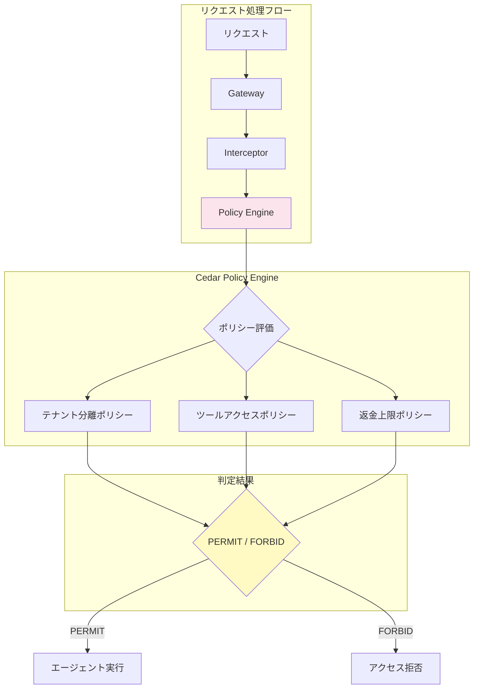
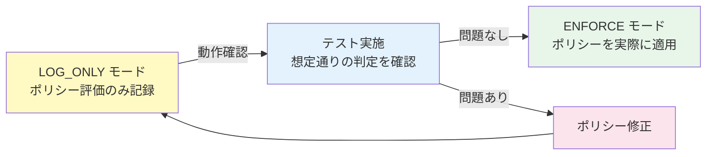
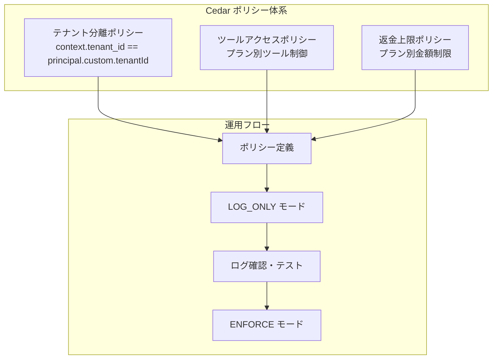

# 第7章: Policy & Cedar（ポリシーとCedar）

## 概要

Amazon Bedrock AgentCore の Policy Engine と Cedar ポリシー言語を使い、マルチテナント SaaS カスタマーサポートエージェントにきめ細かなアクセス制御を実装します。

本章では以下を学びます:

- Cedar ポリシー言語の基礎
- テナント分離ポリシー
- プラン別ツールアクセス制御ポリシー
- プラン別返金上限ポリシー
- `agentcore policy` CLI によるポリシー登録
- LOG_ONLY から ENFORCE モードへの段階的切り替え

---

## アーキテクチャ



---

## 7.1 Cedar ポリシー言語の基礎

### Cedar の概念

Cedar は Amazon が開発した宣言的なポリシー言語で、以下の3つの要素でアクセス制御を定義します:

| 要素 | 説明 | 例 |
|---|---|---|
| **Principal** | アクションを行う主体 | ユーザー、エージェント |
| **Action** | 実行される操作 | ツールアクション（search_tickets, process_refund 等） |
| **Resource** | 操作対象のリソース | チケット、請求情報 |

### 基本構文

```cedar
// 許可ポリシー
permit (
    principal,        // 誰が
    action,           // 何を
    resource          // 何に対して
) when {
    // 条件
};

// 拒否ポリシー (許可より優先)
forbid (
    principal,
    action,
    resource
) when {
    // 条件
};
```

### 本ハンズオンの Cedar ポリシーファイル構成

```
policies/cedar/
├── tenant_isolation.cedar   # テナント分離ポリシー
├── tool_access.cedar        # ツールアクセス制御ポリシー
└── refund_limit.cedar       # 返金上限ポリシー
```

---

## 7.2 テナント分離ポリシー

テナント分離は、マルチテナントシステムにおける最も基本的かつ重要なポリシーです。リクエストの `tenant_id` と認証済みプリンシパルの `tenantId` 属性を照合し、クロステナントアクセスを防止します。

### ポリシー定義

`policies/cedar/tenant_isolation.cedar` の実際の内容:

```cedar
// ルール1: tenant_id が一致する場合、アクセスを許可
permit (
    principal,
    action,
    resource
)
when {
    context.tenant_id == principal.custom.tenantId
};

// ルール2: tenant_id が一致しない場合、アクセスを明示的に拒否
// 他のポリシーが誤って許可しても、安全ネットとして機能する
forbid (
    principal,
    action,
    resource
)
when {
    context.tenant_id != principal.custom.tenantId
};

// ルール3: tenant_id がリクエストコンテキストに存在しない場合、拒否
// すべてのリクエストに tenant_id を必須とする
forbid (
    principal,
    action,
    resource
)
unless {
    context has tenant_id
};
```

### ポイント

- `context.tenant_id`: リクエストコンテキストに含まれるテナント ID（API リクエスト時に渡される）
- `principal.custom.tenantId`: Cognito 認証で設定されるカスタム属性
- `unless` 句: 条件を満たさない場合に拒否する（`tenant_id` が存在しないリクエストを弾く）
- 3 つのルールが多層防御を実現し、漏れなくテナント分離を担保

---

## 7.3 ツールアクセス制御ポリシー

テナントのプランティア（Basic / Premium）に応じて、利用可能なツールを制御します。

### プラン別ツールアクセス

| プラン | 利用可能なツール |
|---|---|
| **Basic** | チケット管理（search_tickets, create_ticket, update_ticket）、ナレッジ検索（search_knowledge） |
| **Premium** | 上記に加え、請求情報（get_billing_info, process_refund）、分析（get_analytics, generate_report） |

### ポリシー定義

`policies/cedar/tool_access.cedar` の実際の内容:

```cedar
// Basic プラン: チケット管理ツールを許可
permit (
    principal,
    action in [
        Tool::Action::"search_tickets",
        Tool::Action::"create_ticket",
        Tool::Action::"update_ticket"
    ],
    resource
)
when {
    principal.custom.plan == "basic"
};

// Basic プラン: ナレッジ検索ツールを許可
permit (
    principal,
    action in [
        Tool::Action::"search_knowledge"
    ],
    resource
)
when {
    principal.custom.plan == "basic"
};

// Basic プラン: 請求系ツールを明示的に拒否
forbid (
    principal,
    action in [
        Tool::Action::"get_billing_info",
        Tool::Action::"process_refund"
    ],
    resource
)
when {
    principal.custom.plan == "basic"
};

// Basic プラン: 分析系ツールを明示的に拒否
forbid (
    principal,
    action in [
        Tool::Action::"get_analytics",
        Tool::Action::"generate_report"
    ],
    resource
)
when {
    principal.custom.plan == "basic"
};

// Premium プラン: 全ツールを許可
permit (
    principal,
    action in [
        Tool::Action::"search_tickets",
        Tool::Action::"create_ticket",
        Tool::Action::"update_ticket",
        Tool::Action::"search_knowledge",
        Tool::Action::"get_billing_info",
        Tool::Action::"process_refund",
        Tool::Action::"get_analytics",
        Tool::Action::"generate_report"
    ],
    resource
)
when {
    principal.custom.plan == "premium"
};
```

### ポイント

- `action in [...]` 構文で複数のアクションをまとめて制御
- `Tool::Action::"search_tickets"` の形式でツールアクションを参照
- Basic プランでは `permit` と `forbid` を組み合わせて、許可されていないツールへのアクセスを二重に防止

---

## 7.4 返金上限ポリシー

プランに応じた返金金額の上限を制御します。金額はセント単位で管理し、浮動小数点の問題を回避しています。

### ビジネスルール

- **Basic プラン**: 1回の返金上限 $100（10,000 セント）
- **Premium プラン**: 1回の返金上限 $1,000（100,000 セント）

### ポリシー定義

`policies/cedar/refund_limit.cedar` の実際の内容:

```cedar
// Basic プラン: $100 以下の返金を許可
permit (
    principal,
    action == Tool::Action::"process_refund",
    resource
)
when {
    principal.custom.plan == "basic" &&
    context has refund_amount &&
    context.refund_amount <= 10000
};

// Basic プラン: $100 超過の返金を拒否
forbid (
    principal,
    action == Tool::Action::"process_refund",
    resource
)
when {
    principal.custom.plan == "basic" &&
    context has refund_amount &&
    context.refund_amount > 10000
};

// Premium プラン: $1,000 以下の返金を許可
permit (
    principal,
    action == Tool::Action::"process_refund",
    resource
)
when {
    principal.custom.plan == "premium" &&
    context has refund_amount &&
    context.refund_amount <= 100000
};

// Premium プラン: $1,000 超過の返金を拒否
forbid (
    principal,
    action == Tool::Action::"process_refund",
    resource
)
when {
    principal.custom.plan == "premium" &&
    context has refund_amount &&
    context.refund_amount > 100000
};

// 返金金額が指定されていないリクエストを拒否
forbid (
    principal,
    action == Tool::Action::"process_refund",
    resource
)
unless {
    context has refund_amount
};
```

### ポイント

- `action == Tool::Action::"process_refund"` で返金アクションのみに限定
- `context has refund_amount` で返金金額の存在を確認
- `context.refund_amount` はセント単位（$100 = 10000, $1000 = 100000）
- 返金金額未指定のリクエストも `unless` 句で拒否

---

## 7.5 agentcore CLI によるポリシー登録

### ポリシー関連の CLI サブコマンド

```bash
# ポリシー関連のヘルプを表示
agentcore policy --help
```

`agentcore policy` サブコマンドを使って、Cedar ポリシーの登録と管理を行います。

### ポリシーの登録

```bash
# テナント分離ポリシーの登録
agentcore policy create \
  --name tenant-isolation \
  --policy-file policies/cedar/tenant_isolation.cedar

# ツールアクセス制御ポリシーの登録
agentcore policy create \
  --name tool-access \
  --policy-file policies/cedar/tool_access.cedar

# 返金上限ポリシーの登録
agentcore policy create \
  --name refund-limit \
  --policy-file policies/cedar/refund_limit.cedar
```

### 登録済みポリシーの確認

```bash
# ポリシー一覧の取得
agentcore policy list

# 特定ポリシーの詳細表示
agentcore policy get --name tenant-isolation
```

---

## 7.6 LOG_ONLY から ENFORCE モードへの段階的切り替え

### 段階的なポリシー適用



### LOG_ONLY モードでの動作確認

LOG_ONLY モードでは、ポリシー評価は実行されますが、結果はログに記録されるのみでアクセス制御は行われません。これにより、本番トラフィックに影響を与えずにポリシーの挙動を確認できます。

1. ポリシーを LOG_ONLY モードで登録
2. 通常のトラフィックを流して、ポリシー評価結果をログで確認
3. 想定外の DENY がないか確認
4. 問題なければ ENFORCE モードに切り替え

### CloudWatch Logs での確認

CloudWatch Logs Insights で以下のクエリを実行し、LOG_ONLY モードの評価結果を確認します:

```sql
fields @timestamp, decision, principal, action, resource
| filter @message like "POLICY_EVALUATION"
| stats count() by decision
| sort decision
```

DENY が想定通りのケースのみであることを確認した上で、ENFORCE モードに切り替えます。

---

## 7.7 検証

### テストシナリオ一覧

| # | シナリオ | 期待結果 |
|---|---|---|
| 1 | テナント A が自テナントのデータにアクセス | PERMIT |
| 2 | テナント A がテナント B のデータにアクセス | FORBID |
| 3 | tenant_id なしのリクエスト | FORBID |
| 4 | Basic プランが search_tickets を実行 | PERMIT |
| 5 | Basic プランが process_refund を実行 | FORBID |
| 6 | Premium プランが get_analytics を実行 | PERMIT |
| 7 | Basic プランが $50 の返金を実行 | PERMIT |
| 8 | Basic プランが $200 の返金を実行 | FORBID |
| 9 | Premium プランが $500 の返金を実行 | PERMIT |
| 10 | Premium プランが $1,500 の返金を実行 | FORBID |
| 11 | Premium プランが $1,000（上限ちょうど）の返金を実行 | PERMIT |
| 12 | 返金金額未指定で process_refund を実行 | FORBID |

### 検証 1: テナント分離の確認

```bash
# テナント A として自テナントのデータにアクセス（PERMIT を期待）
agentcore invoke '{"prompt": "チケット一覧を表示して", "sessionAttributes": {"tenantId": "tenant-a"}}'

# テナント A としてテナント B のデータにアクセス（FORBID を期待）
agentcore invoke '{"prompt": "チケット一覧を表示して", "sessionAttributes": {"tenantId": "tenant-b"}}'
```

### 検証 2: ツールアクセス制御の確認

```bash
# Basic プランでチケット検索（PERMIT を期待）
agentcore invoke '{"prompt": "チケットを検索して", "sessionAttributes": {"tenantId": "tenant-a", "tenantPlan": "basic"}}'

# Basic プランで分析レポート生成（FORBID を期待）
agentcore invoke '{"prompt": "月次レポートを生成して", "sessionAttributes": {"tenantId": "tenant-a", "tenantPlan": "basic"}}'
```

### 検証 3: 返金上限の確認

Basic プランの $100 上限と Premium プランの $1,000 上限が正しく適用されることを確認します。上限ちょうどの金額（境界値）もテストに含めてください。

---

## まとめ



| ポリシー | ファイル | 保護対象 | 制御内容 |
|---|---|---|---|
| テナント分離 | `tenant_isolation.cedar` | 全リソース | tenant_id の一致を検証 |
| ツールアクセス | `tool_access.cedar` | エージェントツール | Basic: 4ツール、Premium: 全8ツール |
| 返金上限 | `refund_limit.cedar` | 返金処理 | Basic: $100以下、Premium: $1,000以下 |

### ポイント

1. **forbid は permit より優先**: 明示的な拒否ポリシーで安全性を担保
2. **多層防御**: テナント分離は permit + forbid + unless の3ルールで確実に保護
3. **段階的適用**: LOG_ONLY で十分にテストしてから ENFORCE に切り替え
4. **境界値テスト**: 上限値ちょうど、上限値+1 のテストケースを必ず含める

---

[前のチャプターへ戻る](06-multi-tenant-isolation.md) | [次のチャプターへ進む](08-observability.md)
