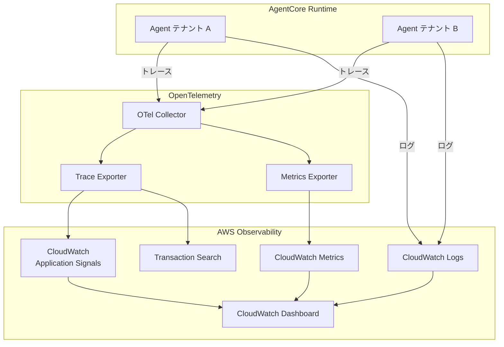
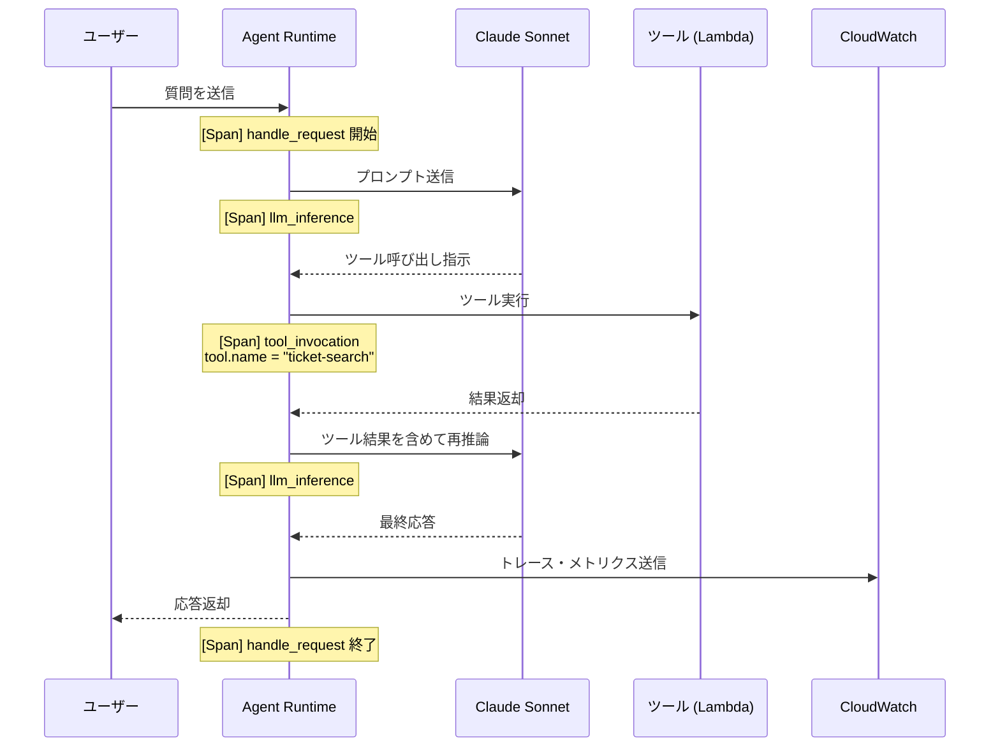

# チャプター 7: Observability（オブザーバビリティ）

## 本チャプターのゴール

- AgentCore の OpenTelemetry トレーシングを有効化し、エージェントの実行フローを可視化する
- Transaction Search を設定してトレースの検索・フィルタリングを行う
- CloudWatch と連携してテナント別のメトリクスとダッシュボードを構築する
- ツール呼び出しのレイテンシーを分析し、パフォーマンスボトルネックを特定する

## 前提条件

- チャプター 02 までのエージェントデプロイが完了していること
- AWS CLI と CDK がセットアップ済みであること
- CloudWatch へのアクセス権限があること

## アーキテクチャ概要



---

## 7.1 OpenTelemetry トレーシングの有効化

AgentCore Runtime は OpenTelemetry (OTel) を標準サポートしています。エージェント実行時のトレースを自動的に収集し、各ステップの実行時間や入出力を記録します。

### 7.1.1 Strands Agent でのトレーシング設定

```python
# agents/support_agent_observable.py
import os
from strands import Agent
from strands.telemetry import configure_telemetry

# OpenTelemetry の設定
configure_telemetry(
    service_name="support-hub-agent",
    otlp_endpoint=os.environ.get("OTEL_EXPORTER_OTLP_ENDPOINT", "http://localhost:4317"),
    enabled=True,
    resource_attributes={
        "service.namespace": "support-hub",
        "deployment.environment": os.environ.get("ENVIRONMENT", "dev"),
    }
)

def create_agent(tenant_id: str):
    """テナント別のエージェントを作成（トレーシング付き）"""
    agent = Agent(
        model="us.anthropic.claude-sonnet-4-6",
        system_prompt=f"""あなたはテナント {tenant_id} のカスタマーサポートエージェントです。
        丁寧かつ正確にお客様の質問にお答えください。""",
        trace_attributes={
            "tenant.id": tenant_id,
            "agent.type": "customer-support",
        }
    )
    return agent
```

### 7.1.2 トレース属性の追加

テナント識別のために、カスタム属性をトレースに付与します。

```python
from opentelemetry import trace

tracer = trace.get_tracer("support-hub.agent")

def handle_request(tenant_id: str, user_message: str):
    """リクエスト処理にカスタムスパンを追加"""
    with tracer.start_as_current_span("handle_support_request") as span:
        # テナント情報をスパン属性に追加
        span.set_attribute("tenant.id", tenant_id)
        span.set_attribute("request.message_length", len(user_message))

        agent = create_agent(tenant_id)
        response = agent(user_message)

        span.set_attribute("response.message_length", len(str(response)))
        span.set_attribute("response.tool_calls_count",
                          response.metrics.get("tool_calls", 0))
        return response
```

---

## 7.2 Transaction Search の有効化

Transaction Search を使うと、トレースデータに対してリッチなクエリを実行できます。

### 7.2.1 Transaction Search の設定

```bash
# Transaction Search を有効化（CloudWatch Application Signals）
aws cloudwatch put-managed-insight-rules \
  --managed-rules '[{
    "TemplateName": "ApplicationSignals",
    "ResourceARN": "arn:aws:logs:'${AWS_REGION}':'${AWS_ACCOUNT_ID}':log-group:/aws/agentcore/traces"
  }]'
```

### 7.2.2 トレースのクエリ例

```bash
# テナント A のトレースを検索
aws cloudwatch-application-signals search-traces \
  --start-time "$(date -u -d '1 hour ago' +%Y-%m-%dT%H:%M:%S)" \
  --end-time "$(date -u +%Y-%m-%dT%H:%M:%S)" \
  --filter-expression 'attribute["tenant.id"] = "tenant-a"'

# レイテンシーが 5 秒を超えるトレースを検索
aws cloudwatch-application-signals search-traces \
  --start-time "$(date -u -d '1 hour ago' +%Y-%m-%dT%H:%M:%S)" \
  --end-time "$(date -u +%Y-%m-%dT%H:%M:%S)" \
  --filter-expression 'duration > 5000'
```

---

## 7.3 CloudWatch 連携

### 7.3.1 ログの構造化出力

```python
import json
import logging
from datetime import datetime, timezone

class StructuredLogFormatter(logging.Formatter):
    """CloudWatch Logs 向け構造化ログフォーマッタ"""

    def format(self, record):
        log_entry = {
            "timestamp": datetime.now(timezone.utc).isoformat(),
            "level": record.levelname,
            "message": record.getMessage(),
            "logger": record.name,
            "tenant_id": getattr(record, "tenant_id", "unknown"),
            "trace_id": getattr(record, "trace_id", None),
            "span_id": getattr(record, "span_id", None),
        }
        if record.exc_info:
            log_entry["exception"] = self.formatException(record.exc_info)
        return json.dumps(log_entry, ensure_ascii=False)


def setup_logging(tenant_id: str):
    """テナント別ロガーの設定"""
    logger = logging.getLogger(f"support-hub.{tenant_id}")
    handler = logging.StreamHandler()
    handler.setFormatter(StructuredLogFormatter())
    logger.addHandler(handler)
    logger.setLevel(logging.INFO)
    return logger
```

### 7.3.2 メトリクスの送信

```python
import boto3

cloudwatch = boto3.client("cloudwatch")

def publish_agent_metrics(tenant_id: str, metrics: dict):
    """テナント別エージェントメトリクスを CloudWatch に送信"""
    metric_data = [
        {
            "MetricName": "AgentResponseLatency",
            "Dimensions": [
                {"Name": "TenantId", "Value": tenant_id},
                {"Name": "Environment", "Value": "production"},
            ],
            "Value": metrics["response_latency_ms"],
            "Unit": "Milliseconds",
        },
        {
            "MetricName": "ToolInvocationCount",
            "Dimensions": [
                {"Name": "TenantId", "Value": tenant_id},
                {"Name": "Environment", "Value": "production"},
            ],
            "Value": metrics["tool_invocation_count"],
            "Unit": "Count",
        },
        {
            "MetricName": "TokensConsumed",
            "Dimensions": [
                {"Name": "TenantId", "Value": tenant_id},
                {"Name": "Environment", "Value": "production"},
            ],
            "Value": metrics["total_tokens"],
            "Unit": "Count",
        },
    ]

    cloudwatch.put_metric_data(
        Namespace="SupportHub/AgentCore",
        MetricData=metric_data,
    )
```

---

## 7.4 エージェント推論ステップの可視化

AgentCore は、エージェントの推論プロセスを個別のスパンとしてトレースに記録します。



### 7.4.1 推論ステップのカスタムトレース

```python
from opentelemetry import trace

tracer = trace.get_tracer("support-hub.reasoning")

def trace_reasoning_steps(agent_response):
    """エージェントの推論ステップをトレースとして記録"""
    for i, step in enumerate(agent_response.reasoning_steps):
        with tracer.start_as_current_span(f"reasoning_step_{i}") as span:
            span.set_attribute("step.index", i)
            span.set_attribute("step.type", step.type)  # "thinking", "tool_use", "response"

            if step.type == "tool_use":
                span.set_attribute("tool.name", step.tool_name)
                span.set_attribute("tool.input_size", len(json.dumps(step.tool_input)))
                span.set_attribute("tool.duration_ms", step.duration_ms)

            elif step.type == "thinking":
                span.set_attribute("thinking.token_count", step.token_count)
```

---

## 7.5 テナント別メトリクスとダッシュボード

### 7.5.1 CloudWatch ダッシュボードの定義

```python
# cdk/lib/observability_stack.py
from aws_cdk import (
    Stack,
    aws_cloudwatch as cloudwatch,
    Duration,
)
from constructs import Construct


class ObservabilityStack(Stack):
    def __init__(self, scope: Construct, id: str, tenant_ids: list[str], **kwargs):
        super().__init__(scope, id, **kwargs)

        dashboard = cloudwatch.Dashboard(
            self, "SupportHubDashboard",
            dashboard_name="SupportHub-MultiTenant-Overview",
        )

        # テナント別レイテンシーグラフ
        latency_widgets = []
        for tenant_id in tenant_ids:
            latency_metric = cloudwatch.Metric(
                namespace="SupportHub/AgentCore",
                metric_name="AgentResponseLatency",
                dimensions_map={
                    "TenantId": tenant_id,
                    "Environment": "production",
                },
                statistic="Average",
                period=Duration.minutes(5),
            )
            latency_widgets.append(
                cloudwatch.GraphWidget(
                    title=f"レスポンスレイテンシー - {tenant_id}",
                    left=[latency_metric],
                    width=12,
                )
            )

        dashboard.add_widgets(*latency_widgets)

        # テナント横断比較グラフ
        all_tenant_metrics = []
        for tenant_id in tenant_ids:
            all_tenant_metrics.append(
                cloudwatch.Metric(
                    namespace="SupportHub/AgentCore",
                    metric_name="TokensConsumed",
                    dimensions_map={
                        "TenantId": tenant_id,
                        "Environment": "production",
                    },
                    statistic="Sum",
                    period=Duration.minutes(5),
                )
            )

        dashboard.add_widgets(
            cloudwatch.GraphWidget(
                title="テナント別トークン消費量",
                left=all_tenant_metrics,
                width=24,
            )
        )

        # アラームの設定
        for tenant_id in tenant_ids:
            high_latency_alarm = cloudwatch.Alarm(
                self, f"HighLatencyAlarm-{tenant_id}",
                metric=cloudwatch.Metric(
                    namespace="SupportHub/AgentCore",
                    metric_name="AgentResponseLatency",
                    dimensions_map={
                        "TenantId": tenant_id,
                        "Environment": "production",
                    },
                    statistic="p99",
                    period=Duration.minutes(5),
                ),
                threshold=10000,  # 10 秒
                evaluation_periods=3,
                alarm_description=f"テナント {tenant_id} のエージェントレスポンスが遅延しています",
            )
```

---

## 7.6 ツール呼び出しレイテンシー分析

### 7.6.1 ツール別レイテンシーの計測

```python
import time
from functools import wraps
from opentelemetry import trace

tracer = trace.get_tracer("support-hub.tools")

def trace_tool_invocation(tool_name: str):
    """ツール呼び出しのレイテンシーを計測するデコレータ"""
    def decorator(func):
        @wraps(func)
        def wrapper(*args, **kwargs):
            with tracer.start_as_current_span(f"tool.{tool_name}") as span:
                span.set_attribute("tool.name", tool_name)
                start_time = time.monotonic()

                try:
                    result = func(*args, **kwargs)
                    span.set_attribute("tool.status", "success")
                    return result
                except Exception as e:
                    span.set_attribute("tool.status", "error")
                    span.set_attribute("tool.error", str(e))
                    span.record_exception(e)
                    raise
                finally:
                    duration_ms = (time.monotonic() - start_time) * 1000
                    span.set_attribute("tool.duration_ms", duration_ms)

                    # CloudWatch メトリクスにも送信
                    cloudwatch.put_metric_data(
                        Namespace="SupportHub/AgentCore",
                        MetricData=[{
                            "MetricName": "ToolInvocationLatency",
                            "Dimensions": [
                                {"Name": "ToolName", "Value": tool_name},
                            ],
                            "Value": duration_ms,
                            "Unit": "Milliseconds",
                        }]
                    )
        return wrapper
    return decorator


# 使用例
@trace_tool_invocation("ticket-search")
def search_tickets(tenant_id: str, query: str):
    """チケット検索ツール"""
    # Lambda 関数を呼び出し
    pass
```

### 7.6.2 レイテンシー分析クエリ（CloudWatch Logs Insights）

```sql
-- ツール別平均レイテンシー（過去 1 時間）
fields @timestamp, tool.name, tool.duration_ms
| filter ispresent(tool.name)
| stats avg(tool.duration_ms) as avg_latency,
        p50(tool.duration_ms) as p50_latency,
        p99(tool.duration_ms) as p99_latency,
        count() as invocation_count
  by tool.name
| sort avg_latency desc

-- テナント別・ツール別レイテンシー
fields @timestamp, tenant.id, tool.name, tool.duration_ms
| filter ispresent(tool.name) and ispresent(tenant.id)
| stats avg(tool.duration_ms) as avg_latency,
        count() as invocation_count
  by tenant.id, tool.name
| sort tenant.id, avg_latency desc
```

---

## 7.7 CDK によるオブザーバビリティスタックのデプロイ

### 7.7.1 スタック構成

```python
# cdk/app.py
import aws_cdk as cdk
from lib.observability_stack import ObservabilityStack

app = cdk.App()

tenant_ids = ["tenant-a", "tenant-b"]

ObservabilityStack(
    app, "SupportHub-Observability",
    tenant_ids=tenant_ids,
    env=cdk.Environment(
        account=os.environ["CDK_DEFAULT_ACCOUNT"],
        region=os.environ["CDK_DEFAULT_REGION"],
    ),
)

app.synth()
```

### 7.7.2 デプロイ

```bash
cd cdk
npm install
npx cdk deploy SupportHub-Observability
```

---

## 7.8 検証

### 検証 1: CloudWatch でトレースを確認

1. エージェントにテスト質問を送信します。

```bash
# テナント A としてリクエスト
python scripts/invoke_agent.py \
  --tenant-id tenant-a \
  --message "注文番号 12345 のステータスを教えてください"

# テナント B としてリクエスト
python scripts/invoke_agent.py \
  --tenant-id tenant-b \
  --message "料金プランの変更方法を教えてください"
```

2. CloudWatch コンソールで **Application Signals** > **Traces** を開きます。

3. フィルターに `tenant.id = "tenant-a"` を入力し、テナント A のトレースが表示されることを確認します。

4. トレースを展開し、以下のスパンが記録されていることを確認します。
   - `handle_support_request` （ルートスパン）
   - `llm_inference` （LLM 呼び出し）
   - `tool.ticket-search` （ツール呼び出し）

### 検証 2: テナント別メトリクスの確認

1. CloudWatch コンソールで **Dashboards** > **SupportHub-MultiTenant-Overview** を開きます。

2. 以下のメトリクスがテナント別に表示されていることを確認します。
   - レスポンスレイテンシー
   - トークン消費量
   - ツール呼び出し回数

3. テナント A とテナント B のメトリクスが独立して計測されていることを確認します。

### 検証 3: ツールレイテンシーの確認

CloudWatch Logs Insights で以下のクエリを実行します。

```sql
fields @timestamp, tool.name, tool.duration_ms
| filter ispresent(tool.name)
| stats avg(tool.duration_ms) as avg_latency by tool.name
| sort avg_latency desc
```

各ツールの平均レイテンシーが表示されることを確認します。

---

## まとめ

本チャプターで学んだこと:

| 項目 | 内容 |
|------|------|
| OTel トレーシング | AgentCore Runtime のトレースを OpenTelemetry で収集 |
| Transaction Search | トレースデータの検索とフィルタリング |
| CloudWatch 連携 | ログ・メトリクス・トレースの統合管理 |
| 推論ステップ可視化 | エージェントの思考プロセスをスパンで記録 |
| テナント別メトリクス | Dimensions を使ったテナント分離メトリクス |
| ツールレイテンシー | ツール呼び出しのパフォーマンス分析 |

次のチャプターでは、**Code Interpreter** を使ったデータ分析エージェントの構築に進みます。

---

[前のチャプター へ戻る](07-advanced-topics.md) | [次のチャプター へ進む](09-code-interpreter.md)
