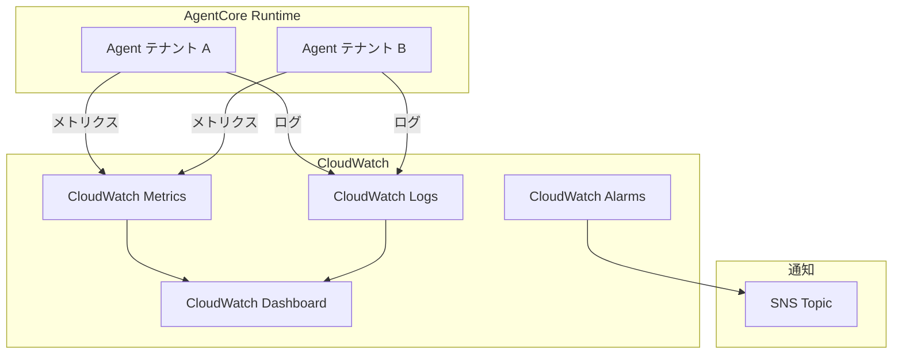

# 第8章: Observability（オブザーバビリティ）

## 本チャプターのゴール

- AgentCore のオブザーバビリティ基盤を理解する
- CloudWatch ダッシュボード、アラーム、ロググループを CDK で構築する
- テナント別のメトリクスとアラームを設定する
- `agentcore obs` CLI でオブザーバビリティの状態を確認する

## 前提条件

- チャプター 02 までのエージェントデプロイが完了していること
- AWS CLI と CDK がセットアップ済みであること
- CloudWatch へのアクセス権限があること

## アーキテクチャ概要



---

## 8.1 ObservabilityStack の構成

本ハンズオンのオブザーバビリティ基盤は、CDK の `ObservabilityStack` で構築されています。

### スタックの概要

ファイル: `cdk/stacks/observability_stack.py`

```python
class ObservabilityStack(Stack):
    def __init__(
        self,
        scope: Construct,
        construct_id: str,
        gateway_id: str,
        runtime_id: str,
        **kwargs,
    ) -> None:
```

`ObservabilityStack` は `gateway_id` と `runtime_id` を受け取り、AgentCore コンポーネント全体のオブザーバビリティを構築します。

### CDK アプリケーションでのスタック構成

`cdk/app.py` での呼び出し:

```python
from stacks.observability_stack import ObservabilityStack

observability_stack = ObservabilityStack(
    app,
    "AgentCoreObservabilityStack",
    gateway_id=gateway_stack.gateway_id,
    runtime_id=runtime_stack.runtime_id,
    description="CloudWatch dashboard, alarms, and log groups for AgentCore",
    **env_kwargs,
)
observability_stack.add_dependency(gateway_stack)
observability_stack.add_dependency(runtime_stack)
```

---

## 8.2 ロググループ

AgentCore の各コンポーネントに対応する CloudWatch Logs ロググループを作成します。保持期間はハンズオン用に 2 週間に設定されています。

| ロググループ | 対象コンポーネント |
|---|---|
| `/aws/agentcore/gateway` | Gateway |
| `/aws/agentcore/runtime` | Runtime |
| `/aws/agentcore/tools` | ツール（Lambda 関数） |
| `/aws/agentcore/interceptor` | Interceptor |

```python
self.gateway_log_group = logs.LogGroup(
    self,
    "GatewayLogGroup",
    log_group_name="/aws/agentcore/gateway",
    retention=logs.RetentionDays.TWO_WEEKS,
    removal_policy=RemovalPolicy.DESTROY,
)

self.runtime_log_group = logs.LogGroup(
    self,
    "RuntimeLogGroup",
    log_group_name="/aws/agentcore/runtime",
    retention=logs.RetentionDays.TWO_WEEKS,
    removal_policy=RemovalPolicy.DESTROY,
)

self.tools_log_group = logs.LogGroup(
    self,
    "ToolsLogGroup",
    log_group_name="/aws/agentcore/tools",
    retention=logs.RetentionDays.TWO_WEEKS,
    removal_policy=RemovalPolicy.DESTROY,
)

self.interceptor_log_group = logs.LogGroup(
    self,
    "InterceptorLogGroup",
    log_group_name="/aws/agentcore/interceptor",
    retention=logs.RetentionDays.TWO_WEEKS,
    removal_policy=RemovalPolicy.DESTROY,
)
```

---

## 8.3 カスタムメトリクス

カスタム名前空間 `AgentCore/MultiTenant` に以下のメトリクスを定義しています:

| メトリクス名 | Dimension | 統計値 | 説明 |
|---|---|---|---|
| `AgentInvocations` | `GatewayId` | Sum | エージェント呼び出し回数 |
| `AgentErrors` | `GatewayId` | Sum | エージェントエラー回数 |
| `AgentLatency` | `RuntimeId` | p99 | エージェントレイテンシー（p99） |
| `ToolInvocations` | `GatewayId` | Sum | ツール呼び出し回数 |
| `AgentInvocations` | `TenantId=tenant-a` | Sum | テナント A の呼び出し回数 |
| `AgentInvocations` | `TenantId=tenant-b` | Sum | テナント B の呼び出し回数 |

```python
namespace = "AgentCore/MultiTenant"

invocation_metric = cloudwatch.Metric(
    namespace=namespace,
    metric_name="AgentInvocations",
    dimensions_map={"GatewayId": gateway_id},
    statistic="Sum",
    period=Duration.minutes(5),
)

error_metric = cloudwatch.Metric(
    namespace=namespace,
    metric_name="AgentErrors",
    dimensions_map={"GatewayId": gateway_id},
    statistic="Sum",
    period=Duration.minutes(5),
)

latency_metric = cloudwatch.Metric(
    namespace=namespace,
    metric_name="AgentLatency",
    dimensions_map={"RuntimeId": runtime_id},
    statistic="p99",
    period=Duration.minutes(5),
)
```

---

## 8.4 アラーム設定

### 高エラー率アラーム

5 分間でエラーが 10 件を超えた状態が 2 回連続すると発報します。

```python
error_alarm = cloudwatch.Alarm(
    self,
    "HighErrorRateAlarm",
    alarm_name="agentcore-high-error-rate",
    alarm_description="AgentCore agent error rate exceeds threshold",
    metric=error_metric,
    threshold=10,
    evaluation_periods=2,
    comparison_operator=cloudwatch.ComparisonOperator.GREATER_THAN_THRESHOLD,
    treat_missing_data=cloudwatch.TreatMissingData.NOT_BREACHING,
)
error_alarm.add_alarm_action(cw_actions.SnsAction(self.alarm_topic))
```

### 高レイテンシーアラーム

p99 レイテンシーが 30 秒を超えた状態が 3 回連続すると発報します。

```python
latency_alarm = cloudwatch.Alarm(
    self,
    "HighLatencyAlarm",
    alarm_name="agentcore-high-latency",
    alarm_description="AgentCore agent p99 latency exceeds 30s",
    metric=latency_metric,
    threshold=30000,  # 30 seconds in milliseconds
    evaluation_periods=3,
    comparison_operator=cloudwatch.ComparisonOperator.GREATER_THAN_THRESHOLD,
    treat_missing_data=cloudwatch.TreatMissingData.NOT_BREACHING,
)
latency_alarm.add_alarm_action(cw_actions.SnsAction(self.alarm_topic))
```

アラームの通知先は SNS トピック `agentcore-alarms` です。

---

## 8.5 CloudWatch ダッシュボード

ダッシュボード名: `AgentCore-MultiTenant-Dashboard`

### Row 1: 概要メトリクス

| ウィジェット | 表示内容 |
|---|---|
| Agent Invocations | エージェント呼び出し回数の推移 |
| Agent Errors | エラー回数の推移 |
| Agent Latency (p99) | p99 レイテンシーの推移 |

### Row 2: テナント別 & ツール利用

| ウィジェット | 表示内容 |
|---|---|
| Invocations by Tenant | テナント A / B の呼び出し回数比較 |
| Tool Invocations | ツール呼び出し回数の推移 |

### Row 3: Lambda メトリクス

ツール Lambda 関数（`agentcore-tool-ticket-management`, `agentcore-tool-knowledge-search`, `agentcore-tool-billing-inquiry`）の Duration と Errors を表示します。

### Row 4: アラームステータス

エラー率アラームとレイテンシーアラームの状態を一覧表示します。

---

## 8.6 agentcore obs CLI

`agentcore obs` サブコマンドでオブザーバビリティ関連の操作を行います。

```bash
# オブザーバビリティ関連のヘルプ
agentcore obs --help
```

---

## 8.7 CDK デプロイ

### デプロイ手順

```bash
cd cdk

# 仮想環境の有効化と依存関係のインストール
python -m venv .venv
source .venv/bin/activate
pip install -r requirements.txt

# 差分確認
cdk diff AgentCoreObservabilityStack

# デプロイ
cdk deploy AgentCoreObservabilityStack
```

### デプロイ結果の確認

デプロイ完了後、以下の CloudFormation 出力が表示されます:

| 出力名 | 説明 |
|---|---|
| `DashboardUrl` | CloudWatch ダッシュボードの URL |
| `AlarmTopicArn` | アラーム通知用 SNS トピックの ARN |

---

## 8.8 検証

### 検証 1: ダッシュボードの確認

1. CloudWatch コンソールで **Dashboards** > **AgentCore-MultiTenant-Dashboard** を開きます
2. 以下のウィジェットが表示されていることを確認します:
   - Agent Invocations
   - Agent Errors
   - Agent Latency (p99)
   - Invocations by Tenant
   - Tool Invocations
   - Tool Lambda Duration / Errors
   - Alarm Status

### 検証 2: エージェント呼び出しとメトリクスの連動

```bash
# テナント A としてリクエスト
agentcore invoke \
  --agent-id <AGENT_ID> \
  --payload '{"prompt": "注文番号 12345 のステータスを教えてください", "sessionAttributes": {"tenantId": "tenant-a"}}'

# テナント B としてリクエスト
agentcore invoke \
  --agent-id <AGENT_ID> \
  --payload '{"prompt": "料金プランの変更方法を教えてください", "sessionAttributes": {"tenantId": "tenant-b"}}'
```

CloudWatch ダッシュボードで以下を確認します:

1. Agent Invocations メトリクスが増加していること
2. Invocations by Tenant でテナント A / B それぞれのメトリクスが記録されていること
3. Tool Invocations でツール呼び出しが記録されていること

### 検証 3: ログの確認

CloudWatch Logs で各ロググループにログが出力されていることを確認します:

```bash
# Gateway ログの確認
aws logs tail /aws/agentcore/gateway --since 10m

# Runtime ログの確認
aws logs tail /aws/agentcore/runtime --since 10m

# ツールログの確認
aws logs tail /aws/agentcore/tools --since 10m
```

### 検証 4: CloudWatch Logs Insights でのクエリ

```sql
-- テナント別のリクエスト数（過去 1 時間）
fields @timestamp, @message
| filter @message like /tenant/
| stats count() by bin(5m)
| sort @timestamp desc
```

---

## まとめ

本チャプターで学んだこと:

| 項目 | 内容 |
|------|------|
| ロググループ | Gateway / Runtime / Tools / Interceptor の 4 つのロググループ |
| カスタムメトリクス | AgentCore/MultiTenant 名前空間のメトリクス |
| アラーム | 高エラー率（>10/5min）、高レイテンシー（p99>30s） |
| ダッシュボード | AgentCore-MultiTenant-Dashboard で全体を可視化 |
| テナント別メトリクス | TenantId Dimension によるテナント分離メトリクス |
| SNS 通知 | agentcore-alarms トピックへのアラーム通知 |

次のチャプターでは、**Code Interpreter** を使ったデータ分析エージェントの構築に進みます。

---

[前のチャプターへ戻る](07-policy-cedar.md) | [次のチャプターへ進む](09-code-interpreter.md)
