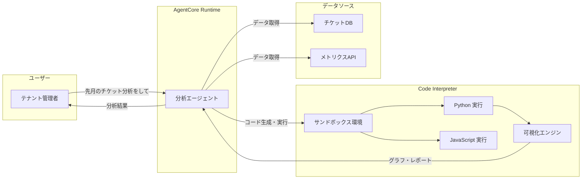
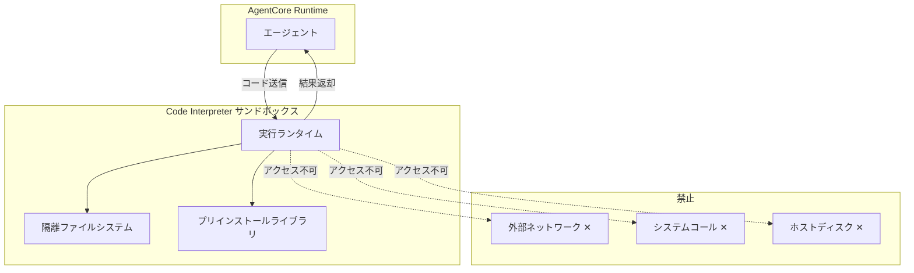

# チャプター 8: Code Interpreter（コードインタープリター）

## 本チャプターのゴール

- AgentCore Code Interpreter のサンドボックス実行環境を理解する
- テナント別のサポートチケット統計を動的に分析するエージェントを構築する
- Python / JavaScript コードの実行による計算・可視化を実装する
- Strands Agent と Code Interpreter を統合し、動的レポート生成を実現する

## 前提条件

- チャプター 02 までのエージェントデプロイが完了していること
- テナント別のサポートチケットデータが存在すること（テストデータで可）

## アーキテクチャ概要



---

## 8.1 サンドボックス実行環境の概念

AgentCore Code Interpreter は、安全に隔離されたサンドボックス環境でコードを実行します。

### 主な特徴

| 特徴 | 説明 |
|------|------|
| **完全な隔離** | 各実行セッションは独立したコンテナで動作 |
| **言語サポート** | Python 3.12、JavaScript (Node.js 20) |
| **プリインストールライブラリ** | pandas、matplotlib、numpy、scipy 等 |
| **ファイル入出力** | CSV・JSON の読み込み、画像・PDF の出力 |
| **セッション永続化** | 同一セッション内で変数やファイルを保持 |
| **タイムアウト制御** | 最大実行時間の設定（デフォルト 60 秒） |
| **ネットワーク分離** | 外部ネットワークへのアクセスは不可 |

### セキュリティモデル



---

## 8.2 AgentCore Code Interpreter のセットアップ

### 8.2.1 Code Interpreter セッションの作成

```python
import boto3

bedrock_agent_core = boto3.client("bedrock-agent-core")

# Code Interpreter セッションを作成
response = bedrock_agent_core.create_code_interpreter_session(
    sessionName="ticket-analysis-tenant-a",
    runtimeEnvironment="PYTHON",  # "PYTHON" or "JAVASCRIPT"
    sessionTimeoutSeconds=300,
    tags={
        "TenantId": "tenant-a",
        "Purpose": "ticket-analysis",
    }
)

session_id = response["sessionId"]
print(f"セッション作成完了: {session_id}")
```

### 8.2.2 コードの実行

```python
# Python コードを実行
result = bedrock_agent_core.invoke_code_interpreter(
    sessionId=session_id,
    code="""
import pandas as pd
import json

# サンプルデータの作成（実際にはツールから取得したデータを使用）
data = {
    "ticket_id": ["T-001", "T-002", "T-003", "T-004", "T-005"],
    "category": ["注文確認", "返品", "注文確認", "技術サポート", "返品"],
    "status": ["解決済み", "対応中", "解決済み", "解決済み", "エスカレーション"],
    "resolution_time_hours": [2.5, None, 1.0, 4.0, None],
    "satisfaction_score": [5, 3, 5, 4, 2],
}
df = pd.DataFrame(data)

# 基本統計
summary = {
    "total_tickets": len(df),
    "resolved_count": len(df[df["status"] == "解決済み"]),
    "avg_resolution_time": df["resolution_time_hours"].mean(),
    "avg_satisfaction": df["satisfaction_score"].mean(),
    "category_distribution": df["category"].value_counts().to_dict(),
}
print(json.dumps(summary, ensure_ascii=False, indent=2))
""",
)

print("実行結果:", result["output"])
```

---

## 8.3 データ分析エージェントの構築

### 8.3.1 テナント別チケット統計エージェント

```python
# agents/analytics_agent.py
from strands import Agent, tool
from strands.tools.code_interpreter import CodeInterpreterTool
import boto3
import json

# DynamoDB からチケットデータを取得するツール
@tool
def get_tenant_tickets(tenant_id: str, date_from: str, date_to: str) -> str:
    """指定テナントのサポートチケットを取得します。

    Args:
        tenant_id: テナント ID
        date_from: 開始日（YYYY-MM-DD 形式）
        date_to: 終了日（YYYY-MM-DD 形式）

    Returns:
        JSON 形式のチケットデータ
    """
    dynamodb = boto3.resource("dynamodb")
    table = dynamodb.Table("support-tickets")

    response = table.query(
        KeyConditionExpression="tenant_id = :tid AND created_at BETWEEN :from AND :to",
        ExpressionAttributeValues={
            ":tid": tenant_id,
            ":from": date_from,
            ":to": date_to,
        },
    )

    return json.dumps(response["Items"], ensure_ascii=False, default=str)


@tool
def get_tenant_metrics(tenant_id: str) -> str:
    """テナントの KPI メトリクスを取得します。

    Args:
        tenant_id: テナント ID

    Returns:
        JSON 形式のメトリクスデータ
    """
    cloudwatch = boto3.client("cloudwatch")

    # 直近 30 日のメトリクスを取得
    response = cloudwatch.get_metric_statistics(
        Namespace="SupportHub/AgentCore",
        MetricName="AgentResponseLatency",
        Dimensions=[
            {"Name": "TenantId", "Value": tenant_id},
        ],
        StartTime="2026-02-21T00:00:00Z",
        EndTime="2026-03-23T00:00:00Z",
        Period=86400,  # 1 日単位
        Statistics=["Average", "Maximum", "SampleCount"],
    )

    return json.dumps(response["Datapoints"], default=str)


# Code Interpreter ツールの作成
code_interpreter = CodeInterpreterTool(
    runtime="PYTHON",
    session_timeout_seconds=300,
)

# 分析エージェントの作成
analytics_agent = Agent(
    model="us.anthropic.claude-sonnet-4-20250514",
    system_prompt="""あなたはマルチテナント SaaS プラットフォーム「SupportHub」のデータ分析エージェントです。

以下の役割を担います：
1. テナント別のサポートチケット統計を分析する
2. Python コードを使って計算・可視化を行う
3. わかりやすい日本語でレポートを作成する

分析時のガイドライン：
- 必ず具体的な数値を示す
- グラフや図表を積極的に作成する
- 改善提案を含める
- テナント間の比較は、テナント管理者にはそのテナントのデータのみ提示する
""",
    tools=[get_tenant_tickets, get_tenant_metrics, code_interpreter],
)
```

### 8.3.2 エージェントの実行

```python
# テナント A の管理者としてレポートを依頼
response = analytics_agent(
    "先月（2026年2月）のサポートチケット統計レポートを作成してください。"
    "カテゴリ別の件数、平均解決時間、顧客満足度の推移をグラフ付きで分析してください。"
)

print(response)
```

---

## 8.4 Python / JavaScript による計算と可視化

### 8.4.1 Python でのグラフ生成

エージェントが Code Interpreter を使って以下のようなコードを動的に生成・実行します。

```python
# Code Interpreter 内で実行されるコード例
import matplotlib.pyplot as plt
import matplotlib
import pandas as pd
import numpy as np

# 日本語フォントの設定
matplotlib.rcParams["font.family"] = "sans-serif"

# チケットデータの分析
df = pd.DataFrame(ticket_data)  # エージェントが取得したデータ

# --- カテゴリ別チケット件数 ---
fig, axes = plt.subplots(2, 2, figsize=(14, 10))

# 1. カテゴリ別件数の棒グラフ
category_counts = df["category"].value_counts()
axes[0, 0].bar(category_counts.index, category_counts.values, color="steelblue")
axes[0, 0].set_title("Category-wise Ticket Count")
axes[0, 0].set_ylabel("Count")
axes[0, 0].tick_params(axis="x", rotation=45)

# 2. ステータス別の円グラフ
status_counts = df["status"].value_counts()
axes[0, 1].pie(status_counts.values, labels=status_counts.index, autopct="%1.1f%%")
axes[0, 1].set_title("Status Distribution")

# 3. 日別チケット件数の推移
df["date"] = pd.to_datetime(df["created_at"]).dt.date
daily_counts = df.groupby("date").size()
axes[1, 0].plot(daily_counts.index, daily_counts.values, marker="o", color="coral")
axes[1, 0].set_title("Daily Ticket Count Trend")
axes[1, 0].tick_params(axis="x", rotation=45)

# 4. 顧客満足度の分布
axes[1, 1].hist(df["satisfaction_score"].dropna(), bins=5, range=(1, 6),
                color="mediumseagreen", edgecolor="black")
axes[1, 1].set_title("Satisfaction Score Distribution")
axes[1, 1].set_xlabel("Score")
axes[1, 1].set_ylabel("Count")

plt.tight_layout()
plt.savefig("ticket_analysis.png", dpi=150, bbox_inches="tight")
print("Graph saved: ticket_analysis.png")
```

### 8.4.2 JavaScript での計算

```javascript
// Code Interpreter 内で実行される JavaScript コード例
const ticketData = JSON.parse(inputData);

// 平均解決時間の計算
const resolvedTickets = ticketData.filter(t => t.status === "resolved");
const avgResolutionTime = resolvedTickets.reduce((sum, t) =>
    sum + t.resolution_time_hours, 0) / resolvedTickets.length;

// SLA 達成率の計算（4 時間以内の解決）
const slaTarget = 4.0;
const withinSla = resolvedTickets.filter(t =>
    t.resolution_time_hours <= slaTarget).length;
const slaRate = (withinSla / resolvedTickets.length) * 100;

// 時間帯別の問い合わせ分布
const hourlyDistribution = {};
ticketData.forEach(t => {
    const hour = new Date(t.created_at).getHours();
    hourlyDistribution[hour] = (hourlyDistribution[hour] || 0) + 1;
});

const result = {
    summary: {
        total_tickets: ticketData.length,
        resolved_tickets: resolvedTickets.length,
        avg_resolution_time_hours: avgResolutionTime.toFixed(2),
        sla_achievement_rate: slaRate.toFixed(1) + "%",
    },
    hourly_distribution: hourlyDistribution,
};

console.log(JSON.stringify(result, null, 2));
```

---

## 8.5 Strands Agent との統合

### 8.5.1 Code Interpreter をツールとして統合

```python
# agents/analytics_agent_advanced.py
from strands import Agent, tool
from strands.tools.code_interpreter import CodeInterpreterTool

# Code Interpreter ツール（セッション永続化あり）
code_interpreter = CodeInterpreterTool(
    runtime="PYTHON",
    session_timeout_seconds=600,
    pre_installed_packages=["pandas", "matplotlib", "numpy", "scipy"],
)


@tool
def generate_report_pdf(title: str, sections: str) -> str:
    """分析結果を PDF レポートとして生成します。

    Args:
        title: レポートタイトル
        sections: レポートセクション（JSON 形式）

    Returns:
        生成された PDF ファイルのパス
    """
    # Code Interpreter で PDF 生成コードを実行
    code = f"""
from reportlab.lib.pagesizes import A4
from reportlab.pdfgen import canvas
from reportlab.lib.units import cm
import json

sections = json.loads('''{sections}''')
c = canvas.Canvas("report.pdf", pagesize=A4)
c.setTitle("{title}")

# ヘッダー
c.setFont("Helvetica-Bold", 20)
c.drawString(2*cm, 27*cm, "{title}")

# セクションの描画
y_pos = 25*cm
for section in sections:
    c.setFont("Helvetica-Bold", 14)
    c.drawString(2*cm, y_pos, section["heading"])
    y_pos -= 1*cm
    c.setFont("Helvetica", 11)
    for line in section["content"].split("\\n"):
        c.drawString(2.5*cm, y_pos, line)
        y_pos -= 0.6*cm

c.save()
print("PDF generated: report.pdf")
"""
    return code


# 高度な分析エージェント
advanced_analytics_agent = Agent(
    model="us.anthropic.claude-sonnet-4-20250514",
    system_prompt="""あなたは高度なデータ分析エージェントです。
Code Interpreter を使って、データの取得・分析・可視化・レポート生成を一気通貫で行います。

分析フロー:
1. データを取得する（get_tenant_tickets ツール）
2. Code Interpreter で統計分析を行う
3. グラフや図表を生成する
4. 結果をわかりやすくまとめる

常に日本語で応答してください。""",
    tools=[
        get_tenant_tickets,
        get_tenant_metrics,
        code_interpreter,
        generate_report_pdf,
    ],
)
```

### 8.5.2 マルチステップ分析の例

```python
# 複合的な分析リクエスト
response = advanced_analytics_agent("""
以下の分析を段階的に行い、レポートを作成してください：

1. テナント A の過去 3 か月分のチケットデータを取得
2. 月別のトレンド分析（件数、解決時間、満足度）
3. カテゴリ別の詳細分析
4. 異常値の検出（解決時間が極端に長いケースなど）
5. 改善提案のまとめ

グラフは折れ線グラフと棒グラフを組み合わせて作成してください。
""")
```

---

## 8.6 動的レポート生成のコード例

### 8.6.1 テナントレポートジェネレーター

```python
# scripts/generate_tenant_report.py
import sys
import json
from datetime import datetime, timedelta
from agents.analytics_agent import analytics_agent

def generate_monthly_report(tenant_id: str, year: int, month: int):
    """月次レポートを自動生成"""

    prompt = f"""
テナント「{tenant_id}」の {year}年{month}月 の月次サポートレポートを作成してください。

以下を含めてください：
1. **概要サマリー**
   - 総チケット数、解決率、平均解決時間、平均満足度
2. **カテゴリ別分析**
   - 件数上位カテゴリの詳細（棒グラフ付き）
3. **トレンド分析**
   - 日別チケット数の推移（折れ線グラフ付き）
   - 前月との比較
4. **SLA 達成状況**
   - 目標: 4 時間以内の初回応答、24 時間以内の解決
5. **改善提案**
   - データに基づいた具体的な改善提案を 3 つ以上

全てのグラフにはタイトルと軸ラベルを付けてください。
"""

    response = analytics_agent(prompt)
    return response


if __name__ == "__main__":
    tenant_id = sys.argv[1] if len(sys.argv) > 1 else "tenant-a"
    now = datetime.now()
    last_month = now - timedelta(days=30)

    report = generate_monthly_report(
        tenant_id=tenant_id,
        year=last_month.year,
        month=last_month.month,
    )

    print("=" * 60)
    print(f"月次レポート - {tenant_id}")
    print("=" * 60)
    print(report)
```

### 8.6.2 実行方法

```bash
# テナント A のレポートを生成
python scripts/generate_tenant_report.py tenant-a

# テナント B のレポートを生成
python scripts/generate_tenant_report.py tenant-b
```

---

## 8.7 検証

### 検証 1: Code Interpreter の基本動作確認

```python
# tests/test_code_interpreter.py
from strands.tools.code_interpreter import CodeInterpreterTool

def test_basic_execution():
    """Code Interpreter の基本実行テスト"""
    ci = CodeInterpreterTool(runtime="PYTHON")

    result = ci.execute("""
import pandas as pd
import numpy as np

# テストデータの生成
np.random.seed(42)
data = {
    "category": np.random.choice(["注文確認", "返品", "技術サポート"], 100),
    "resolution_time": np.random.exponential(3, 100),
    "satisfaction": np.random.randint(1, 6, 100),
}
df = pd.DataFrame(data)

summary = {
    "record_count": len(df),
    "avg_resolution": round(df["resolution_time"].mean(), 2),
    "avg_satisfaction": round(df["satisfaction"].mean(), 2),
}
print(summary)
""")

    assert "record_count" in result["output"]
    assert "100" in result["output"]
    print("基本実行テスト: OK")


def test_visualization():
    """グラフ生成テスト"""
    ci = CodeInterpreterTool(runtime="PYTHON")

    result = ci.execute("""
import matplotlib
matplotlib.use("Agg")
import matplotlib.pyplot as plt
import numpy as np

x = np.arange(1, 31)
y = np.random.poisson(15, 30)

plt.figure(figsize=(10, 5))
plt.plot(x, y, marker="o")
plt.title("Daily Ticket Count")
plt.xlabel("Day")
plt.ylabel("Count")
plt.savefig("test_chart.png")
print("Chart generated successfully")
""")

    assert "Chart generated successfully" in result["output"]
    assert any(f["name"] == "test_chart.png" for f in result.get("files", []))
    print("グラフ生成テスト: OK")


if __name__ == "__main__":
    test_basic_execution()
    test_visualization()
    print("\n全テスト完了")
```

### 検証 2: テナント別分析レポートの生成

```bash
# テスト実行
python tests/test_code_interpreter.py

# テナント A の分析レポート生成
python scripts/generate_tenant_report.py tenant-a
```

以下を確認してください。

1. Code Interpreter がエラーなく実行されること
2. pandas / matplotlib が正常に動作すること
3. グラフ画像（PNG）が生成されること
4. テナント A のデータのみが分析対象になっていること（テナント B のデータが混在していないこと）

---

## まとめ

本チャプターで学んだこと:

| 項目 | 内容 |
|------|------|
| サンドボックス環境 | 隔離された安全なコード実行基盤 |
| Code Interpreter 設定 | セッション作成と Python/JS 実行 |
| データ分析エージェント | チケット統計の自動分析 |
| 可視化 | matplotlib によるグラフ生成 |
| Strands 統合 | Agent のツールとして Code Interpreter を利用 |
| レポート生成 | テナント別月次レポートの自動作成 |

次のチャプターでは、**Evaluations** によるエージェント品質の評価に進みます。

---

[前のチャプター へ戻る](08-observability.md) | [次のチャプター へ進む](10-evaluation.md)
