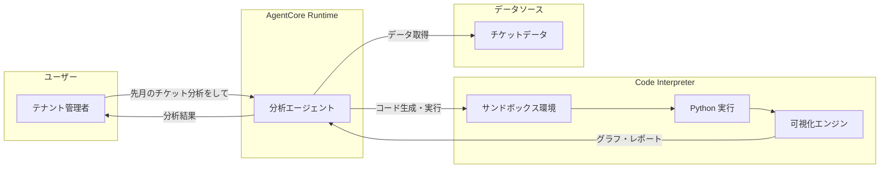

# 第9章: Code Interpreter（コードインタープリター）

## 本チャプターのゴール

- AgentCore Code Interpreter のサンドボックス実行環境を理解する
- テナント別のサポートチケット統計を動的に分析するエージェントを構築する
- Strands Agent SDK と Code Interpreter の統合方法を習得する
- `agents/analytics/src/main.py` の実装を通じて、実践的な分析エージェントを学ぶ

## 前提条件

- チャプター 02 までのエージェントデプロイが完了していること
- テナント別のサポートチケットデータが存在すること（サンプルデータで可）

## アーキテクチャ概要



---

## 9.1 サンドボックス実行環境の概念

AgentCore Code Interpreter は、安全に隔離されたサンドボックス環境でコードを実行します。

### 主な特徴

| 特徴 | 説明 |
|------|------|
| **完全な隔離** | 各実行セッションは独立したコンテナで動作 |
| **プリインストールライブラリ** | pandas、matplotlib、numpy、scipy 等 |
| **セッション永続化** | 同一セッション内で変数やファイルを保持 |
| **ネットワーク分離** | 外部ネットワークへのアクセスは不可 |

---

## 9.2 分析エージェントの実装

### ファイル構成

分析エージェントのソースコードは `agents/analytics/src/main.py` に配置されています。

### Code Interpreter のインポートとセットアップ

```python
from strands import Agent
from strands_tools.code_interpreter import AgentCoreCodeInterpreter
from bedrock_agentcore.runtime import BedrockAgentCoreApp
from model.load import load_model
```

**重要**: Code Interpreter のインポートは `from strands_tools.code_interpreter import AgentCoreCodeInterpreter` です。

### Code Interpreter インスタンスの作成

```python
REGION = os.getenv("AWS_REGION", "us-east-1")

code_interpreter = AgentCoreCodeInterpreter(
    region=REGION,
    session_name=session_id,
    auto_create=True,
    persist_sessions=True,
)
```

| パラメータ | 説明 |
|---|---|
| `region` | AWS リージョン |
| `session_name` | セッション識別子（セッション ID を使用） |
| `auto_create` | セッションが存在しない場合に自動作成 |
| `persist_sessions` | セッション内の変数やファイルを保持 |

### エージェントへの統合

```python
agent = Agent(
    model=load_model(),
    system_prompt=enriched_prompt,
    tools=[code_interpreter.code_interpreter],
)
```

`code_interpreter.code_interpreter` をツールとして Agent に渡します。

---

## 9.3 テナント別データ分析

### システムプロンプト

分析エージェントのシステムプロンプトは日本語/英語のバイリンガルで記述されており、以下のガイドラインを含みます:

1. **テナント分離**: 分析は常に単一テナントのデータのみを対象とする
2. **利用可能な分析**: チケット統計、解決時間分析、トレンド分析、SLA 達成率、顧客満足度レポート
3. **出力形式**: Code Interpreter を使用してグラフやチャートを生成
4. **使用ライブラリ**: pandas, matplotlib, seaborn

### サンプルチケットデータ

`agents/analytics/src/main.py` にはデモ用のサンプルデータが含まれています:

- **テナント A**: 10 件のチケット（open, resolved, in_progress 混在）
- **テナント B**: 7 件のチケット

各チケットには以下の属性があります:

| 属性 | 説明 | 例 |
|---|---|---|
| `id` | チケット ID | TKT-A001 |
| `status` | ステータス | open, resolved, in_progress |
| `priority` | 優先度 | critical, high, medium, low |
| `category` | カテゴリ | billing, technical, account |
| `created` | 作成日 | 2025-12-01 |
| `resolved` | 解決日 | 2025-12-03 (未解決は None) |
| `satisfaction` | 顧客満足度 | 1-5 (未回答は None) |

### テナントコンテキストの抽出

```python
def extract_tenant_context(payload: dict) -> dict:
    """Extract tenant context from the invocation payload."""
    tenant_context = {}

    # sessionAttributes から取得
    session_attrs = payload.get("sessionAttributes", {})
    if session_attrs:
        tenant_context["tenant_id"] = session_attrs.get("tenantId", "")
        tenant_context["tenant_name"] = session_attrs.get("tenantName", "")
        tenant_context["plan"] = session_attrs.get("tenantPlan", "")

    # requestContext.authorizer.claims から取得（フォールバック）
    request_context = payload.get("requestContext", {})
    authorizer = request_context.get("authorizer", {})
    claims = authorizer.get("claims", {})
    if claims and not tenant_context.get("tenant_id"):
        tenant_context["tenant_id"] = claims.get("custom:tenantId", "")
        tenant_context["tenant_name"] = claims.get("custom:tenantName", "")
        tenant_context["plan"] = claims.get("custom:tenantPlan", "")

    return tenant_context
```

---

## 9.4 エントリポイントとストリーミング応答

```python
@app.entrypoint
async def invoke(payload, context):
    session_id = getattr(context, 'session_id', 'default')

    # テナントコンテキストの抽出
    tenant_context = extract_tenant_context(payload)
    tenant_id = tenant_context.get("tenant_id", "unknown")

    # チケットデータをコンテキストに追加
    ticket_data = get_ticket_data_as_context(tenant_id)
    enriched_prompt = SYSTEM_PROMPT + f"""
## 現在のテナントデータ / Current Tenant Data
Tenant ID: {tenant_id}
...
```json
{ticket_data}
```
"""

    # Code Interpreter の作成
    code_interpreter = AgentCoreCodeInterpreter(
        region=REGION,
        session_name=session_id,
        auto_create=True,
        persist_sessions=True,
    )

    # エージェントの作成
    agent = Agent(
        model=load_model(),
        system_prompt=enriched_prompt,
        tools=[code_interpreter.code_interpreter],
    )

    # ストリーミング応答
    stream = agent.stream_async(
        payload.get("prompt", "チケットの統計を分析してください")
    )

    async for event in stream:
        if "data" in event and isinstance(event["data"], str):
            yield event["data"]
```

### ポイント

- `BedrockAgentCoreApp` の `@app.entrypoint` デコレータでエントリポイントを定義
- `agent.stream_async()` でストリーミング応答を生成
- テナント別のチケットデータをシステムプロンプトに埋め込むことで、テナント分離を実現

---

## 9.5 Python による計算と可視化

エージェントが Code Interpreter を使って動的に生成・実行するコードの例:

```python
# Code Interpreter 内で実行されるコード例
import matplotlib.pyplot as plt
import pandas as pd

# チケットデータの分析
df = pd.DataFrame(ticket_data)

# カテゴリ別チケット件数
fig, axes = plt.subplots(2, 2, figsize=(14, 10))

# 1. カテゴリ別件数の棒グラフ
category_counts = df["category"].value_counts()
axes[0, 0].bar(category_counts.index, category_counts.values, color="steelblue")
axes[0, 0].set_title("Category-wise Ticket Count")

# 2. ステータス別の円グラフ
status_counts = df["status"].value_counts()
axes[0, 1].pie(status_counts.values, labels=status_counts.index, autopct="%1.1f%%")
axes[0, 1].set_title("Status Distribution")

# 3. 顧客満足度の分布
axes[1, 1].hist(df["satisfaction"].dropna(), bins=5, range=(1, 6),
                color="mediumseagreen", edgecolor="black")
axes[1, 1].set_title("Satisfaction Score Distribution")

plt.tight_layout()
plt.savefig("ticket_analysis.png", dpi=150, bbox_inches="tight")
```

---

## 9.6 検証

### 検証 1: 分析エージェントの起動

```bash
# 分析エージェントをローカルで起動
cd agents/analytics
agentcore dev
```

### 検証 2: テナント別分析リクエスト

```bash
# テナント A のチケット分析を依頼
agentcore invoke '{"prompt": "チケットの統計を分析してください。カテゴリ別と優先度別の集計を出してください。", "sessionAttributes": {"tenantId": "tenant-a"}}'

# テナント B のチケット分析を依頼
agentcore invoke '{"prompt": "チケットの解決率と平均満足度を計算してください。", "sessionAttributes": {"tenantId": "tenant-b"}}'
```

以下を確認してください:

1. Code Interpreter がエラーなく実行されること
2. pandas / matplotlib が正常に動作すること
3. グラフ画像（PNG）が生成されること
4. テナント A のデータのみが分析対象になっていること（テナント B のデータが混在していないこと）

### 検証 3: セッション永続化の確認

同一セッション内で複数回のリクエストを送信し、前回の分析結果を踏まえた追加分析が可能であることを確認します。

```bash
# 1回目: 基本統計
agentcore invoke '{"prompt": "チケットの基本統計を出してください", "sessionAttributes": {"tenantId": "tenant-a"}}'

# 2回目: 前回の結果を踏まえた深堀り（同一セッションで）
agentcore invoke '{"prompt": "先ほどのデータで、未解決チケットの詳細を分析してください", "sessionAttributes": {"tenantId": "tenant-a"}}'
```

---

## まとめ

本チャプターで学んだこと:

| 項目 | 内容 |
|------|------|
| サンドボックス環境 | 隔離された安全なコード実行基盤 |
| AgentCoreCodeInterpreter | `strands_tools.code_interpreter` からインポート |
| コンストラクタ | `region`, `session_name`, `auto_create`, `persist_sessions` |
| テナント分離 | チケットデータをテナント単位でフィルタリング |
| ストリーミング | `agent.stream_async()` による非同期ストリーミング応答 |
| 可視化 | matplotlib によるグラフ生成 |

次のチャプターでは、**Evaluations** によるエージェント品質の評価に進みます。

---

[前のチャプターへ戻る](08-observability.md) | [次のチャプターへ進む](10-evaluation.md)
